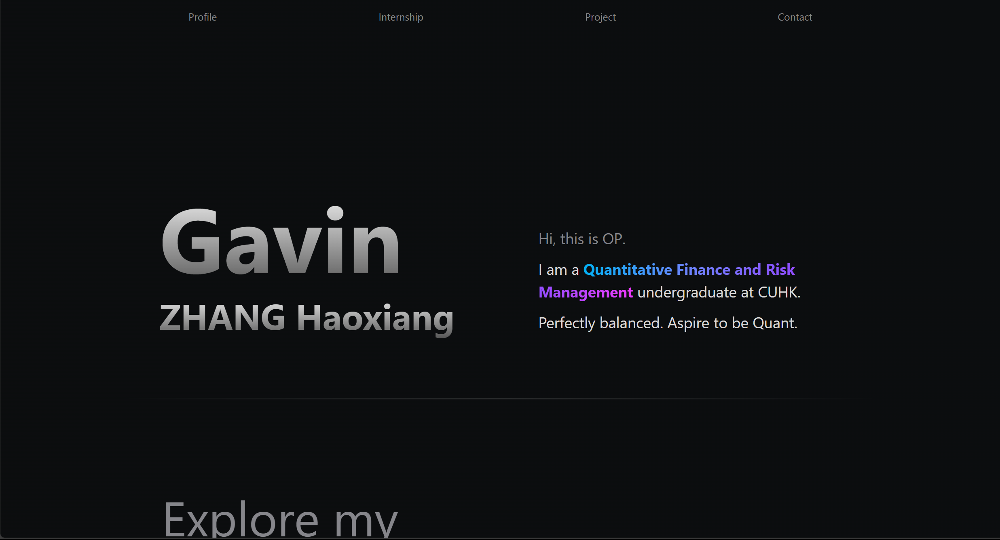

# Gavin-OP.github.io _(Gavin's Personal Website)_



[](https://github.com/RichardLitt/standard-readme)

The personal website for Gavin to showcase his skills, archive memories, and record his personal life.  

The website is build based on ReactJS, HTML, CSS, NodeJS, and Express. The repo contains the design, documentation, and implementation of Gavin's personal website. 

## Table of Contents
- [Install](#install)  
- [Usage](#usage)
- [Todo List](#todo-list)
- [References](#references)
- [Contributing](#contributing)
- [License](#license)  

## Install  

1. Install [NodeJS, npm](https://nodejs.org/en/download) and [Git](https://git-scm.com/downloads).
2. Open terminal in the directory where you want to install the repo
3. Use the following command to clone the repo
   ```shell
   git clone https://github.com/Gavin-OP/Gavin-OP.github.io.git
   ```
## Usage

- run `npm install` to install all dependencies
- run `npm start` to start the website locally  
- run `npm run deploy` to build the website and deploy to gh-pages branch  
- update master branch by git

## Todo List
- [ ] ⭐⭐⭐⭐⭐Design the website layout, what should be included??? reference [How to jazz up your website like Apple with JavaScript](https://medium.com/geekculture/how-to-jazz-up-your-website-like-apple-with-javascript-eed2bf227fec)
- [ ] ⭐html header, footer, and body
- [ ] ⭐Add a NodeJS backend server to serve all the files, reference [How to Create a React App with a Node Backend: The Complete Guide](https://www.freecodecamp.org/news/how-to-create-a-react-app-with-a-node-backend-the-complete-guide/)

## References

[25 React Website Design Examples We Love](https://blog.hubspot.com/website/react-websites-examples)  
[How To Create A Website Like Apple](https://internetdevels.com/blog/how-to-create-a-website-like-apple)

## Contributing

PRs and [issues](https://github.com/Gavin-OP/Gavin-OP.github.io/issues) are gladly accepted!  

## License  

[UNLICENSE](./LICENSE)
