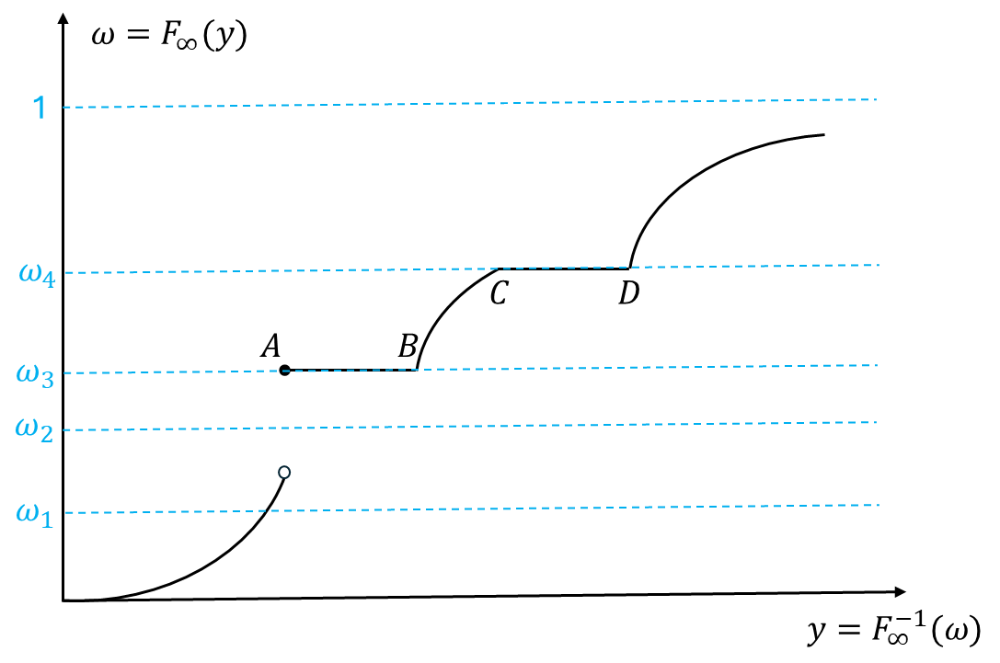
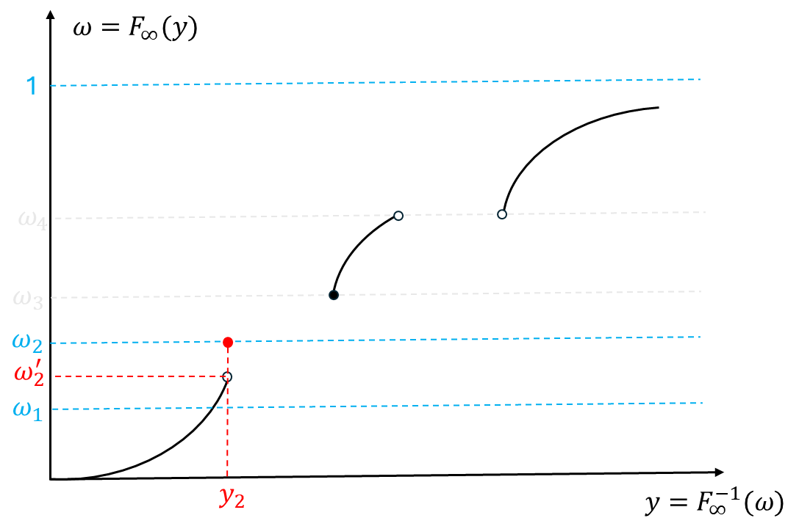
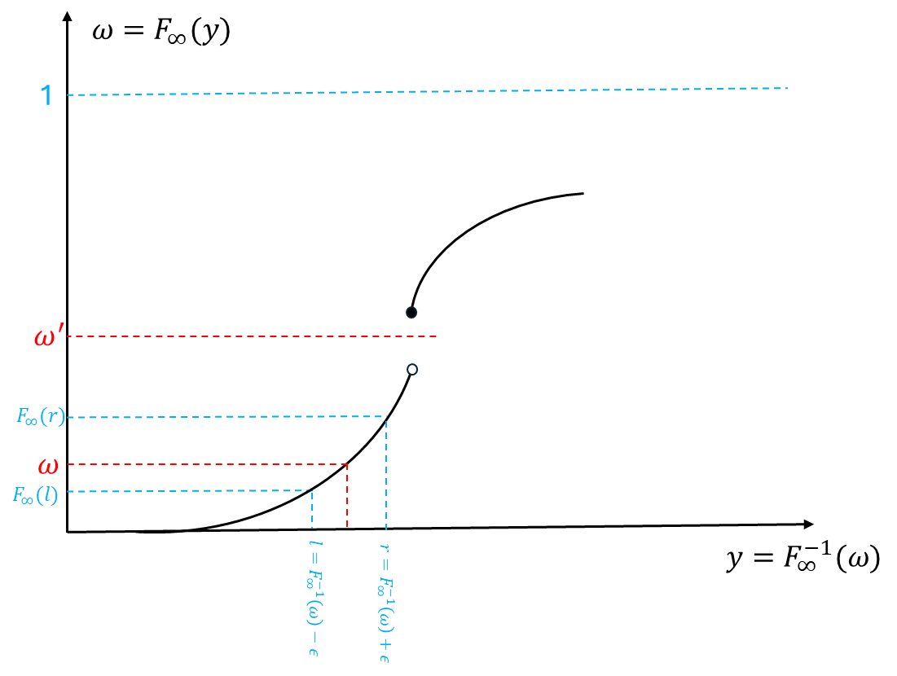
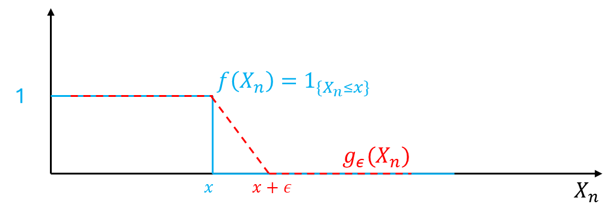

# Chapter 3: Central Limit Theorem

[TOC]

## 1. Convergence in Distribution

- **Definition**. Weak Convergence. $F_n$ is a sequence of distribution functions. (d.f.). $F$ is also a d.f. $F_n$ is said to converge weakly to $F$, denoted by $F_n\Rightarrow F$, if $F_n(y)\to F(y)$ for every continuous point of $F$.

- **Definition**: $X_n$ is a sequence of random variables. $X$ is a random variable. $X_n$ converges to $X$ **weakly** (**or in distribution**), denoted by $X_n\Rightarrow X$ (or $X_n\overset{d}\to X$) if $F_{X_n}\Rightarrow F_X$

- **Fact**. If $X_n\to X$ in probability, then $X_n\Rightarrow X$. If $X_n\Rightarrow c$ where $c$ is a constant, then $X_n\to c$

  - First relation:
    $$
    \begin{align}
    P(X_n\le x)&=P(\{X_n\le x\}\cap \{|X_n-X|\le\varepsilon\})+P(\{X_n\le x\}\cap \{|X_n-X|>\varepsilon\})&\text{(Law of Totol Prob)}\\
    &\le P(X\le x+\varepsilon)+P(|X_n-X|>\varepsilon)&\text{(Subset operations)}\\
    \Rightarrow \lim_{n\to\infty}P(X_n\le x)&= \lim_{n\to\infty}\left[P(X\le x+\varepsilon)+P(|X_n-X|>\varepsilon)\right]\\
    &=P(X\le x+\varepsilon)+0&\text{(converge in prob)}\\
    \end{align}
    $$

  - Second statement: $X_{n}\stackrel{\mathrm{d}}{\to}c\:\Rightarrow\:\mathsf{P}(X_{n}\leq x)\to1_{\{c\leq x\}}$. Then for any $\varepsilon>0$
    $$
    \begin{aligned}
    \mathsf P(|X_n-c|>\varepsilon)&=\mathsf P(X_n<c-\varepsilon)+\mathsf P(X_n>c+\varepsilon)\\
    &\leq\mathsf P(X_n\leq c-\varepsilon)+1-\mathsf P(X_n\leq c+\varepsilon)\\
    &\to1_{\{c\leq c-\varepsilon\}}+1-1\{c\leq c+\varepsilon\}=0.\end{aligned}
    $$
  
  - Inverse of statement 1 is not true because:
  
    - $(X_n)_{n\in\mathbb N}$ and $X$ may not be defined on same probability space
  
    - Even defined on same probability space, it could be wrong like this example:
      $$
      X_n:\;\underbrace{\boxed{\begin{matrix}H\\T\end{matrix}}}_\Omega
      \begin{matrix}\rightarrow\\\rightarrow\end{matrix}
      \underbrace{\boxed{\begin{matrix}0\\1\end{matrix}}}_{\mathcal F}
      \quad\quad
      X:\;\underbrace{\boxed{\begin{matrix}H\\T\end{matrix}}}_\Omega
      \begin{matrix}\rightarrow\\\rightarrow\end{matrix}
      \underbrace{\boxed{\begin{matrix}1\\0\end{matrix}}}_{\mathcal F}
      $$
  
- **Theorem 3.2.2**. (Skorokhod’s Theorem). If $F_n\Rightarrow F_\infty$, then $\exists Y_n,\;1\le n\le\infty$ such that $Y_n$ has d.f. $F_n$ for $1\le n\le\infty$ and $Y_n\overset{a.s.}\to Y_\infty$. Proof:

  - Let $\Omega=(0,1),\mathcal F=\mathcal B\cap(0,1), P=$Lebesgue measure. Define $Y_n:\Omega\to\mathbb R$ to be:
    $$
    Y_n(\omega)=F_n^{-1}(\omega),\quad F_n^{-1}(\omega):=\inf\{y:F_n(y)\geq\omega\}=\sup\{y:F_n(y)<\omega\}\\
    
    Y_\infty(\omega)=F_\infty^{-1}(\omega),\quad F_\infty^{-1}(\omega):=\inf\{y:F_\infty(y)\geq\omega\}=\sup\{y:F_\infty(y)<\omega\}.
    $$

  - By theorem about d.f. in Chapter 1, we know $Y_n\sim F_n,\; Y_\infty\sim F_\infty$ 

  - Now the only thing we need to prove is:
    $$
    Y_n(\omega)=F_n^{-1}(\omega)\overset{a.s.}\to F^{-1}(\omega)=Y(\omega)
    $$

  - $\overset{a.s.}\to$ means we only need to verify $F_n^{-1}(\omega)\to F_\infty^{-1}(\omega)$ for all $\omega$ that is with Lebesgue measure of non-zero. So we can find those $\omega$ with Lebesgue measure of zero and truncate them first (so that we only verify the miscellaneous ones)  

    - Now we consider preimage of $F_\infty$ for each $\omega\in(0,1)$ (note that the preimage is not equivalent to $F_\infty^{-1}(\omega)$). 
    - Consider preimage of $F_\infty$ that is empty or is a unique real number. Note that preimage of certain $\omega$ is unique value means bijective relation for this point, like $\omega_2$; Preimage of certain $\omega$ is empty means some jump of $F_\infty$, like $\omega_1$. Denote the collection of them as $\Omega_0$
    - Also consider $\Omega_0^c$, which are constant segments of $F_\infty$ plot. Example is $\omega_3,\omega_4$. 
      - These constant must be countable, otherwise the distribution function would diverge (which violate the condition that d.f. must converge to 1). 
      - Thus We know $P(\Omega_0^c)=0$ (I think the zero prob could be further proved in Real Analysis, but now I am not capable of this. Hope I can handle it in the future).
      - So $P(\Omega_0)=1$
    - So we only need to prove $F_n^{-1}(\omega)\to F_\infty^{-1}(\omega),\forall\omega\in\Omega_0$

    

  - Now $\forall \omega\in\Omega_0$, we have:

    -  $F_\infty(y)<\omega\text{ for }y<F_\infty^{-1}(\omega)$ and

    -  $F_\infty(z)>\omega\text{ for }z>F_\infty^{-1}(\omega)$. 
  
    - We can verify $\forall \omega\in\Omega_0$ the result is true while $\forall \omega\in\Omega_0^c$ the result is false. Note that $\forall \omega\in\Omega_0^c$ will make the second result false
  
  
    
  
  - Then we verify $F_n^{-1}(\omega)\to F_\infty^{-1}(\omega),\forall\omega\in\Omega_0$ by proving two things:
    - $\lim\inf_{n\to\infty}F_n^{-1}(\omega)\geq F^{-1}(\omega)$
      - Let $y<F_\infty^{-1}(\omega)$, where $F_\infty(.)$ is continuous at $y$. Since $\omega\in\Omega_0$, we have $F_\infty(y)<\omega$.
      - Because continuity of $y$ and weak convergence of d.f., if $n$ is sufficient large, say $\exists N_1$ such that $\forall n\ge N_1$ we have $F_n(y)<\omega$, which further means $F_n^{-1}(\omega)>y$ (this is because definition by $\inf$ for $F^{-1}_n$. So here we impose no further constraint on $F_n$)
      - Now consider among all continuous $y$ such that $y<F_\infty^{-1}(\omega)$, if $y_i$ is quite close to $F_\infty^{-1}(\omega)$, then $\exists N_i$ such that $\forall n\ge N_i$ we have $F_n^{-1}(\omega)>y_i$, or in another word, $\inf_{n\ge N_i}F_n^{-1}(\omega)\ge y_i$. 
      - If we consider a sufficiently large $N$ that is larger than any $N_i$, then for any $n\ge N$, we have $\inf_{n\ge N}F_n^{-1}(\omega)\ge y_i$ for all $y_i$, which is $\liminf_{n\ge N}F_n^{-1}(\omega)\ge y_i$ for all $y_i$. If we take $y\uparrow F_\infty^{-1}(\omega)$, then we can conclude: $\lim\inf_{n\to\infty}F_n^{-1}(\omega)\geq F^{-1}(\omega)$ 
      - Also, we can treat above step as: $\liminf_{n\ge N_i}F_n^{-1}(\omega)\ge \sup_i y_i$, since $y_i$ could be arbitrarily close to $F_{\infty}^{-1}(\omega)$ from downside, then we know $\liminf_{n\ge N_i}F_n^{-1}(\omega)\ge \inf_i y_i=F_{\infty}^{-1}(\omega)$
    - $\lim\sup_{n\to\infty}F_n^{-1}(\omega)\le F^{-1}(\omega)$
      - Let $y>F_\infty^{-1}(\omega)$, where $F_\infty(.)$ is continuous at $y$. Since $\omega\in\Omega_0$, we have $F_\infty(y)<\omega$.
      - If $n$ is sufficiently large then $F_n(y)>\omega$ and thus $F_n^{-1}(x)<y$. 
      - By same trick, we have the proof done
  
  - The professor gives another way to sketch the proof, but essentially they are the same. 
  
    - Given any $\omega\in\Omega_0$, find $\epsilon\downarrow 0$ such that $F^{-1}_\infty(\omega)\pm \epsilon:=(l,r)$ are both continuous points of $F_\infty$. In fact, $l,r$ here is like $y$ in above two scenarios.
  
    - So we have $F_n(l)\to F_\infty(l)$ and $F_n(l)\to F_\infty(l)$ and $F_\infty(l)<F_\infty[F_\infty^{-1}(\omega)]<F_\infty(r)$ (equivalently, we have $F_\infty(l)<\omega<F_\infty(r)$)
  
    - then for all sufficiently large $n$, we have $F_n(l)<\omega<F_n(r)$. Because $l<F^{-1}_\infty(\omega)<r$, using same trick above, we know $\lim\sup_{n\to\infty}F_n^{-1}(\omega)\le F^{-1}(\omega)\le \lim\inf_{n\to\infty}F_n^{-1}(\omega)$, so $F_n^{-1}(\omega)\to F_\infty^{-1}(\omega),\forall\omega\in\Omega_0$
  
    - Note that for unique value point like below picture, above $\epsilon$-$N$ language is easy to imagine. However, if some $\omega^\prime$ lies in $\Omega_0$ where preimage of it is empty, the above still holds. 
  
      
  
- **Corollary**: Suppose a continuous function $g:\mathbb R\to\mathbb R$, and $g\ge 0$. If $X_n\overset{d}\to X$, then:
  $$
  \liminf_{n\to\infty} Eg(X_n)\ge Eg(X)
  $$
  
  - **Proof: **By Skorokhod's Theorem, we can construct $Y_n\overset{d}{=}X_n,n\ge 1$ and $Y_n\overset{a.s.}\to Y$. Then:
    $$
    \begin{align}
    \liminf_{n\to\infty} Eg(X_n)&=\liminf_{n\to\infty} Eg(Y_n)&(\mathcal L(X_n)=\mathcal L(Y_n))\\
    &\ge Eg(Y)&(\text{Fatou Lemma})\\
    &=Eg(X)&(\mathcal L(X)=\mathcal L(Y))
    \end{align}
    $$
  
  - Also, we have:
    $$
    \limsup_{n\to\infty} Eg(X_n)\le Eg(X)
    $$
  
- **Theorem 3.2.3**. $X_n\Rightarrow X$ if and only if $\forall g:\mathbb R\to\mathbb R$ bounded and continuous, we have $Eg(X_n)\to Eg(X)$. Proof:

  - **Theorem 1.5.3**. Bounded Convergence Theorem. If $Y_n\overset{a.s.}\to Y$ and $Y_n,Y$ are all bounded almost everywhere (measurable function), then we have $EY_n\to EY$

    - Compared with DCT, this theorem has stronger assumption. BCT assumes bounded random variable almost everywhere while DCT assumes bounded expectation
    - The textbook show this theorem by more rigorous measurable function construction

  - $\Rightarrow$: 

    - By Skorokhod's Theorem, we can construct $Y_n,n\ge 1$ and $Y$ on the same probability space such that $Y_n\sim F_n$ for all $n$ and $Y_n\overset{a.s.}\to Y$. 
    - Since $g$ is continuous, we know $g(Y_n)\overset{a.s.}\to g(Y)$ as well. Also because $g(Y_n), g(Y)$ are bounded, then we have:

    $$
    Eg(X_n)=Eg(Y_n)\xrightarrow{BCT}Eg(Y)=Eg(X)
    $$

  - $\Leftarrow$: 
  
    - Let $X_n\sim F_n,\; X\sim F$, then for any continuity point and any $\epsilon>0$, define a continuous function as:
      $$
      g_\epsilon(y)=\begin{cases}
      1&y\le x\\
      -\frac1\epsilon[y-(x+\epsilon)]&x ≤ y ≤ x +\epsilon\\
      0&y>\epsilon\\
      \end{cases}
      $$
      
    - So $g_\epsilon(X_n)$ provides a scaler up compared with indicator function$1_{\{X\le x\}}$ shown in above plot.
  
      
  
      
      
    - Then we have:
      $$
      \begin{align}
      F_n(x)&=P(X_n\le x)=E1_{\{X_n\le x\}}&(\text{by definition})\\
      &\le Eg(X_n)&(\text{by above scaler})\\
      &\to Eg(X)&(\text{by condition of}\Leftarrow)\\
      &\le E1_{\{X\le x+\epsilon\}}&(\text{imagine shift }f(X_n))\\
      &=F(x+\epsilon)\downarrow F(x)\;as\; \epsilon\downarrow 0
      \end{align}
      $$
  
    - So we have:
      $$
      \limsup_{n\to\infty} F_n(x)\le F(x)
      $$

    - Similarly, we can prove:
      $$
      \liminf_{n\to\infty} F_n(x)\ge F(x)
      $$
      by setting:
      $$
      g_\epsilon(y)=\begin{cases}
      1&y\le x\\
      -\frac1\epsilon[y-(x-\epsilon)]&x ≤ y ≤ x +\epsilon\\
      0&y>\epsilon\\
      \end{cases}
      $$
  
    - So $F_n(x)\to F(x)$
  
  - **Note:** if we change the RHS statement into: $\forall g:\mathbb R\to\mathbb R$ bounded and continuous, *and its derivatives are bounded and continuous for sufficient large orders*, we have $Eg(X_n)\to Eg(X)$.
  
    - So we add a constraint on $g$: bounded and continuous derivatives of sufficiently large derivative
  
    - $\Rightarrow$ is still fine because we do not need constraint on derivative to prove it
  
    - $\Leftarrow$ need modify the constructed $g_\epsilon$ to make sure bounded and continuous derivative (the above graph example implies non-continuous first order derivative).To make 1st order derivative continuous, we may change it into smoothen version
  
      
  
    - The reason why we add these conditions: we will apply $\Leftarrow$ to prove convergence in distribution in below CLT theorem, and if we add additional conditions to RHS, $\Leftarrow$ will not change. However, these additional conditions are necessary for operations of proof below.
  
- **Central Limit Theorem**. (Lindeberg’s swapping argument). Let $X_1,X_2,...$ be a sequence of i.i.d. random variables such that $EX_i=\mu,Var(X_i)=\sigma^2,E|X_i|^3<\infty$. Let:
  $$
  W_n=\sum_{i=1}^n\frac{X_i-\mu}{\sigma\sqrt{n}}\\\Downarrow\\
  W_n\overset{d}{\operatorname*{\to}}Z\sim N(0,1)
  $$
  **Proof**

  - Let $g:\mathbb R\to\mathbb R$ be any bounded and continuous function with bounded and continuous derivatives up to third order. By **Theorem 3.2.3**, it suffices to show $Eg(W_n)\to Eg(Z)$.

  - Let $\xi_i=\frac{X_i-\mu}{\sigma\sqrt{n}}$,  and define $\eta_1,...,\eta_n$ on the same probability space such that $\{\xi_1,\cdots,\xi_n,\eta_1,\ldots,\eta_n\}$ are independent and $\eta_i\sim N(0,\frac1n)$. Then we have:
    $$
    E\xi_i=E\eta_i=0,\:E\xi_i^2=E\eta_i^2=\frac1n,\:E|\xi_i|^3,E|\eta_i|^3\leq\frac C{n^{3/2}},\;\; Z=\sum_{i=1}^n\eta_i\sim N(0,1)\\
    \text{3rd moment because: }E|\xi_i|^3=E\left(\left|\frac{X_i-\mu}{\sigma}\right|^3\cdot\frac1{(\sqrt n)^3}\right)
    $$

  - Now  
    $$
    \begin{align}
    &\;\;\;\;\;Eg(W_n)-Eg(Z)=E\left[g\left(\sum_{i=1}^n\xi_i\right)-g\left(\sum_{i=1}^n\eta_i\right)\right]\\
    &=\sum_{k=1}^n\left\{Eg(\xi_1+\cdots+\xi_{k-1}+\xi_k+\eta_{k+1}+\cdots+\eta_n)-Eg(\xi_1+\cdots+\xi_{k-1}+\eta_k+\eta_{k+1}+\cdots+\eta_n)\right\}&(\text{difference expansion})\\
    &=E\sum_{k=1}^n\left\{\left[g(V_k)+\xi_kg'(V_k)+\frac{\xi_k^2}2g''(V_k)+\frac{\xi_k^3}6g'''(V_k)+\cdots\right]-\left[g(V_k)+\eta_kg'(V_k)+\frac{\eta_k^2}2g''(V_k)+\frac{\eta_k^3}6g'''(V_k)+\cdots\right]\right\}\\
    &=E\sum_{k=1}^n\left\{\left[g(V_k)+\xi_kg'(V_k)+\frac{\xi_k^2}{2}g''(V_k)+O(|\xi_k|^3)\right]-\left[g(V_k)+\eta_kg'(V_k)+\frac{\eta_k^2}{2}g''(V_k)+O(|\eta_k|^3)\right]\right\}
    \end{align}
    $$
    Where $V_k:=\xi_1+\cdots+\xi_{k-1}+\eta_{k+1}+\cdots+\eta_n$. We can cancel some terms:

    - $g(V_k)-g(V_k)=0$
    - $E[\xi_k g'(V_k)]=E[\xi_k]E[g'(V_k)]=0$ because of independence and $E(\xi_k)=0$. Similar for $\eta_k$. 
    - $E\big[\frac{\xi_k^2}2 g''(V_k)\big]=\frac12E[\xi_k^2]E[g'(V_k)]=\frac1{2n}E[g'(V_k)]\to0$. Similar for $\eta_k$
    - The remainder $R_2(\xi_k)=O(|\xi_k|^3)$ means $E[R_2(\xi_k)]\le E[C|\xi_k|^3]\le E\left[\frac{C_2}{n^{3/2}}\right]\to 0$. (it is also the case that $R_2(\xi_k)=O(|\xi_k|^3)=o(|\xi_k|^2)$)

  - So we have: $Eg(W_n)-Eg(Z)\to0$. Proof done.

## 2. Characteristic Functions

- **Complex Random Variables**

  - **Definition**. 

    - $Z=X+iY$
    - $EZ=EX+iEY$ (expectation of complex random variable is a complex number)
    - $\bar Z=X-iY$

  - **Fact about Complet r.v.**

    - $|EZ|\le E|Z|$. Proof:
      $$
      |EZ|=\sqrt{(EX)^2+(EY)^2}\le \sqrt{EX^2+EY^2}\le= \sqrt{E(X^2+Y^2)}\le E\left(\sqrt{X^2+Y^2}\right)\\
      \text{trick: } (EX)^2\le EX^2;\;\text{Jensen's Inequality}
      $$

    - $E(Z_1+Z_2)=E(Z_1)+E(Z_2)$. Just linear relation, proof easy. Same for $E(cZ)=cE(Z)$, where $c$ is a non-random complex number 

    - If $Z_1=X_1+iY_1,\;Z_2=X_2+iY_2$, and if $(X_1,Y_1)\perp \!\!\! \perp(X_2,Y_2)$, then $E(Z_1Z_2)=E(Z_1)E(Z_2)$
      $$
      E(Z_1Z_2)=E[X_1X_2+i(X_1Y_2+X_2Y_1)-Y_1Y_2]=E(X_1)E(X_2)+iE(X_1)E(Y_2)+iE(X_2)E(Y_1)-E(Y_1)E(Y_2)\\
      E(Z_1)E(Z_2)=[E(X_1)+iE(Y_1)][E(X_2)+iE(Y_2)]\\
      \Rightarrow E(Z_1Z_2)=E(Z_1)E(Z_2)
      $$

    - $|Z_1Z_2|=|Z_1||Z_2|$. Proof:
      $$
      |Z_1Z_2|^2=\big|X_1X_2-Y_1Y_2+i(X_1Y_2+X_2Y_1)\big|^2=(X_1X_2-Y_1Y_2)^2+(X_1Y_2+X_2Y_1)^2=X_1^2X_2^2+X_1^2Y_2^2+Y_1^2X_2^2+Y_1^2Y_2^2\\
      |Z_1|^2|Z_2|^2=(X_1^2+Y_1^2)(X_2^2+Y_2^2)=X_1^2X_2^2+X_1^2Y_2^2+Y_1^2X_2^2+Y_1^2Y_2^2\\
      \Rightarrow |Z_1Z_2|=|Z_1||Z_2|
      $$

    - $|Z_1+Z_2|\le |Z_1|+|Z_2|$
    
    - If $Z_n=X_n+iY_n,n=1,2,...$ and $|Z_n|\le M<\infty$ and $Z_n\to Z$ a.s., then $E(Z_n)\to E(Z)$. This could be understood as two dimensional variable version of DCT
    
  - **Fact about complex number**

    - $|e^x|=|e^{\mathrm{Re}(x)}|$
    - $|wz|=|w||z|$
    - $|w+z|\le |w|+|z|$

- **Definition**. ch.f. of random variable $\varphi:\mathbb R\to\mathbb C$ is defined as:

$$
\varphi_X(t):=Ee^{itX}=E\cos(tX)+i\cdot E\sin(tX)
$$

- **Properties of ch.f.**

  - (1). $\varphi_X(0)=1,\;|\varphi_X(t)|\le 1$

    - Second statement is because:
      $$
      |\varphi_X(t)|= \sqrt{[E\cos(tX)]^2+ [E\sin(tX)]^2}\le \sqrt{E\cos^2(tX)+ E\sin^2(tX)}=1
      $$

  - (2). $\varphi_X(t)=\overline{\varphi_X(-t)}$.  (think of conjugate)

  - (3). $\sup_{t\in\mathbb R}|\varphi_X(t+h)-\varphi_X(t)|\to 0$ as $h\to0$

    **Proof:**

    - First we check:

    $$
    \begin{align}
    \sup_{t\in\mathbb R}|\varphi_X(t+h)-\varphi_X(t)|&=\sup_{t\in\mathbb R}|Ee^{i(t+h)X}-Ee^{itX}|\\
    &=\sup_{t\in\mathbb R}\big|E[e^{itX}(e^{ihX}-1)]\big|\\
    &\le \sup_{t\in\mathbb R}E[\big|e^{itX}(e^{ihX}-1)\big|]&(\text{property }|EZ|\le E|Z|)\\
    &=\sup_{t\in\mathbb R}E\left[\big|e^{itX}\big|\big|(e^{ihX}-1)\big|\right]&(\text{property }|Z_1Z_2|=|Z_1||Z_2|)\\
    &= E\big|e^{ihX}-1\big|&(|e^{itX}|\le 1)
    \end{align}
    $$

    - Also, when $h\to0$, $e^{ihX}-1\overset{a.s.}\to0$, then by DCT (or BCT, because of boundedness), we have $E\big|e^{ihX}-1\big|(|e^{itX}|\le 1)\to 0$ as $h\to0$
    - Note that the above $\sup$ operation is equivalent to the result for $|\varphi_X(t+h)-\varphi_X(t)|\le E\big|e^{ihX}-1\big|$ in the textbook
    - The above deduced to the conclusion: $|\varphi_X(t+h)-\varphi_X(t)|\to0$, which implies uniformly continuous (no matter how the domain is selected, the difference in the codomain would not burst)

  - (4). $\varphi_{aX+b}(t)=e^{itb}\varphi_{X}(at)$. Proof:
    $$
    \begin{align}
    LHS&=Ee^{it(aX+b)}=e^{itb}Ee^{itaX}=e^{itb}\varphi_X(at)=RHS
    \end{align}
    $$

  - (5). If $X_1\perp \!\!\! \perp X_2$, then $\varphi_{X_1+X_2}(t)=\varphi_{X_1}(t)\varphi_{X_2}(t)$. Proof:
    $$
    LHS=Ee^{it(X_1+X_2)}=E\big[e^{itX_1}e^{itX_2)}\big]=E\big[e^{itX_1}]E[e^{itX_2}\big]=\varphi_{X_1}(t)\varphi_{X_2}(t)=RHS
    $$

  - (6). If $EX^2<\infty$, then $\varphi_X(t)=1+itE(X)-\frac{t^2}{2}E(X^2)+o(t^2)$ as $t\to0$. Proof:
    $$
    \begin{align}
    \varphi_X(t)=Ee^{itX}&=E\left[1+itX+\frac{(itX)^2}2+R_2(itX) \right]\\
    &=1+itE(X)-\frac{t^2}2E(X^2)+E(R_2)\\
    \end{align}
    $$

    - Note that $|R_2|=\big|\frac{(itX)^3}{3!}+\frac{(itX)^4}{4!}+\cdots\big|\le \big|\frac{(itX)^3}{3!}\big|+\big|\frac{(itX)^4}{4!}\big|+\cdots=\frac{|tX|^3}{3!}+\frac{|tX|^4}{4!}+\cdots$, so we have:
      $$
      |R_2|\le C_1|tX|^3,\quad |R_2|\le |R_1|=\left|\frac{(itX)^2}2+R_2\right|\le C_2|tX|^2\\\Downarrow\\
      |R_2|\le C\min(|tX|^3,|tX|^2)\quad\text{for some constant }C>0
      $$

    - So $E|R_2|\le Ct^2E\left\{\min(|t||X|^3,|X|^2)\right\}$. Now that when $t\to0$, we know $\min(|t||X|^3+|X|^2)\to0$, then by DCT, we have:
      $$
      E|R_2|/t^2\le CE\left\{\min(|t||X|^3,|X|^2)\right\}\to C\cdot0=0
      $$

    - which means $E|R_2|/t^2=o(1)$, and thus $E|R_2|=o(t^2)$. **Note that when we say a complex-valued function $f(t)$ is $o(t^2)$ as $t\to0$, we mean its mod (which is real) $|f(t)|=o(t^2)$ as $t\to0$**. In this property, treat $R_2$ as the complex-valued function of $t$

- **Example**. ch.f. of usually used distributions

  | Distributions                                    | ch.f. $\varphi_X(t)$                         |
  | ------------------------------------------------ | -------------------------------------------- |
  | $X\sim N(0,1)$                                   | $\exp\left(-\frac{t^2}2\right)$              |
  | $X\sim N(\mu,\sigma^2)$                          | $\exp\left(it\mu-\frac{\sigma^2t^2}2\right)$ |
  | $X\sim Poi(\lambda)$                             | $\exp\left[\lambda(e^{it}-1)\right]$         |
  | $X\sim f_X=\frac{1-\cos x}{\pi x^2}$             | $(1-|t|)^+$                                  |
  | $\alpha$-stable distribution $0<\alpha\le2$ | $\exp(-|t|^\alpha)$                          |

- **Theorem 3.3.4**. Inversion Formula. If $X$ has ch.f. of $\varphi_X(t)=E(e^{itX})$, then $\forall-\infty<a<b<\infty$, we have:
  $$
  \lim_{T\to\infty}\frac{1}{2\pi}\int_{-T}^T\frac{e^{-ita}-e^{-itb}}{it}\varphi_X(t)dt=P(a<X<b)+\frac{1}{2}P(X=a)+\frac{1}{2}P(X=b)
  $$
  **Proof**

  - Note that we can decompose below term into integration form:
    $$
    \begin{align}
    \left|\frac{e^{-ita}-e^{-itb}}{it}\right|=\left|\int_a^be^{-ity}dy\right|\leq b-a.
    \end{align}
    $$
    This guarantee finiteness of the integrand. Note that the inequality could be seen as:
    $$
    \left|\int_a^be^{-ity}dy\right|=\left|\lim_{\Delta y\to0}\sum e^{-ity}\Delta y\right|\le\lim_{\Delta y\to0}\sum |e^{-ity}|\Delta y\le\lim_{\Delta y\to0}\sum 1\cdot\Delta y=b-a
    $$

  - Then:
    $$
    \begin{aligned}
    \frac{1}{2\pi}\int_{-T}^{T}\frac{e^{-ita}-e^{-itb}}{it}\varphi_{X}(t)dt&=\frac{1}{2\pi}\int_{-T}^{T}\frac{e^{-ita}-e^{-itb}}{it}Ee^{itX}dt\\
    &=E\frac{1}{2\pi}\int_{-T}^{T}\frac{e^{it(X-a)}-e^{it(X-b)}}{it}dt&(\text{Fubini})\\
    &=E\frac{1}{2\pi}\int_{-T}^{T}\left[\frac{\cos(t(X-a))-\cos(t(X-b))}{it}+\frac{\sin(t(X-a))-\sin(t(X-b))}{t}\right]dt\\
    &=E\frac{1}{\pi}\int_{0}^{T}\left[\frac{\sin(t(X-a))-\sin(t(X-b))}{t}\right]dt
    \end{aligned}
    $$
    note that the last step is because $\cos$ part is odd ($\cos$ in the numerator is even but the denominator $t$ is odd, so overall it is odd). Similarly, the $\sin$ part is even (check the denominator and numerator)
    
  - Use facts from **Exercise 1.7.5**:

  - Then we have:
    $$
    \begin{align}
    LHS&=\lim_{T\to\infty}E\frac{1}{\pi}\int_{0}^{T}\left[\frac{\sin(t(X-a))-\sin(t(X-b))}{t}\right]dt\\
    &=\lim_{T\to\infty}E\frac{1}{\pi}\int_{0}^{T}\frac{\sin(t(X-a))}{t}dt-\lim_{T\to\infty}E\frac{1}{\pi}\int_{0}^{T}\frac{\sin(t(X-))}{t}dt\\
    &= E\frac{1}{\pi}\lim_{T\to\infty}\int_{0}^{T}\frac{\sin(t(X-a))}{t}dt-E\frac{1}{\pi}\lim_{T\to\infty}\int_{0}^{T}\frac{\sin(t(X-))}{t}dt&(\text{DCT})\\
    \end{align}
    $$

  - Use facts from **Exercise 1.7.5**:
    $$
    \lim_{T\to\infty}\int_0^T\frac{\sin(tc)}{t}dt=\begin{cases}\frac{\pi}{2}&c>0\\0&c=0\\-\frac{\pi}{2}&c<0\end{cases}\;\;,\quad\quad\left|\int_0^T\frac{\sin(tc)}tdt\right|\leq4
    $$
    Note that the second fact is used to fulfill condition of above DCT application. Now let:
    $$
    A=\frac1\pi\lim_{T\to\infty}\int_{0}^{T}\frac{\sin(t(X-a))}{t}dt,\quad B=\frac1\pi\lim_{T\to\infty}\int_{0}^{T}\frac{\sin(t(X-b))}{t}dt	\\
    $$
    Then:
    $$
    A=\begin{cases}
    \frac{1}{2} &X>a\\
    0 &X=a\\
    -\frac{1}{2} &X<a
    \end{cases},\quad\quad B=\begin{cases}
    \frac{1}{2} &X>b\\
    0 &X=b\\
    -\frac{1}{2} &X<b
    \end{cases}\\
    $$
    
  - From below table of $A-B$

    | **(A-B, Range)** | $X>b$      | $X=b$           | $X<b$           |
    | ---------------- | ---------- | --------------- | --------------- |
    | $X>a$            | $(0,X>b)$  | $(\frac12,X=b)$ | $(1,a<X<b)$     |
    | $X=a$            | Impossible | Impossible      | $(\frac12,X=a)$ |
    | $X<a$            | Impossible | Impossible      | $(0,X<a)$       |

    So:
    $$
    A-B=\begin{cases}
    0&X<a\text{ or }X>b\\
    \frac12&X=a\text{ or }X=b\\
    1&a<X<b\\
    \end{cases}
    $$
    Then:
    $$
    E(A-B)=E\left(1_{\{a<X<b\}}+\frac12\cdot1_{\{X=a\}\cup\{X=b\}}\right)=P(a<X<b)+\frac12P(X=a)+\frac12P(X=b)
    $$
    QED.

- **Exercise**. Show $P(X=a)=\lim_{T\to\infty}\frac1{2T}\int_{-T}^Te^{-ita}\varphi_X(t)dt$

  - First we compute RHS:

  $$
  \begin{align}
  RHS&=\lim_{T\to\infty}E\frac1{2T}\int_{-T}^Te^{it(X-a)}dt\\
  &=\lim_{T\to\infty}E\frac1{2T}\int_{-T}^T\cos{[t(X-a)]}+i\sin{[t(X-a)]}dt\\
  &=\lim_{T\to\infty}E\frac1{T}\int_{0}^T\cos{[t(X-a)]}dt\\
  \end{align}
  $$

  - If $X=a$, then
    $$
    \begin{align}
    RHS=\lim_{T\to\infty}E\frac1{T}\int_{0}^T\cos{[t(X-a)]}=\lim_{T\to\infty}E\frac1{T}\int_{0}^T1dt=1\\
    \end{align}
    $$

  - If $X\ne a$, then:
    $$
    \begin{align}
    RHS&=\lim_{T\to\infty}E\frac1{T}\left[\frac{\sin(t(X-a))}{X-a}\right]_0^T\\
    &=\lim_{T\to\infty}E\frac{\sin(T(X-a))}{T(X-a)}\\
    &= E\lim_{T\to\infty}\frac{\sin(T(X-a))}{T(X-a)}=0
    \end{align}
    $$
    
  - So:

  $$
  RHS=E\lim_{T\to\infty}\frac{\sin(T(X-a))}{T(X-a)}=E1_{\{X=a\}}=P(X=a)=LHS
  $$

- **Exercise 3.3.2**. If $X$ is integer-valued, then:
  $$
  P(X=x)=\frac{1}{2\pi}\int_{-\pi}^{\pi}e^{-itx}\varphi_X(t)dt,\:\forall\:x\in\mathbb{Z}
  $$

  - From previous exercise, we know:
    $$
    \begin{align}
    P(X=x)&=\lim_{T\to\infty}\frac1{2T}\int_{-T}^Te^{-itx}\varphi_X(t)dt
    \end{align}
    $$
    
  - Let $T_n=(2n+1)\pi,n=0,1,...$ Then:
    $$
    \begin{align}
    P(X=x)&=\lim_{T_n\to\infty}\frac1{2T_n}\int_{-T_n}^{T_n} e^{-itx}\varphi_X(t)dt\\
    &=\lim_{n\to\infty}\frac1{2(2n+1)\pi}\int_{-(2n+1)\pi}^{(2n+1)\pi} e^{-itx}\varphi_X(t)dt\\
    &=\lim_{n\to\infty}\frac1{2(2n+1)\pi}\sum_{k=-n}^n\int_{(2k-1)\pi}^{(2k+1)\pi} e^{-itx}\varphi_X(t)dt\\
    \end{align}
    $$
    
  - Note $e^{-i(t+2\pi)x}\varphi_X(t+2\pi)=e^{-i(t)x}\varphi_X(t)$, then we have:
    $$
    \begin{align}
    P(X=x)&=\lim_{n\to\infty}\frac1{2(2n+1)\pi}\sum_{k=-n}^n\int_{(2k-1)\pi}^{(2k+1)\pi} e^{-itx}\varphi_X(t)dt\\
    &=\lim_{n\to\infty}\frac1{2(2n+1)\pi}\cdot(2n+1)\cdot\int_{-\pi}^{\pi} e^{-itx}\varphi_X(t)dt\\
    &=\frac1{2\pi}\int_{-\pi}^{\pi} e^{-itx}\varphi_X(t)dt\\
    \end{align}
    $$

- **Theorem 3.3.5**. If $\int_{-\infty}^{\infty}|\varphi_X(t)|dt\:<\:\infty$, then $X$ is a continuous random variable with bounded and continuous density:
  $$
  f(x)=\frac1{2\pi}\int_{-\infty}^\infty e^{-itx}\varphi_X(t)dt
  $$
  Proof:

  - From previous proof, we have:
    $$
    P(a<X<b)+\frac12 P(X=a)+\frac12 P(X=b)=\frac1{2\pi}\int_{-\infty}^\infty\frac{e^{-ita}-e^{-itb}}{it}\varphi(t)dt\leq\frac{(b-a)}{2\pi}\int_{-\infty}^\infty|\varphi(t)|dt>\infty
    $$

  - The last inequality is because we know $\frac1{2\pi}\int_{-\infty}^\infty\frac{e^{-ita}-e^{-itb}}{it}\varphi(t)dt$ is a positive real number. Then we can take modulus and this term does not change:
    $$
    \frac1{2\pi}\int_{-\infty}^\infty\frac{e^{-ita}-e^{-itb}}{it}\varphi(t)dt=\left|\frac1{2\pi}\int_{-\infty}^\infty\frac{e^{-ita}-e^{-itb}}{it}\varphi(t)dt\right|\le \frac1{2\pi}\int_{-\infty}^\infty\left|\frac{e^{-ita}-e^{-itb}}{it}\right||\varphi(t|dt
    $$

  - So we know $P(a<X<b)$ is bounded, even though $(a,b)$ is quite small.

  - Also $\int_{-\infty}^{\infty}|\varphi_X(t)|dt\:<\:\infty$ implies there is no point mass. (think of an example: $P(X=-1)=P(X=1)=0.5\Rightarrow \int_{-\infty}^{\infty}|\varphi_X(t)|dt\to\infty$). So:
    $$
    \begin{aligned}\mu(x,x+h)&=\frac1{2\pi}\int\frac{e^{-itx}-e^{-it(x+h)}}{it}\varphi(t)\:dt\\&=\frac1{2\pi}\int\left(\int_x^{x+h}e^{-ity}\:dy\right)\varphi(t)\:dt\\&=\int_x^{x+h}\left(\frac1{2\pi}\int\:e^{-ity}\varphi(t)\:dt\right)dy\end{aligned}
    $$

  - Taking limit:
    $$
    \lim_{h\to0}\frac{\mu(x,x+h)}{h}=\frac1{2\pi}\int\:e^{-ity}\varphi(t)\:dt
    $$

  - Boundedness:
    $$
    \left|\frac1{2\pi}\int\:e^{-ity}\varphi(t)\:dt\right|\le\frac1{2\pi}\int\:|e^{-ity}||\varphi(t)|\:dt\le \frac1{2\pi}\int\:|\varphi(t)|\:dt<\infty
    $$

  - Continuous: using DCT. i.e., For $y_n\to y$, find $f(y_n)\to f(y)$. Note that the bound could be using above the bound in previous bullet point

- **Theorem 3.3.6 (i)**. If $X_n\overset{d}\to X$, then $\varphi_{X_n}(t)\to\varphi_{X}(t),\forall t\in\mathbb R$.

  - By Skorokhod's Theorem, since $\varphi_{X_n}(t)$ is bounded and continuous w.r.t $X_n$, then we can construct $Y_n,n\ge 1$ and $Y$ on the same probability space such that $Y_n\sim F_n$ for all $n$,  and $Y\sim F$, and $Y_n\overset{a.s.}\to Y$. 

  -  $\varphi_{Y_n}(t)=E\cos(tY_n)+i\cdot E\sin(tX_n)=E\cos(tX_n)+i\cdot E\sin(tX_n)=\varphi_{X_n}(t)$ (no subscript, i.e., limit r.v., also holds). By BCT, we have: 
    $$
    \varphi_{X_n}(t)=\varphi_{Y_n}(t)\to\varphi_{Y}(t)=\varphi_{X}(t)
    $$

- **Theorem 3.3.6 (ii)**. If $\varphi_{X_n}(t)\to\varphi(t),\forall t\in\mathbb R$ and $\varphi$ is continuous at 0, then $\varphi$ is ch.f. of some random variable $X$ and $X_n\overset{d}\to X$

  - First we prove the sequence $X_n$ is tight.

    - We consider the following equation:
      $$
      \int_{-u}^u1-e^{itx}dt=2u-\int_{-u}^u(\cos tx+i\sin tx)dt=2u-\frac{2\sin ux}x
      $$

    - Divide both sides by $\mu$ and take expectation of both sides using Lebesgue integral form:
      $$
      LHS=u^{-1}\int_x\int_{-u}^u1-e^{itx}dtd\mu_n(x)\overset{\text{Fubini}}=u^{-1}\int_{-u}^u\left(\int_x1-e^{itx}d\mu_n(x)\right)dt\\
      =u^{-1}\int_{-u}^u\left(E_{\mu_n}[1-e^{itx}]\right)dt=u^{-1}\int_{-u}^u(1-\varphi_n(t))dt\\
      RHS=2\int\left(1-\frac{\sin ux}{ux}\right)\mu_n(dx)
      $$

    - Since $1-\frac{\sin ux}{ux}\ge0$, we can scale RHS down by (i) only keep integral between $(-2/u,2/u)$ and (ii) using 
      $$
      \begin{align}
      RHS&\ge 2\int_{|x|\geq2/u}\left(1-\frac{\sin ux}{ux}\right)d\mu_n(x)&(\text{subset of integral})\\
      &=2\int_{|x|\geq2/u}\left(1-\frac{\sin |ux|}{|ux|}\right)d\mu_n(x)&(\text{Even function})\\
      &\ge 2\int_{|x|\geq2/u}\left(1-\frac{1}{|ux|}\right)d\mu_n(x)&(\sin |ux|\le 1)\\
      &\ge 2\int_{|x|\geq2/u}\left(1-\frac{1}{2}\right)d\mu_n(x)\\
      &=\mu_n(\{x:|x|>2/u\})
      \end{align}
      $$

    - Note that $\varphi_{X_n}(0)\to\varphi(0)$ and since  $\varphi_{X_n}(0)=0,\forall n$, then $\varphi(0)=0$. Also $\varphi(t)$ being continuous at zero implies $\varphi(t)\to 1$ as $t\to0$, then:
      $$
      u^{-1}\int_{-u}^u(1-\varphi(t))dt\to0\mathrm{~as~}u\to0
      $$
      this is because: according to $\varphi(t)\to1$, we expand it into $\forall\epsilon>0,\exists \delta>0:\big[\forall |t|<\delta:|1-\varphi(t)|<\epsilon\big]$. Then $\forall |u|<\delta$, we have $|1-\varphi(t)|<\epsilon\forall t\in[-u,u]$. So below second inequality hold (first inequality is due to property of integral):
      $$
      \left|\int_{-u}^u(1-\varphi(t))\:dt\right|\leq \int_{-u}^u\left|1-\varphi(t)\right|dt\le\int_{-u}^u\epsilon\:dt=2u\epsilon\\\Downarrow\\
      \left|u^{-1}\int_{-u}^u(1-\varphi(t))\:dt\right|\le 2\epsilon
      $$
      therefore, we have shown that $\forall\epsilon>0,\exists\delta>0$ such that $\left|u^{-1}\cdot\int_{-u}^u(1-\varphi(t))\:dt\right|<2\epsilon$ for all $|u|<\delta$. 

    - Pick $u$ such that $u^{-1}\cdot\int_{-u}^u(1-\varphi(t))\:dt<\epsilon$. Since $\varphi_{X_n}(t)\to\varphi(t)$, then for sufficiently large $N$ we have:
      $$
      2\epsilon\geq u^{-1}\int_{-u}^u(1-\varphi_n(t))dt\geq\mu_n\{x:|x|>2/u\}
      $$
      since $\epsilon$ could be arbitrarily small, then $\mu_n$ is tight (or in another words, $F_n$ is tight).

  - Now we consider subsequence cases from tightness

    - With **Theorem 3.2.6-3.2.7**, tightness implies every subsequence of random variables' distribution functions' limits are distribution functions. 

    - This means for any subsequence $X_{n(k)}$, then for some random variable $X$ we have $X_{n(k)}\overset{d}\to X$. 

    - With theorem **Theorem 3.3.6 (i)**, we know $\varphi_{X_{n(k)}}(t)\to\varphi_{X}(t),\forall t\in\mathbb R$, where $\varphi_{X}(t)$ is ch.f. of $X$

    - By the condition $\varphi_{X_n}(t)\to\varphi(t),\forall t\in\mathbb R$, we know $\varphi_{X_{n(k)}}(t)\to\varphi(t),\forall t\in\mathbb R$ as well (because subsequence of functional convergence also holds), which means $\varphi_X(t)=\varphi(t)$

    - So for every subsequence, we have $\varphi$ is ch.f. of some random variable $X$ and $X_{n(k)}\overset{d}\to X$

    - Since ch.f. $\varphi$ determines a distribution function, as is show in **Theorem 3.3.4-3.3.5**, then all subsequence has same limit of $X$ in distribution

  - Finally, we verify the whole sequence of $X_n$ converges to $X$ in distribution

    - The above subsequence could be further iterated: every subsequence has a further subsequence that converges to $X$ in distribution

    - According to **Theorem 3.3.6 (i)** or BCT, we know if we map these further subsequence of random variables using bounded and continuous function $g$, then $Eg(X_{n(k(j))})\to Eg(X)$. So **Theorem 2.3.3** implies $Eg(X_{n})\to Eg(X)$ (i.e., the whole sequence's expectation converges to that limit expectation)

    - Then according to **Theorem 3.2.3**, direction $\Leftarrow$,  the above implies $X_n\overset{d}\to X$

## 3. Applying Characteristic Functions to Limit Distribution

- **Central Limit Theorem**. (Characteristic functions). Let $X_1,X_2,...$ be a sequence of i.i.d. random variables such that $EX_i=0,Var(X_i)=1$. Then
  $$
  S_n=\sum_{i=1}^n\frac{X_i-\mu}{\sigma}=\sum_{i=1}^nX_i\\\Downarrow\\
  \frac{S_n}{\sqrt n}\overset{d}{\operatorname*{\to}}Z\sim N(0,1)
  $$
  **Proof:**

  - Let
    $$
    \varphi_n(t)=Ee^{it\frac{S_n}{\sqrt n}}=Ee^{it\frac{\sum_{i=1}^nX_i}{\sqrt n}}=\prod_{i=1}^nEe^{\frac{it}{\sqrt n}X_i}\quad(\text{independence})
    $$
  
  - Also consider standard normal ch.f.
    $$
    \varphi_Z(t)=e^{-\frac{t^2}2}=\prod_{i=1}^ne^{-\frac{t^2}{2n}}
    $$
  
  - Then we check asymptotic result for $|\varphi_n(t)-\varphi_Z(t)|$
  
    - Treat $z_i=Ee^{\frac{it}{\sqrt n}X_i}$ and $w_i=e^{-\frac{t^2}{2n}}$, 
  
    - it is obvious that $|z_i|\le 1$ (see first property of ch.f.) and $|w_i|\le 1$ (again, note this is a deterministic term, not stochastic). The latter's taylor expansion is:
      $$
      e^{-\frac{t^2}{2n}}=1-\frac{t^2}{2n}+\frac{(t^2/2n)^2}{2!}-\frac{(t^2/2n)^3}{3!}=1-\frac{t^2}{2n}+o(t^2/n)\quad as\;\;t^2/n\to0
      $$
      the last $o(.)$ could be verified by dividing remaining terms with $t^2/n$. Again, if we fix $t$, i.e., we do not treat $t$ as asymptotic factor, but rather $n$, then when $n\to\infty$, we have $t^2/n\to\infty$
  
    - Then by **Lemma 3.4.3** in appendix, we know:
  
    $$
    \begin{align}
    \left|\varphi_n(t)-\varphi_Z(t)\right|&=\left|\prod_{i=1}^nEe^{\frac{it}{\sqrt n}X_i}-\prod_{i=1}^ne^{-\frac{t^2}{2n}}\right|\overset{\text{lemma}}\le \sum_{i=1}^n\left|Ee^{\frac{it}{\sqrt n}X_i}-e^{-\frac{t^2}{2n}}\right|\\
    \end{align}
    $$
  
    - From now on, fix $t$ as any number in $\mathbb R$. The order $o(t^2/n)$ is based on asymptotic features from $n\to\infty$, thus $t^2/n\to0$, which enable us to apply property $(6).$ and expansion of $e^{-\frac{t^2}{2n}}$ as below: 
      $$
      \begin{align}
      \sum_{i=1}^n\left|Ee^{\frac{it}{\sqrt n}X_i}-e^{-\frac{t^2}{2n}}\right|&=\sum_{i=1}^n\left|1-\frac{t^2}{2n}+o({t^2}/{n})-e^{-\frac{t^2}{2n}}\right|\;\;as\;\; n\to\infty&(\text{property (6).})\\
      &=\sum_{i=1}^n\left|1-\frac{t^2}{2n}+o({t^2}/{n})-\left(1-\frac{t^2}{2n}+o(t^2/n\right)\right|\;\;as\;\; n\to\infty&(\text{expand }e^{-\frac{t^2}{2n}})\\
      &=\sum_{i=1}^no(t^2/n)=o(t^2)\;\;as\;\; n\to\infty
      \end{align}
      $$
  
    - Note is $t$ is fixed number in $\mathbb R$, so $o(t^2)=o(1)$ as $n\to\infty$, which means:
      $$
      \left|\varphi_n(t)-\varphi_Z(t)\right|\le\sum_{i=1}^n\left|Ee^{\frac{it}{\sqrt n}X_i}-e^{-\frac{t^2}{2n}}\right|\to0\;\;as\;\; n\to\infty\;\;\text{for any }t\in\mathbb R
      $$
  
    - In another way to think of the final step: we are actually interested in $\lim_n\left|\varphi_n(t)-\varphi_Z(t)\right|$:
      $$
      0\le \lim_{n\to\infty}\left|\varphi_n(t)-\varphi_Z(t)\right|\le \lim_{n\to\infty}\sum_{i=1}^n\left|R_2^{S_n}-R_2^Z\right|
      $$
      where $R_2^{S_n},R_2^Z$ means remainder of Taylor's expansion accordingly. Since with $n\to\infty$, both of the remainder tends to be zero, and therefore the summation tend to be zero too.
  
  - Note that we can generalize it when $\mu\ne0$ and $\sigma\ne 1$, and replace $X_i$ with $\frac{X_i-\mu}{\sigma}$ in above statement and proof. And by Theorem $3.3.6 (ii)$, we can conclude convergence in distribution
  
- **Triangular Arrays**. Recall the triangular array of independent random variables:
  $$
  \left[
  \begin{array}{cccccc}
  X_{1,1} &        &        &        &        & \\
  X_{2,1} & X_{2,2} &        &        &        & \\
  X_{3,1} & X_{3,2} & X_{3,3} &        &        & \\
  \vdots  & \vdots  & \vdots  & \ddots &        & \\
  X_{n,1} & X_{n,2} & X_{n,3} & \cdots & X_{n,n} &\\
  \vdots&\vdots&\vdots&\vdots&\vdots
  \end{array}
  \right]
  $$
  
  - Below theorem 3.4.5 and theorem 3.4.6 are both based on this triangular array of random variables.
  - The convergence conditions and operations are usually based on row index $n\to\infty$. For example, below Lindebergs Condition $\sum_{i=1}^nEX_{n,m}^21_{\{|\xi_{ni}|>\epsilon\}}\to0$ means we take summation of variance for each row, and this summation will converges to 0 as $n\to\infty$
  
- **Theorem 3.4.5**. (The Lindeberg-Feller Theorem). For each $n$, let $X_{n,m},1\le m\le n$ be independent random variables with $EX_{n,m}=0$. Suppose:
  $$
  \begin{align}&(i)\:\sum_{m=1}^nEX_{n,m}^2\to\sigma^2>0\\&(ii)\;\text{For all }\epsilon>0,\:\lim_{n\to\infty}\sum_{m=1}^nE\big[|X_{n,m}|^21_{(|X_{n,m}|>\epsilon)})\big]=0\quad\text{(Lindeberg's condition)}
  \end{align}
  $$
  Then $S_n=X_{n,1}+\cdots+X_{n,n}\overset{d}\to N(0,\sigma^2)$ as $n\to\infty$. **Proof:**

  - Again, consider ch.f.:
    $$
    \varphi_n(t)=\prod_{m=1}^n\underbrace{Ee^{{it}X_{n,m}}}_{\varphi_{n,m}(t)},\quad\varphi_Z(t)=e^{-\frac{t^2\sigma^2}2}
    $$
  
    - also, let $\sigma^2_{n,m}=EX_{n,m}^2$.
  
    - Here to prove $S_n\overset{d}\to N(0,\sigma^2)$, we can prove
      $$
      \varphi_n(t)=\prod_{m=1}\varphi_{m,n}(t)\to e^{-\frac{t^2\sigma^2}2}=\varphi_Z(t)
      $$
  
    - In previous CLT proof, we further decompose $\varphi_Z(t)=\prod_{i=1}^ne^{-\frac{t^2\sigma^2}{2n}}$, then we compare $\left|\prod\varphi_{n,m}-\prod e^{-\frac{t^2}{2n}}\right|\le \sum\left|\varphi_{n,m}-e^{-\frac{t^2}{2n}}\right|\to0$ by checking whether the error represented by $\varphi_{n,m}-e^{-\frac{t^2\sigma^2}{2n}}$ would be eliminated when $n\to\infty$
  
    - **Here, we do not further decompose $\varphi_Z(t)$, and we directly see whether $\varphi_n(t)\to e^{-\frac{t^2\sigma^2}2}$**
  
  - To investigate $\varphi_n(t)$, let's check $\varphi_{n,m}(t)$ first:
  
    - Let $z_{n,m}=\varphi_{n,m}(t)$ and $w_{n,m}=1-\frac{t^2}2\sigma_{n,m}^2$. 
  
    - We define these two because we are interested in the remainder characteristics of Taylor expansion of $\varphi_{n,m}(t)$:
      $$
      \begin{align}
      \varphi_n(t)&=\prod_{m=1}^n\underbrace{\varphi_{n,m}(t)}_{z_{n,m}}\\
      &=\prod_{m=1}^nE\left[1+itX_{n,m}-\frac{t^2}2X_{n,m}^2+\frac{it^3}{3!}X_{n,m}^3-\frac{t^4}{4!}X_{n,m}^4+\cdots\right]\\
      &=\prod_{m=1}^n 1+itEX_{n,m}-E\left[\frac{t^2}2X_{n,m}^2\right]+E\left[\frac{t^3}{3!}X_{n,m}^{3}-\frac{t^4}{4!}X_{n,m}^4+\cdots\right]\\
      &=\prod_{m=1}^n \underbrace{1-\frac{t^2}2\sigma_{n,m}^2}_{w_{n,m}}+E\left[\frac{t^3}{3!}X_{n,m}^{3}-\frac{t^4}{4!}X_{n,m}^4+\cdots\right]
      \end{align}
      $$
      that is: for each $n$, $z_{n,m}-w_{n,m}$ is the remainder of the Taylor expansions:
      $$
      z_{n,m}-w_{n,m}=E\left[\frac{t^3}{3!}X_{n,m}^{3}-\frac{t^4}{4!}X_{n,m}^4+\cdots\right]
      $$
  
  - To investigate $\varphi_{n,m}(t)$, we can investigate bound of $|z_{n,m}-w_{n,m}|$ first.
  
    - Similar to proof of property $(6).$, we know the mod could be bounded as:
      $$
      \begin{align}
      |z_{n,m}-w_{n,m}|&\le E\left|\frac{t^3}{3!}X_{n,m}^{3}-\frac{t^4}{4!}X_{n,m}^4+\cdots\right|&(\;|EZ|\le E|Z|\;)\\
      &\le E\left[\left|\frac{t^3}{3!}X_{n,m}^{3}\right|+\left|\frac{t^4}{4!}X_{n,m}^4\right|+\cdots\right]&(\text{triangular})\\
      &=CE\min(|tX_{n,m}|^2,|tX_{n,m}|^3)&(\text{property }(6).)
      \end{align}
      $$
  
    - For any $\epsilon$ and fixed $t$, we can further bound the $\min$ in above RHS as:
      $$
      \min(|tX_{n,m}|^2,|tX_{n,m}|^3)\le |tX_{n,m}|^21_{(|X_n,m|>\epsilon)}+|tX_{n,m}|^31_{(|X_n,m|\le\epsilon)}
      $$
  
    - This holds true in almost surely way because: 
  
      - when $|X_n,m(\omega)|\le\epsilon$ for some $\omega$, we know $RHS=|tX_{n,m}|^3$, and $LHS\le RHS$ for sure (because if $|tX_{n,m}|^3\ge |tX_{n,m}|^2$, then $LHS=|tX_{n,m}|^2$, and if $|tX_{n,m}|^3<|tX_{n,m}|^2$, then $LHS=|tX_{n,m}|^3<|tX_{n,m}|^2$)
      - When $|X_n,m(\omega)|>\epsilon$ for some $\omega$, we know $RHS=|tX_{n,m}|^2$, and $LHS\le RHS$ for sure for similar reasons
      - Take care that the added $\epsilon$ here is arbitrary positive number, and the indicator function with $\epsilon$ would give us above inequality
  
    - Then we know:
  
    $$
    \begin{align}
    |z_{n,m}-w_{n,m}|&\le E|tX_{n,m}|^21_{(|X_n,m|>\epsilon)}+E|tX_{n,m}|^31_{(|X_n,m|\le\epsilon)}
    \end{align}
    $$
  
    - Note that for the second term, we can bounded it as:
      $$
      \begin{align}
      E|tX_{n,m}|^31_{(|X_n,m|\le\epsilon)}&=t^3\int_{|X_n,m|\le\epsilon}|X_{n,m}|\cdot|X_{n,m}|^2\;dP\\
      &\le t^3\int_{|X_n,m|\le\epsilon}\epsilon\cdot|X_{n,m}|^2\;dP\\
      &= t^3\epsilon \cdot E|X_{n,m}|^21_{(|X_n,m|\le\epsilon)})
      \end{align}
      $$
      the inequality holds because we integrate only on $|X_n,m|\le\epsilon$
  
    - Therefore, we have:
      $$
      \begin{align}
      |z_{n,m}-w_{n,m}|&\le E|tX_{n,m}|^21_{(|X_n,m|>\epsilon)}+E|tX_{n,m}|^31_{(|X_n,m|\le\epsilon)}\\
      &\le t^2E|X_{n,m}|^21_{(|X_n,m|>\epsilon)}+t^3\epsilon \cdot E|X_{n,m}|^21_{(|X_n,m|\le\epsilon)}\\
      &\le t^2E|X_{n,m}|^21_{(|X_n,m|>\epsilon)}+t^3\epsilon \cdot E|X_{n,m}|^2&(1_{(.)}\le 1)
      \end{align}
      $$
  
  - Based on above boundedness, we can investigate:
    $$
    \begin{align}
    \lim_{n\to\infty}\sum_{m=1}^n|z_{n,m}-w_{n,m}|&\le \lim_{n\to\infty}\sum_{m=1}^n t^2E|X_{n,m}|^21_{(|X_n,m|>\epsilon)}+\lim_{n\to\infty}\sum_{m=1}^nt^3\epsilon \cdot E|X_{n,m}|^2\\
    &= t^2\cdot\lim_{n\to\infty}\sum_{m=1}^nE|X_{n,m}|^21_{(|X_n,m|>\epsilon)}+t^3\epsilon \cdot\lim_{n\to\infty}\sum_{m=1}^nE|X_{n,m}|^2\\
    &=t^2\cdot0+t^3\epsilon \cdot\sigma^2=t^3\epsilon \cdot\sigma^2
    \end{align}
    $$
  
    - The last step is because condition $(i),(ii)$ in this theorem.
  
    - The above proof means $\lim_{n\to\infty}\sum_{m=1}^n|z_{n,m}-w_{n,m}|\le t^3\epsilon \cdot\sigma^2$ for all $\epsilon>0$, so it means:
      $$
      \sum_{m=1}^n|z_{n,m}-w_{n,m}|\to0\;\;as\;\; n\to\infty
      $$
  
  - Now we want to apply lemma 3.4.3 to derive:
    $$
    \lim_{n\to\infty}\left|\prod_{m=1}^n\underbrace{\varphi_{n,m}(t)}_{z_{n,m}}-\prod_{m=1}^n\underbrace{(1-t^2\sigma_{n,m}^2/2)}_{w_{n,m}}\right|\le\lim_{n\to\infty}\sum_{m=1}^n|z_{n,m}-w_{n,m}|=0
    $$
  
    - **To apply lemma 3.4.3, we need to verify unit mod condition here.**
  
    - $z_{n,m}$ is a ch.f. and thus it must be the case that $|z_{n,m}|\le 1$
  
    - Then we check $w_{n,m}=1-t^2\sigma_{n,m}^2/2$
  
    - For any positive $\epsilon$, it must be the case $\sigma_{n,m}^2\leq\epsilon^2+E[|X_{n,m}|^21_{(|X_{n,m}|>\epsilon)}]$
  
    - Recall condition $(ii)$:
      $$
      \text{For all }\epsilon>0,\:\lim_{n\to\infty}\sum_{m=1}^nE\big[|X_{n,m}|^21_{(|X_{n,m}|>\epsilon)})\big]=0
      $$
      which means $E[|X_{n,m}|^21_{(|X_{n,m}|>\epsilon)}]\to0$ when $n\to\infty$ (summation of non-negative numbers goes to zero implies each component goes to zero)
  
    - So, as $n\to\infty$, $\sigma_{n,m}^2\leq\epsilon^2+E[|X_{n,m}|^21_{(|X_{n,m}|>\epsilon)}]\to \epsilon^2$ for all $\epsilon>0$, which means $\sigma_{n,m}^2\to0$ for any $1\le m\le n$ as $n\to\infty$, and thus for sufficiently large $n$, $\sigma_{n,m}^2$ must be quite small positive number (for any $1\le m\le n$), and thus $t^2\sigma_{n,m}^2/2$ must be quite small positive number (because $t$ is fixed real number), and thus $|1-t^2\sigma_{n,m}^2/2|\le 1$ (for any $1\le m\le n$). 
  
    - Above analysis means when $n$ is sufficiently large, we can apply lemma 3.4.3. That is, we have:
      $$
      \left|\prod_{m=1}^n\varphi_{n,m}(t)-\prod_{m=1}^n(1-t^2\sigma_{n,m}^2/2)\right|\to0
      $$
  
    - Also, in complex domain, we know $|a_n-b_n|\to0$ implies $a_b\to b_n$, where $a_n,b_n$ are all complex numbers. So we have:
      $$
      \prod_{m=1}^n\varphi_{n,m}(t)\to\prod_{m=1}^n(1-t^2\sigma_{n,m}^2/2)
      $$
  
  - Finally, we investigate relationship:
    $$
    \prod_{m=1}^n(1-t^2\sigma_{n,m}^2/2)\to e^{1-t^2\sigma^2/2}
    $$
  
    - Recall in above discussion we have: $\sigma_{n,m}^2\to0$ for any $1\le m\le n$ as $n\to\infty$. It means $\sup_{1\le m\le n}\sigma^2_{n,m}\to0$ as $n\to\infty$, or in another words, $\max_{1\le m\le n}\sigma^2_{n,m}\to0$. 
  
    - Also, by condition $(i):\;\sum_{m=1}^nEX_{n,m}^2\to\sigma^2>0$, we know for any $n$, $\sum_{m=1}^nEX_{n,m}^2$ is bounded by $(0,\sigma^2)$. **Note that if $\sum_{m=1}^kEX_{k,m}^2=\infty$ for some $k<\infty$, we usually do not write convergence $\to$**. So $\sup_n\sum_{m=1}^nEX_{n,m}^2<\infty$.
  
    - Let $c_{m,n}=\sigma^2_{n,m}$, and since $\sum_{m=1}^nc_{m,n}=\sum_{m=1}^n\sigma^2_{n,m}\to\sigma^2$ by condition $(i)$ of the theorem, together with $\max_{1\le m\le n}\sigma^2_{n,m}\to0$ and $\sup_n\sum_{m=1}^nEX_{n,m}^2<\infty$, we can conclude by Exercise 3.1.1 that:
      $$
      \prod_{m=1}^n(1-t^2\sigma_{n,m}^2/2)\to e^{1-t^2\sigma^2/2}
      $$
  
    - Together with all above discussion, we have:
      $$
      \varphi_n(t)=\prod_{m=1}^n\varphi_{n,m}(t)\to\prod_{m=1}^n(1-t^2\sigma_{n,m}^2/2)\to e^{1-t^2\sigma^2/2}=\varphi_Z(t)
      $$
  
    QED.
  
- **Remarks for Theorem 3.4.5**. 
  
  - Normalize the Theorem 3.4.5.
  
    - Note that in Theorem 3.4.5, condition $(i)$ requires $\sum_{m=1}^nEX_{n,m}^2\to\sigma^2>0$. But we can actually consider a normalized version: $\sum_{m=1}^nE(X_{n,m}/\sigma)^2\to1>0$. So the result becomes $S_n/\sigma\to N(0,1)$.
    - This implies if the triangular array of random variables fulfills $\sum_{m=1}^nEX_{n,m}^2\to1$, with all other conditions unchanged, then we can conclude $S_n\to N(0,1)$, which could be regarded as a normalized version of Theorem 3.4.5.

  - One corollary of this normalized version of Theorem 3.4.5. is CLT for i.i.d. sequence: 
  
    - Suppose $X_1,X_2,...$ i.i.d. with $EX_i=\mu$ and $Var(X_1)=\sigma^2$.
  
    - Consider $X_{n,m}=\frac{X_m-\mu}{\sigma\sqrt{n}}$ and $W_n:=\sum_{m=1}^nX_{n,m}$. 
  
    - It can be checked for all $\epsilon>0$:
      $$
      \sum_{m=1}^nE[X^2_{n,m}1_{(|X_{n,m}|>\epsilon)}]=\sum_{m=1}^nE\left[\frac{(X_m-\mu)^2}{\sigma^2n}1_{(|({X_m-\mu})/\sigma|>\epsilon\sqrt{n})}\right]\\
      =\frac1n\sum_{m=1}^nE\left[\frac{(X_m-\mu)^2}{\sigma^2}1_{(|({X_m-\mu})/\sigma|>\epsilon\sqrt{n})}\right]=E\left[\frac{(X_m-\mu)^2}{\sigma^2}1_{(|({X_m-\mu})/\sigma|>\epsilon\sqrt{n})}\right]
      $$
      the last equality is because i.i.d. assumption.
  
    - Note that $1_{(|({X_m-\mu})/\sigma|>\epsilon\sqrt{n})}\to0$ almost surely when $n\to\infty$, so by DCT:
      $$
      E\left[\frac{(X_m-\mu)^2}{\sigma^2}1_{(|({X_m-\mu})/\sigma|>\epsilon\sqrt{n})}\right]\to0
      $$
      which means condition $(ii)$ is fulfilled.  
  
    - Also, $(i)$ is fulfilled because $\sum_{m=1}^nEX_{n,m}^2=1$ and thus the limit is also 1.
  
  - A sufficient condition for Lindeberg's condition is:
    $$
    \sum_{m=1}^nE|X_{n,m}|^p\to0\quad\text{for some }p>2
    $$
    Proved by:
  
    - We bound the Lindeberg's condition as:
  
    $$
    \forall\epsilon>0:\;\;\sum_{m=1}^nE[X^2_{n,m}1_{(|X_{n,m}|>\epsilon)}]\le \sum_{m=1}^nE\left[X^2_{n,m}\cdot\frac{|X_{n,m}|^{p-2}}{\epsilon^{p-2}}\right]=\frac1{\epsilon^{p-2}}\sum_{m=1}^nE|X_{n,m}|^p\to0
    $$
  
    - Note that the inequality can be understood as:
      - when $|X_{n,m}|>\epsilon$, $X^2_{n,m}1_{(|X_{n,m}|>\epsilon)}=X^2_{n,m}$, and $X^2_{n,m}\cdot\frac{|X_{n,m}|^{p-2}}{\epsilon^{p-2}}>X^2_{n,m}\cdot1$
      - When $|X_{n,m}|\le \epsilon$, then $X^2_{n,m}1_{(|X_{n,m}|>\epsilon)}=0$, but $X^2_{n,m}\cdot\frac{|X_{n,m}|^{p-2}}{\epsilon^{p-2}}\in[0,1]$
  
  - Lindeberg's condition implies:
    $$
    \max_{1\leq m\leq n}EX_{n,m}^2\to0,\quad\text{as }n\to\infty.
    $$
    Proof:
  
    - Consider:
  
    $$
    \max_{1\leq m\leq n}E[X_{n,m}^2-\epsilon^2]\le \max_{1\leq m\leq n}E[X_{n,m}^21_{(|X_{n,m}|>\epsilon)}]\le\sum_{m=1}^nE[X_{n,m}^21_{(|X_{n,m}|>\epsilon)}]
    $$
  
    - which means:
  
    $$
    \lim_{n\to\infty}\max_{1\leq m\leq n}EX_{n,m}^2\le \epsilon^2+\lim_{n\to\infty}\sum_{m=1}^nE[X_{n,m}^21_{(|X_{n,m}|>\epsilon)}]=\epsilon
    $$
  
    ​       for all $\epsilon>0$
  
    - So $\lim_{n\to\infty}\max_{1\leq m\leq n}EX_{n,m}^2=0$
  
  - $\max_{1\leq m\leq n}EX_{n,m}^2\to0,\;\text{as }n\to\infty.$ is a necessary condtion for CLT. So if this does not hold, the summation $S_n$ could be non-normal distributed when $n\to\infty$, because the characteristic function $\varphi_n(t)$ may not converge to a normal distribution ch.f.
  
  - Different representation for this theorem's condition: see [this](https://math.stackexchange.com/questions/3917501/lindeberg-feller-alternative-formulation-in-durrett) (also see Theorem 27.2 in Patrick's Probability and Measure), which shows how alternative conditions could imply Durrent's conditions for Lindeberg-Feller Theorem
  
- Example. Let $X_{n,m}\sim \exp(n),m=1,2,...,n$ and being independent across $m$. Let
  $$
  W_n=\sqrt{n}(\sum_{m=1}^nX_{n,m}-1)=\sum_{m=1}^n\left(\sqrt nX_{n,m}-\frac1{\sqrt n}\right)
  $$
  then:
  $$
  W_n\overset d\to N(0,1)
  $$
  **Proof:**
  
  - Some moments:
    $$
    EX_{n,m}=\frac1n,\quad Var(X_{n,m})=\frac1{n^2}
    $$
  
  - Consider:
    $$
    nE\left[\left(\sqrt nX_{n,m}-\frac1{\sqrt n}\right)^21_{|\sqrt nX_{n,m}-1/{\sqrt n}|>\epsilon}\right]=nE\left[\frac{(nX_{n,m}-1)^2}{n}\cdot1_{|\sqrt nX_{n,m}-1/{\sqrt n}|>\epsilon}\right]\\
    =E\left[(nX_{n,m}-1)^2\cdot1_{|nX_{n,m}-1|>{\sqrt n}\epsilon}\right]
    $$
  
  - Because $nX_{n,m}\sim \exp(1)$, which is bounded, i.e., $P(|nX_{n,m}-1|=\infty)=0$, so for the indicator function, $1_{|nX_{n,m}-1|>{\sqrt n}\epsilon}\to0$ almost surely when $n\to\infty$. So by DCT, we get the result
  
- **Theorem 3.6.1.** (Poisson convergence). For each $n$, let $X_{n,m},1\le m\le n$ be independent random variables with $P(X_{n,m}=1)=p_{n,m},P(X_{n,m}=0)=1-p_{n,m}$ (so may not identical distributed). Suppose:
  $$
  \begin{align}
  &(i)\;\sum_{m = 1}^n\:p_{n,m}\to\lambda\in(0,\infty)\\
  &(ii)\:\max_{1\leq m\leq n}p_{n,m}\to0.
  \end{align}
  $$
  Let $S_n=X_{n,1}+X_{n,2}+\cdots+X_{n,n}$, then $S_n\overset d\to Z$, where $Z$ is a $\mathrm{Poisson}(\lambda)$. Proof:
  
  - First, we construct ch.f.
  
    - For ch.f. of $S_n$:
  
    $$
    \varphi_n(t)=Ee^{it\sum_{m=1}^nX_{n,m}}=\prod_{m=1}^nEe^{itX_{n,m}}=\prod_{m=1}^n(p_{n,m}e^{it}+(1-p_{n,m}))
    $$
  
    - For ch.f. of a Poisson random variable $Z$:
      $$
      \varphi_Z(t)=\exp\big[{\lambda(e^{it}-1)}\big]
      $$
  
    - And by condition $(i)$, when $n\to\infty$, then:
      $$
      \prod_{m=1}^n\exp\big[p_{n,m}(e^{it}-1)\big]=\exp\left[(e^{it}-1)\prod_{m=1}^np_{n,m}\right]\quad\xrightarrow{(i)}\quad\exp\big[\lambda(e^{it}-1)\big]=\varphi_Z(t)
      $$
      so when we evaluate $\lim_{n\to\infty}(c_n+)$
  
  - Then evaluate $|\varphi_n(t)-\varphi_Z(t)|$
    $$
    \begin{align}
    \lim_{n\to\infty}|\varphi_n(t)-\varphi_Z(t)|:&=\lim_{n\to\infty}\left|\prod_{m=1}^n[p_{n,m}e^{it}+(1-p_{n,m})]-\exp\big[\lambda(e^{it}-1)\big]\right|\\
    &=\lim_{n\to\infty}\left|\prod_{m=1}^n[p_{n,m}e^{it}+(1-p_{n,m})]-\prod_{m=1}^n\exp\big[p_{n,m}(e^{it}-1)\big]\right|\\
    &\le \lim_{n\to\infty}\sum_{m=1}^n\bigg|p_{n,m}e^{it}+(1-p_{n,m})-\exp\big[p_{n,m}(e^{it}-1)\big]\bigg|&(\text{Lemma 3.4.3})\\
    \end{align}
    $$
  
    - Take care of how we use the below convergence, as is derived above
      $$
      \prod_{m=1}^n\exp\big[p_{n,m}(e^{it}-1)\big]\to\exp\big[\lambda(e^{it}-1)\big]=\varphi_Z(t)
      $$
  
    - Note Lemma 3.4.3 could be applied after verifying:
      $$
      |p_{n,m}e^{it}+(1-p_{n,m})|\le |p_{n,m}e^{it}|+|1-p_{n,m}|=p_{n,m}|e^{it}|+1-p_{n,m}\le p_{n,m}+1-p_{n,m}=1\\
      \exp\big[p_{n,m}(e^{it}-1)\big]=\exp\big[\mathrm{Re}[p_{n,m}(e^{it}-1)]\big]=
      \exp\big[p_{n,m}\underbrace{(\cos(t)-1)}_{\le0}\big]\le 1
      $$
      the process is based on Facts about complex r.v. and complex number.
  
    - Now let $b=p_{n,m}(e^{it}-1)$. To apply Lemma 3.4.4, we need verify:
      $$
      |b|=p_{n,m}\sqrt{(\cos(t)-1)^2+\sin^2(t)}=p_{n,m}\underbrace{\sqrt{2-2\cos(t)}}_{=|e^{it}-1|,\;\;\le 2}\le 2p_{n,m}
      $$
  
    - Since we are evaluating $\lim_{n\to\infty}\sum_{m=1}^n$, and by condition $(ii)$, then asymptotically, we have $2p_{n,m}=0$ for all $m\in[1,n]$ when $n\to\infty$, which means $|b|\le 1$ asymptotically. we are ready to apply Lemma 3.4.4.:
      $$
      \begin{align}
      &\quad\;\;\lim_{n\to\infty}\sum_{m=1}^n\bigg|p_{n,m}e^{it}+(1-p_{n,m})-\exp\big[p_{n,m}(e^{it}-1)\big]\bigg|\\
      &=\lim_{n\to\infty}\sum_{m=1}^n\bigg|1+b-e^b\bigg|\le \lim_{n\to\infty}\sum_{m=1}^n|b^2|\\
      &=\lim_{n\to\infty}\sum_{m=1}^np^2_{n,m}|e^{it}-1|^2
      \end{align}
      $$
  
    - Also, given $|e^{it}-1|\le 2$ with above discussion, we further have:
      $$
      \lim_{n\to\infty}\sum_{m=1}^np^2_{n,m}|e^{it}-1|^2\le \lim_{n\to\infty}\sum_{m=1}^n4p^2_{n,m}\le\lim_{n\to\infty}4\cdot\underbrace{\max_{1\leq m\leq n}p_{n,m}}_{\to0}\cdot\sum_{m=1}^np_{n,m}=0
      $$
  
  - So we know $|\varphi_n(t)-\varphi_Z(t)|\to0$ as $n\to\infty$ and by Theorem $3.3.6 (ii)$, we can conclude convergence in distribution

## 4. Miscellaneous on Convergence

- **Slutsky's Theorem**. If $X_n\overset d\to X,\; Y_n\overset{p.r.}\to c$ as $n\to\infty$, where $c$ is a constant and $X_n,Y_n,X$ are all defined on same probability space $(\Omega,\mathcal F,P)$. Then:
  $$
  X_n+Y_n\overset d\to X+c,\quad X_nY_n\overset d\to cX
  $$
  **Proof:**

  - Let $x-c$ be a continuity point of $F_X$ (which make $x$ a continuous point of $F_{X+c}$). Choose a decreasing sequence $\epsilon\downarrow0$ such that $x-c+\epsilon$ continuity points of $F_X$ for all $\epsilon$ in the sequence. 

  - We first derive $\limsup_{n\to\infty}P(X_n+Y_n\leq x)\le P(X+c\leq x+\epsilon)$: 

    - Consider the probability relation:
      $$
      \begin{align}
      P(X_n+Y_n\leq x)&=P(\{X_n+Y_n\leq x\}\cap\{|Y_n-c|\geq\epsilon\})+P(\{X_n+Y_n\leq x\}\cap\{|Y_n-c|<\epsilon\})\\
      &\leq P(|Y_n-c|\geq\epsilon)+P(\{X_n+Y_n\leq x\}\cap\{|Y_n-c|<\epsilon\})\\
      &\leq P(|Y_n-c|\geq\epsilon)+P(X_n\leq x-c+\epsilon)\\
      &\to P(X+c\leq x+\epsilon)\quad\text{as }n\to\infty
      \end{align}
      $$

    - The first line it by total probability trick

    - third line inequality is because
      $$
      \{X_n+Y_n\leq x\}\cap\{|Y_n-c|<\epsilon\}=\{X_n+Y_n\leq x\}\cap\big(\{Y_n>c-\epsilon\}\cap\{Y_n<c+\epsilon\}\big)\\
      \subset \underbrace{\{X_n+Y_n\leq x\}\cap\{Y_n>c-\epsilon\}}_A\subset\underbrace{\{X_n\le x-c+\epsilon\}}_B
      $$
      also take care last $\subset$ is because for every $\omega\in A$, we can show $\omega\in B$, so $A\subset B$, **and DO NOT see it as $A=B$**

    - The last $\to$ is because when $n\to\infty$, $Y_n\overset{p.r.}\to c$ implies $P(|Y_n-c|\geq\epsilon)\to0$, and $X_n\overset d\to X$ implies $P(X_n\leq x-c+\epsilon)\to P(X\leq x-c+\epsilon)$

    - This part implies $\limsup_{n\to\infty}P(X_n+Y_n\leq x)\le P(X+c\leq x+\epsilon)$ (think of this: the information that $a_n\le b_n$ for all $n$ and $b_n\to b$ cannot imply $\lim a_n$ exists, but it only imply $\limsup a_n\le b$)

  - Similarly, we derive $\liminf_{n\to\infty}P(X_n+Y_n\leq x)\ge P(X+c\leq x-\epsilon')$, where $\epsilon'$ is another sequence of numbers that $\epsilon\downarrow0$ and $x-c-\epsilon'$ are continuous points of $F_X$.

    - Construct events first:

    $$
    \begin{align}
    \{X_n+Y_n\le x\}\cap\{|Y_n-c|\ge\epsilon'\}&=\{X_n+Y_n\le x\}\cap\big(\{Y_n\ge c+\epsilon'\}\cup \{Y_n\le c-\epsilon'\}\big)\\
    &\supset\{X_n+Y_n\le x\}\cap \{Y_n\ge c+\epsilon'\}=\{X_n\le x-c-\epsilon'\}
    \end{align}
    $$

    - So we know the probability relation:
      $$
      P(X_n\le x-c-\epsilon')\le P\big(\{X_n+Y_n\le x\}\cap\{|Y_n-c|\ge\epsilon'\}\big)\le P(X_n+Y_n\le x)+P(|Y_n-c|\ge\epsilon')
      \\\Downarrow\\
      P(X_n+Y_n\le x)\ge P(X_n\le x-c-\epsilon')-P(|Y_n-c|\ge\epsilon')
      $$

    - Then take limit of RHS as $n\to\infty$, and the inequality $\ge$ means
      $$
      \liminf_{n\to\infty}P(X_n+Y_n\le x)\ge P(X+c\le x-\epsilon')-0
      $$

  - So we now have:
    $$
    P(X+c\le x-\epsilon')\le \liminf_{n\to\infty}P(X_n+Y_n\le x)\le \limsup_{n\to\infty}P(X_n+Y_n\leq x)\le P(X+c\leq x+\epsilon)
    $$
    for all $\epsilon,\epsilon'>0$. 

    - Sending $\epsilon,\epsilon'$ to zero, then:
      $$
      P(X+c\le x)\le \liminf_{n\to\infty}P(X_n+Y_n\le x)\le \limsup_{n\to\infty}P(X_n+Y_n\leq x)\le P(X+c\leq x)
      $$

    - which means:
      $$
      F_{X+c}(x)=\liminf_{n\to\infty}P(X_n+Y_n\le x)= \limsup_{n\to\infty}P(X_n+Y_n\leq x)
      $$

    - Therefore:
      $$
      F_{X+c}=\lim_{n\to\infty}P(X_n+Y_n\leq x)
      $$

- **Theorem 2.5.4 (Example 3.4.7.)**. (Kolmogorov’s three-series theorem). Let $X_1,X_2,...$ be independent. Let $A>0$ and let $Y_m=X_m1_{(|X_m|\le A)}$. Then $\sum_{n=1}^\infty X_n$ converges almost surely if and only if:
  $$
  (i)\;\sum_{n=1}^\infty P(|X_n|>A)<\infty,\quad
  (ii)\;\sum_{n=1}^\infty EY_n\text{ converges},\quad (iii)\;\sum_{n=1}^\infty Var\left(Y_n\right)<\infty
  $$
  **Proof of  sufficiency** $\Rightarrow$: (note that necessity has been proved in Chapter 2)

  - If $(i)$ does not hold, i.e., $\sum_{n=1}^\infty P(|X_n|>A)=\infty$:
    -  Since $\{|X_n|>A\}$ are independent across $n$, thus by Borel-Cantelli lemma $(ii)$, we have $P(|X_n|>A\;i.o.)=1$
    - So it means for almost all $\omega\in\Omega$, we have $|X_n(\omega)|>A$ for infinitely many index, say $n_1,n_2,...$, which is impossible to make convergence of $\sum_{n=1}^\infty X_n$. (because to make it converge, it must be the case that $X_n(\omega)\to0$ as $n\to\infty$, which contradicts the bound $|X_n(\omega)|>A$)

  - If $(iii)$ does not hold, i.e., $\sum_{n=1}^\infty Var\left(Y_n\right)=\infty$. 

    - Define
      $$
      c_n=\sum_{m=1}^n\operatorname{Var}(Y_m)\quad\mathrm{and}\quad X_{n,m}=(Y_m-EY_m)/c_n^{1/2}
      $$

    - Recall $Y_m=X_m1_{(|X_m|\le A)}$. So $|Y_n|\le A<\infty$ being bounded (this theorem actually regard $A$ as finite), then $Y_m$ has both finite expectation and variance, see [Popoviciu's inequality](https://stats.stackexchange.com/questions/45588/variance-of-a-bounded-random-variable). And:
      $$
      EX_{n,m}=0,\quad\sum_{m=1}^nEX_{n,m}^2=1
      $$

    - Also, since we have hypothesize that $\sum_{n=1}^\infty Var\left(Y_n\right)=\infty$, then it means $c_n\to\infty$ as $n\to\infty$. So $X_{n,m}\to 0$ almost surely for all $1\le m\le n$ when $n\to\infty$, which make Lindeberg's condition hold:
      $$
      \sum_{m=1}^nE|X_{n,m}|^21_{(|X_{n,m}|>\epsilon)}\to0
      $$

    - So Theorem 3.4.5 implies:
      $$
      S_n=\sum_{m=1}^mX_{n,m}\overset d\to N(0,1)\;\;as\;\; n\to\infty\quad (*)
      $$

    - Now consider the main condition in this theorem that $\sum_{n=1}^\infty X_n$ converges (i.e., $\lim_{n\to\infty}\sum_{m=1}^n X_m$ exists), which means $|X_m|$ getting arbitrarily small when $m\to\infty$, so $1_{(|X_m|\le A)}\to0$ as $m\to\infty$ for any given fixed finite $A$. Therefore, there exists sufficiently large $N$ such that for all $m\ge N$, we have $Y_m=0$. Then we can write $\sum_{n=1}^\infty Y_n=\sum_{n=1}^{N-1} X_n$, which is bounded because convergence implies boundedness. So $\sum_{n=1}^\infty Y_n$ also converges.

    - Therefore, if we let $T_n=\frac{\sum_{m=1}^n Y_n}{c_n^{1/2}}$, then $\lim_{n\to\infty}T_n\to0$. (almost surely, thus also in probability). So together with $(*)$ and with Slutsky theorem, we have $S_n-T_n\overset d\to N(0,1)$

    - However, if we directly see $S_n-T_n$ from construction of them:
      $$
      S_n-T_n=\sum_{m=1}^m\frac{(Y_m-EY_m)}{c_n^{1/2}}-\frac{\sum_{m=1}^n Y_n}{c_n^{1/2}}=\frac{\sum_{m=1}^n EY_n}{c_n^{1/2}}
      $$
      which is non-random, and thus the convergence should be non-random, too, which contradicts $S_n-T_n\overset d\to N(0,1)$.

  - Now we have proved $(i)$ and $(iii)$ are all right. We are left to show $(ii)$ is right. Note here we do not use contradiction anymore

    - Since $E(Y_m-EY_m)=0$ by setup, and $\sum_{n=1}^\infty Var\left(Y_n\right)=\sum_{n=1}^\infty E(Y_n-EY_m)^2<\infty$ by proved $(iii)$, then by Theorem 2.5.3, we know $\lim_{n\to\infty}\sum_{m=1}^n(Y_m-EY_m)$ exists

    - Since we already shown $\sum_{n=1}^\infty Y_n$ converges, i.e., $\lim_{n\to\infty}\sum_{m=1}^n Y_m<\infty$, then
      $$
      \underbrace{\lim_{n\to\infty}\sum_{m=1}^n(Y_m-EY_m)}_{\text{exists}}-\underbrace{\lim_{n\to\infty}\sum_{m=1}^n Y_m}_{\text{exists}}=\lim_{n\to\infty}\sum_{m=1}^n EY_m\;\;\text{exists}
      $$

- **Theorem 3.2.4**. (Continuous Mapping Theorem). Let $g:\mathbb R\to\mathbb R$ be a measurable function and let $D_g=\{x:g\text{ is continuous at }x\}$. If $X_n\Rightarrow X$ and $P(X\in D_g)=0$, then:
  $$
  g(X_n)\overset d\to g(X)
  $$
  **Proof:**

  - By Skorokhods theorem, we can construct $Y_n\to Y$ a.s. and $Y_n$ ($Y_n$ respectively) has the same distribution as $X_n$ ($X$ respectively).
    - Same distribution implies $P(Y\in D_g)=P(X\in D_g)=0$
  - Now consider a function $f$ that is *bounded and continuous everywhere*, then:
    - $D_{f\circ g}\subset D_g$ because: it is possible that $g(x)$ is discontinuous at $x_0$ but the function $f[g(x)]$ is continuous at this point
    - Thus $P(Y\in D_{f\circ g})\le P(Y\in D_{g})=0\Rightarrow P(Y\in D_{f\circ g})=0$, which means for almost all $\omega$, we have $f[g(y)]$ is continuous at $y=Y(\omega)$
    - Together with $Y_n\to Y$ a.s., we then have $f[g(Y_n)]\to f[g(Y)]$ a.s.
  - The BCT implies $Ef[g(Y_n)]\to Ef[g(Y)]$ because $f(\cdot)$ is bounded by setup and $Y_n\to Y$ a.s. 
    - The same distributions from Skorokhods theorem implies $Ef[g(X_n)]=Ef[g(Y_n)]\to Ef[g(Y)]=Ef[g(X)]$, so we also have $Ef[g(X_n)]\to Ef[g(X)]$
    - Since this expectation convergence holds for all continuous and bounded function $f$, then by theorem 3.2.3, we have $g(X_n)\overset d\to g(X)$
  - Also note that if addition condition, $g(.)$ is bounded, is imposed, we can show:
    - $g(Y_n)\to g(Y)$ a.s., and by BCT, we know $Eg(X_n)\to Eg(x)$
    - So a key point about proposing a continuous and bounded function $f$ here: we want to make sure $f[g(\cdot)]$ is bounded and continuous almost surely for input $Y$, so that we can apply BCT. So if we impose the condition of $g(.)$ being bounded, then we can directly derive relation of $Eg(X_n)\to Eg(x)$ using BCT.

- **Theorem 3.2.5**. (Portmanteau Theorem, which provides more ways to define weak convergence). The following are equivalent:
  $$
  \begin{array}{l}\text{(i) }X_n\Rightarrow X_\infty.\\
  \text{(ii) }\forall\text{ open sets }G,\liminf_{n\to\infty}P(X_n\in G)\geq P(X_\infty\in G).\\
  \text{(iii) }\forall\text{ closed sets }K,\lim\sup_{n\to\infty}P(X_n\in K)\leq P(X_\infty\in K).\\\text{(iv) }\forall A\text{ with }P(X_\infty\in\partial A)=0,\lim_{n\to\infty}P(X_n\in A)=P(X_\infty\in A).\end{array}
  $$
  **Proof:**

  - $\mathrm{(i)}\Rightarrow \mathrm{(ii)}$: 

    - By Skorokhod s theorem, we can construct $Y_n\to Y_\infty$ a.s. and $Y_n$ ($Y_\infty$ resp.) has the same distribution as $X_n$ ($X_\infty$ resp.).

    - First we show why $\liminf_{n\to\infty} 1_{(Y_n\in G)}\ge 1_{(Y_\infty\in G)}$. For $\omega$ such that $Y_\infty(\omega)\not\in G$, RHS is always zero, thus LHS always $\ge $ RHS. 

    - The rest $\omega$ fulfills $Y_\infty(\omega)\in G$. And since $Y_n\to Y_\infty$ almost surely, then for arbitrarily small positive number $\epsilon$, there exists some $N_\omega$ such that for all $n\ge N_\omega$, we have $|Y_n(\omega)-Y_\infty(\omega)|<\epsilon$. Since $Y_\infty(\omega)\in G$, which is an open set, then the arbitrarily small distance $|Y_n(\omega)-Y_\infty(\omega)|$ implies $Y_n(\omega)\in G$ too. So these sufficiently large $n$ would make $\liminf_{n\to\infty} 1_{(Y_n\in G)}=1$. Similar for other $\omega$ such that $Y_\infty(\omega)\in G$. So the inequality holds almost surely.

    - Then take expectation:
      $$
      E\liminf_{n\to\infty} 1_{(Y_n\in G)}\ge E1_{(Y_\infty\in G)}=P(Y_\infty\in G)
      $$

    - By Fatou's lemma:
      $$
      \begin{align}
      \liminf_{n\to\infty} \underbrace{P(Y_n\in G)}_{=P(X_n\in G)}&=\liminf_{n\to\infty} E1_{(Y_n\in G)}\\
      &\ge E\liminf_{n\to\infty} 1_{(Y_n\in G)}\\
      &\ge \underbrace{P(Y_\infty\in G)}_{=P(X_\infty\in G)}
      \end{align}
      $$

    - Note that above underbrace is due to same distribution from Skorokhod s theorem, thus:
      $$
      \liminf_{n\to\infty}P(X_n\in G)\geq P(X_\infty\in G)
      $$

  - $(\mathrm{ii})\Leftrightarrow(\mathrm{iii})$: 

    - When $K$ is a closed set, then $G=K^c$ is an open set. If $\mathrm{(ii)}$ is true, then insert $G=K^c$: 
      $$
      \liminf_{n\to\infty}P(X_n\in K^c)\geq P(X_\infty\in K^c)\\\Downarrow\\
      \liminf_{n\to\infty}\big[1-P(X_n\in K)\big]\geq 1-P(X_\infty\in K)\\\Downarrow\\
      \limsup_{n\to\infty}P(X_n\in K^c)\le P(X_\infty\in K)
      $$

    - So $\mathrm{(iii)}$ is true. Similar for the inverse direction. Note that the above operation is based on:
      $$
      \inf_{k\ge n}(-X_k)=-\sup_{k\ge n}(X_k)
      $$

  - $\mathrm{(ii)+(iii)\Rightarrow(iv)}$:

    - Consider some set $A$ such that $P(X\in\partial A)=0$ (condition of $\mathrm{(iv)}$), where $$\partial A=\bar A- A^o$$ is the boundary of set $A$, and $A^o,\bar A$ are the [interior](https://en.wikipedia.org/wiki/Interior_(topology)) and closure of set $A$. Then we have:
      $$
      P(X_\infty\in \bar A)=P(X_\infty\in A)=P(X_\infty\in A^o)
      $$

    - Note that such event $A$ implies $P(X_n\in A^o)\le P(X_n\in A)\le P(X_n\in \bar A)$ because $P(X_n\in \partial A)$ could be non-zero under measure for $X_n$ (its probability is zero under measure of $X_\infty$ as a condition here as is shown above). So we have relaion:
      $$
      A^o\subset A\subset \bar A
      $$

    - Thus:
      $$
      \begin{align}
      \limsup_{n\to\infty}P(X_n\in A)&\leq\limsup_{n\to\infty}P(X_n\in \bar A)\overset{\mathrm{(iii).}}\leq P(X_\infty\in \bar A)=P(X_\infty\in A)\\
      \liminf_{n\to\infty}P(X_n\in A)&\geq\liminf_{n\to\infty}P(X_n\in A^o)\overset{\mathrm{(ii).}}\geq P(X_\infty\in A^o)=P(X_\infty\in A)
      \end{align}
      $$

  - $\text{(iv)}\Rightarrow\text{(i)}$: Find all $x\in\mathbb R$ such that $P(X_\infty=x)=0$, then such point $x$ must be continuous point of $F$, and it is obvious that $\{X_\infty=x\}$ is boundary of event $A=(-\infty,x]$. So $\mathrm{(iv)}$ implies $\lim_{n\to\infty} P(X_n\in A)=P(X_\infty\in A)$, i.e., $\lim_{n\to\infty} P(X_n\le x)=P(X_\infty\le x)$. 

- **Total Variation**. 

  - **Definition**. The total variation distance between two probability measures $\mu_1$ and $\mu_2$ is defined as:

  $$
  d_{TV}(\mu_1,\mu_2):=\sup_{A\in\mathcal F}|\mu_1(A)-\mu_2(A)|
  $$

  - **Theorem**. Let $f_n$ be a sequence of probability density functions (pdf), $f$ be a pdf. Suppose $X_n\sim f_n$, $X\sim f$ (and they are continuous random variables with the corresponding pdf). If $f_n(x)\to f(x)$ for all $x\in\mathbb R$, then:
    $$
    d_{TV}(\mathcal{L}(X_n),\mathcal{L}(X))\to0.
    $$
     **Proof:**

    - It suffices to show for any Borel set $B\in\mathcal B$ (because r.v. is defined with Borel set):
      $$
      \left|\int_Bf_n(x)dx-\int_Bf(x)dx\right|\to0
      $$

    - We have:
      $$
      \begin{align}
      &\quad\;\;\left|\int_Bf_n(x)dx-\int_Bf(x)dx\right|=\left|\int_Bf_n(x)-f(x)dx\right|\\
      &\le \int_B|f_n(x)-f(x)|dx &(\text{triangular for integral})\\
      &\leq\int_{-\infty}^\infty|f_n(x)-f(x)|dx &(\text{scale up domain})\\
      &=\int_{-\infty}^\infty[f_n(x)-f(x)]^+dx+\int_{-\infty}^\infty[f(x)-f_n(x)]^+dx &(|z|=z^++(-z)^+)
      \end{align}
      $$

    - Now consider decomposition as:
      $$
      f_n(x)-f(x)=[f_n(x)-f(x)]^+-[f(x)-f_n(x)]^+\\\Downarrow\\
      0=\underbrace{\int_{-\infty}^\infty f_n(x)dx}_{=0}-\underbrace{\int_{-\infty}^\infty f(x)dx}_{=0}=\int_{-\infty}^\infty[f_n(x)-f(x)]^+dx-\int_{-\infty}^\infty[f(x)-f_n(x)]^+dx\\\Downarrow\\
      \int_{-\infty}^\infty[f_n(x)-f(x)]^+dx+\int_{-\infty}^\infty[f(x)-f_n(x)]^+dx=2\int_{-\infty}^\infty[f_n(x)-f(x)]^+dx
      $$

    - Given $f_n(x)\to f(x)$, then 
      $$
      2\int_{-\infty}^\infty[f_n(x)-f(x)]^+dx=2E\bigg([f_n(x)-f(x)]1_{\{f_n(x)-f(x)>0\}}\bigg)\to0
      $$
       by DCT because $1_{\{f_n(x)-f(x)>0\}}\to 0$ a.s.

- **Definition**. (Kolmogorov distance) between two probability measures $\mu_1$ and $\mu_2$ (with d.f. $F_1$and $F_2$ resp.) is defined as:
  $$
  d_K(\mu_1,\mu_2):=\sup_{x\in\mathbb{R}}|F_1(x)-F_2(x)|
  $$

## 5. Limit Theorems in $\mathbb R^d$

- **Definitions**

  - **Distribution function (d.f.).** of $\vec X=(X_1,X_2,...,X_d)^T\in\mathbb R^d$ is:
    $$
    F_{\vec X}(\vec x):=P(\vec X\le \vec x)
    $$
    where $\vec X\le \vec x$ means $X_1\le x_1,...,X_d\le x_d$

  - **Convergence in distribution**. 
    $$
    F_{\vec X_n}\Rightarrow F_{\vec X}\quad\Longleftrightarrow\quad F_{\vec X_n}(\vec x)\to F_{\vec X}(\vec x)\quad\Longleftrightarrow\quad \vec X_n\overset d\to \vec X
    $$

  - **Characteristic function (ch.f.)** for $\vec X\in\mathbb R^d$ is 
    $$
    \varphi_{\vec X}:\mathbb R^d\to\mathbb C,\quad \varphi_{\vec X}(\vec t)=Ee^{i\vec t\vec X},\quad \vec t\vec X=\sum_{i=1}^dt_iX_i
    $$
    

- **Theorems**

  - **Theorem 3.9.4**. 
    $$
    \vec X_n\overset d\to \vec X\quad\Longleftrightarrow\quad\forall \vec t\in\mathbb R^d:\varphi_{\vec X_n}(\vec t)\to\varphi_{\vec X}(\vec t)
    $$

  - **Theorem 3.9.5**. (Cramer-Wold Device). 
    $$
    \vec X_n\overset d\to \vec X\quad\Longleftrightarrow\quad\forall \vec\theta\in\mathbb R^d:\vec\theta \vec X_n\overset d\to \vec\theta\vec X
    $$

    - This theorem comes from theorem 3.9.4 because we can treat $\vec t\vec X_n$ as a whole, and it mimic the theorem for univariate version of proving weak convergence from ch.f.
    - This theorem is vital because it provides a dimension-reduction method to prove weak convergence of multivariate limit distribution.
    - Below theorem can be proved by this theorem.

  - **Theorem 3.9.6**. (CLT in $\mathbb R^d$). Let $\vec X_1,\vec X_2,...\in\mathbb R^d$ be i.i.d., and $E\vec X_1=\vec\mu$, $Cov(\vec X_1,\vec X_1)=\Sigma$, where $\Sigma$ is a $d\times d$ positive semi-definite matrix. Let $\vec S_n=\vec X_1+\cdots+\vec X_n$, then:
    $$
    \frac{\vec S_n-n\vec\mu}{\sqrt n}\overset d\to \Sigma^{1/2}\vec Z
    $$
    where
    $$
    \vec Z\sim N(0,I_d),\quad f_{\vec Z}(\vec x)=\frac1{(\sqrt{2\pi})^d}\exp\left(-|\vec x|^2/2\right)
    $$

## 6. Concentration Inequalities

- **Bernstein's Inequality**. Suppose $X_1,X_2,...,X_n$ are independent with $EX_i=0$ for all $i$. Also, $X_i$ is subexponential, i.e., $P(|X_i|>x)\le c_1e^{-c_2x}$ (or equivalently, $E|X_i|^p\le K^p\cdot p!,\forall p\ge 1$). Let $W_n=\frac{X_1+\cdots+X_n}{\sqrt n}=\frac{S_n}{\sqrt n}$, then:
  $$
  P(W_n> x)\le \exp\left(-\frac1C\cdot\frac{x^2}{1+\frac{x}{\sqrt n}}\right)\\\Updownarrow\\
  P(S_n> x)\le \exp\left(-\frac1C\cdot\frac{x^2}{n+x}\right)\\
  $$

  **Proof:**

  - The $\Updownarrow$ is obvious because
    $$
    P(W_n>x)=P(S_n>\sqrt n\cdot x)
    $$
    and just replace $x$ with $\sqrt n\cdot x$ in $P(W_n> x)\le\exp(\cdot)$, and vice versa.

  - **We prove the bound of $P(S_n> x)$ then.** Note that
    $$
    P(S_n>x)=P\big[e^{tS_n}>e^{tx}\big]\overset{\text{markov}}\le\frac{Ee^{tS_n}}{e^{tx}}
    $$

  - First we compute bound of $Ee^{tS_n}=\prod_{i=1}^nEe^{tX_i}$ for $0<t<\frac1K$:
    $$
    \begin{align}
    Ee^{tX_i}&=1+tEX_i+\sum_{p=2}^\infty\frac{t^pE|X_i|^p}{p!}&(\text{Taylor})\\
    &\le 1+\sum_{p=2}^\infty\frac{t^pK^p\cancel{p!}}{\cancel{p!}}&(\text{sub-exponential})\\
    &=1+\frac{(tK)^2}{1-tK}&(\text{Geometric sequence})\\
    &\le \exp\left(\frac{(tK)^2}{1-tK}\right)\\
    &\Downarrow\\
    Ee^{tS_n}&\le \exp\left(\frac{nt^2K^2}{1-tK}\right)
    \end{align}
    $$

  - Now we consider optimal bound:

    - Start from above bound for any $t$:
      $$
      P(S_n>x)\le\frac{Ee^{tS_n}}{e^{tx}}\le\exp\left(\frac{nt^2K^2}{1-tK}-tx\right)=:g(t)
      $$

    - Optimize $g(t)$ w.r.t $t$, we have:
      $$
      \frac{\partial g(t)}{\partial t}=0\quad\Rightarrow\quad t_*=\frac1K\left(1-\frac1{\sqrt {1+\frac x{nk}}}\right)\le \frac{x}{2nK^2+Kx}=:t'<\frac1K
      $$

    - So new bound is:
      $$
      \exp\left(\frac{n(t')^2K^2}{1-t'K}-t'x\right)=\exp\left(-\frac{x^2}{2(2nK^2+Kx)}\right)
      $$

  - Note that the above bound is based on $0<t<\frac1K$, but since the $t'$ that we used for the eventual bound fulfills $t'<\frac1K$ and the bound could eliminate $t$, so $t$ here is just an instrument that will not affect the eventual bound that we derived.

  - Note that the explicit form of bound for $P(S_n> x)$ we computed is consistent with the bound in the theorem:
    $$
    \exp\left(-\frac{x^2}{2(2nK^2+Kx)}\right)\quad \text{v.s.}\quad \exp\left(-\frac1C\cdot\frac{x^2}{n+x}\right)
    $$

    - Before showing the consistency between above two terms, let's explain how the bound in the theorem means: we have a random variable with p-th moment bound $E|X_i|^p\le K^p\cdot p!$ (so $K>0$ too), and if we are interested in bound of $P(S_n>x)$ for specific $n$, then we can derive the bound by regarding $K$ and $n$ being fixed.
    - So to prove consistency, it suffices to show there is some $C>0$, such that $2(2nK^2+Kx)\le C(n+x)$ holds for any $x\in\mathbb R$ with given $K>0$ and $n\ge 1$ (regarded as fixed). 
    - If $x>0$, then we can pick $C\ge \max(4K^2,2K)$; if $x\le 0$, then $2(2nK^2+Kx)\le 4nK^2$, so we can select $C\ge 4K^2$. To sum up, we can always select $C\ge \max(4K^2,2K)$ such that $2(2nK^2+Kx)\le C(n+x)$ for all $x\in\mathbb R$
    
  - Also, note that $W_n$ could demonstrate different types of bounds for different values of $x/\sqrt n$:
  
    - When $x/\sqrt n$ is close to zero, then the bound becomes sub-Gaussian:
      $$
      \exp\left(-\frac1C\cdot\frac{x^2}{1+\frac{x}{\sqrt n}}\right)\approx\exp\left(-\frac{x^2}C\right)
      $$
  
    - When $x/\sqrt n$ is sufficiently large, then $1+x/\sqrt n\approx x/\sqrt n$, and the bound becomes sub-exponential:
      $$
      \exp\left(-\frac1C\cdot\frac{x^2}{1+\frac{x}{\sqrt n}}\right)\approx\exp\left(-\frac{x}{C/\sqrt n}\right)
      $$
  
    - For more details about sub-Gaussian and sub-exponential as well as their implications, see [this](https://www.stat.berkeley.edu/~bartlett/courses/2013spring-stat210b/notes/3notes.pdf) (reminder: a sub-Gaussian random variable means the r.v. has lighter tail than Gaussian, while sub-exponential has heavier tail than sub-Gaussian); 
  
    - For more forms of Bernstein inequalities, see [this](https://en.wikipedia.org/wiki/Bernstein_inequalities_(probability_theory))
  
- **Hoeffding's inequality**. Let $X_1,...,X_n$ be independent, $X_i\in[a_i,b_i]$, $i=1,2,...,n$. Let $S_n=\sum_{i=1}^n(X_i-EX_i)$, then for all $x>0$, we have:
  $$
  P(S_n>x)\le \exp\left(-\frac{2x^2}{\sum_{i=1}^n(b_i-a_i)^2}\right)
  $$
  **Proof:**

  - We prove [Hoeffding's lemma](https://en.wikipedia.org/wiki/Hoeffding%27s_lemma) first, which is: if $a\le X\le b$ almost surely, then for all $t\in\mathbb R$, we have: 
    $$
    {E}\left[e^{t(X-E[X])}\right]\leq\exp\Big(\frac{t^2(b-a)^2}{8}\Big)\\\Updownarrow\\
    \log{E}\left[e^{t(X-E[X])}\right]\le \frac{t^2(b-a)^2}{8}
    $$

    - Note that $E(X-EX)=0$ and $a-EX\le X-EX\le b+EX$ almost surely. ($EX$ must be bounded because $X$ is bounded almost surely). So without loss of generality, we can assume $EX=0$, and assume the bound is $[a,b]$ (note this bound is different with original $[a,b]$, but their length are the same, which will not affect the result afterwards)

    - Consider $h(t)=\log E(e^{tX})=\log\left(\int e^{tx}dP(x)\right)$, where $X\sim P$. Then:
      $$
      \begin{align}
      h'(t)&=\frac1{\int e^{tx}dP(x)}\frac{\partial}{\partial t}\left(\int e^{tx}dP(x)\right)\\
      &=\frac1{\int e^{tx}dP(x)}\int \left(\frac{\partial}{\partial t}e^{tx}\right)dP(x)\\
      &=\frac{\int xe^{tx}dP(x)}{\int e^{tx}dP(x)}=\int xdP_t(x)=E_t(X),\quad dP_t(x)=\frac{e^{tx}dP(x)}{\int e^{tx}dP(x)}=\frac{e^{tx}dP(x)}{Ee^{tx}}\\
      h''(t)&=\frac{\int x^2e^{tx}dP(x)\cdot Ee^{tx}-\big[\int xe^{tx}dP(x)\big]^2}{(Ee^{tx})^2}\\
      &=\frac{\int x^2e^{tx}dP(x)}{Ee^{tx}}-\left(\frac{\int xe^{tx}dP(x)}{Ee^{tx}}\right)^2\\
      &=E_t(X^2)-[E_t(X)]^2=:Var_t(X)
      \end{align}
      $$
       and $P_t$ is called tilted measure, $E_t(X)$ is expectation under measure $P_t$

    - Now we expand $h(t)$ by Taylor expansion with $a=0$, and apply mean value theorem (there exists $\xi\in(a,t)$ such that $R_k(t)=\frac{h^{(k+1)}(\xi)}{(k+1)!}(t-a)^{k+1}$): 
      $$
      h(t)=\sum_{k=0}^\infty\frac{h^{(k)}(a)}{k!}(t-a)^k=h(0)+t\cdot h'(0)+R_1(t)\\
      =h(0)+t\cdot h'(0)+\frac{h''(\xi)}{2}t^2=h(0)+tE_t(X)+Var_\xi(X)=0+0+Var_\xi(X)
      $$

    - Note that for any distribution for $X$, we always have:
      $$
      Var(X)\le \frac{(b-a)^2}{4}
      $$
      so it is also true that $Var_\xi(X)\le \frac{(b-a)^2}{4}$, where $\xi$ means some distribution measure $P_\xi$

    - So:
      $$
      h(t)=\log E(e^{tX})\le \frac{t^2(b-a)^2}{8}
      $$
      

  - Again, consider
    $$
    \begin{align}
    P(S_n>x)=P\big[e^{tS_n}>e^{tx}\big]&\le\frac{Ee^{tS_n}}{e^{tx}}&(\text{markov})\\
    &=\exp(tx)\cdot\prod_{i=1}^n Ee^{t(X_i-EX_i)}\\
    &=\exp(tx)\cdot\exp\left(\sum_{i=1}^n\log \left[Ee^{t(X_i-EX_i)}\right] \right)\\
    &\le \exp(tx)\cdot\exp\left(\frac{t^2\sum_{i=1}^n(b_i-a_i)^2}{8}\right)\\
    &=\exp\left(\frac{t^2\sum_{i=1}^n(b_i-a_i)^2}{8}-tx\right)=: g(t)
    \end{align}
    $$

  - Then to optimize $g(t)$, the optimal:
    $$
    t_*=\frac{4x}{\sum_{i=1}^n(b_i-a_i)^2},\quad g(t_*)=\exp\left(-\frac{2x^2}{\sum_{i=1}^n(b_i-a_i)^2}\right)
    $$

## Appendix

- **Theorem 3.2.6**. (Helly's Selection Theorem). Every sequence of distribution functions $F_n$ has a subsequence $F_{n(k)}$ and a right continuous non-decreasing function $F$ so that $\lim_{n\to\infty} F_{n(k)}=F(y)$ at all continuity $y$ of $F$ (which is not necessarily a distribution function).  

- **Theorem 3.2.7**. Every subsequential limit above is a distribution function if and only if $\{F_n\}$ is tight, meaning that $\forall \epsilon>0,\exists M_\epsilon$ such that
  $$
  \lim_{n\to\infty}P(|X_n|\geq M_\epsilon)\leq\epsilon
  $$

  - Note that in the lecture note, this definition is more restricted: $P(|X_n|\geq M_\epsilon)\leq\epsilon,\forall n$ (in uniformly way)
  - One example is $X_n$ is tight if $E|X_n|\le C$ (bounded) for all $n$

- **Lemma 3.4.3**. If $z_1,...,z_n.\;\; w_1,...,w_n$ are complex, and $|Z_i|\le 1$, $|w_i|\le 1$ for all $i$, then:
  $$
  \left|\prod_{i=1}^nz_i-\prod_{i=1}^nw_i\right|\le \sum_{i=1}^n\big|z_i-w_i\big|
  $$

- **Lemma 3.4.4.** If $b$ is a complex number with $|b|\le 1$ then $|e^b-(1+b)|\le |b^2|$

- **Exercise 3.1.1.** If $\max_{1\le j\le n}|c_{j,n}|\to 0$, and $\sum_{j=1}^nc_{j,n}\to\lambda$, and $\sup\sum_{j=1}^n|c_{j,n}|<\infty$, then $\prod_{j=1}^n(1+c_{j,n}\to e^\lambda)$. **Proof:**

  - It is equivalent to prove $\sum_{j=1}^n \ln (1 + c_{j,n}) \to \lambda$ as $n\to\infty$

  - Consider below inequality ([reference](https://math.stackexchange.com/questions/2816858/durretts-probability-problem-3-1-1-show-prod-j-1n-1c-j-n-to-e-lamb)):
    $$
    \underbrace{\left|\sum_{j=1}^n\log(1+c_{j,n})-\sum_{j=1}^nc_{j,n}\right|}_{LHS}
    \le\sum_{j=1}^n\left|\frac{\log(1+c_{j,n})}{c_{j,n}}-1\right||c_{j,n}|
    \le \underbrace{\max_{1\le j\le n}\left|\frac{\log(1+c_{j,n})}{c_{j,n}}-1\right|\sum_{j=1}^n|c_{j,n}|}_{RHS}
    $$

  - Take $\lim$:

    - For LHS:

    $$
    \lim_{n\to\infty}LHS=\left|\lim_{n\to\infty}\sum_{j=1}^n\log(1+c_{j,n})-\lambda\right|
    $$

    - For RHS, first term:
      $$
      \max_{1\le j\le n}\left|\frac{\log(1+c_{j,n})}{c_{j,n}}-1\right|
      $$
      when $n$ is sufficiently large, given condition $\max_{1\le j\le n}|c_{j,n}|\to 0$, we know $c_{j,n}$ is close to zero, and thus $\left|\frac{\log(1+c_{j,n})}{c_{j,n}}-1\right|\le |c_{j,n}|$. Apply $\max_{1\le j\le n}|c_{j,n}|\to 0$ again, we know
      $$
      \max_{1\le j\le n}\left|\frac{\log(1+c_{j,n})}{c_{j,n}}-1\right|\to0
      $$

    - For RHS, second term $\sum_{j=1}^n|c_{j,n}|$, according to condition $\sup\sum_{j=1}^n|c_{j,n}|<\infty$, we know limit of $\sum_{j=1}^n|c_{j,n}|<\infty$. 

    - First term goes to zero while the second term is finite, then the multiplication goes to zero.

- **Theorem 3.4.9**. (Berry-Esseen Theorem. See [this](https://sites.stat.washington.edu/jaw/COURSES/520s/523/HO.523.20/CGS-Chapter3.pdf)). 

  - Under Lindeberg's condition: given $X_{n,m}$ are all independent with mean zero and:
    $$
    \forall n:\;\sum_{m=1}^nEX_{n,m}^2=1\\
    \forall\epsilon>0:\:\lim_{n\to\infty}\sum_{m=1}^nE\big[|X_{n,m}|^21_{(|X_{n,m}|>\epsilon)})\big]=0
    $$
    Let $W_n=\sum_{m=1}^nX_{n,m}$, then for all $n$, we have:
    $$
    \sup_{x\in\mathbb R}\big|P(W_n\le x)-\Phi(x)\big|\le 3\sum_{m=1}^nE|X_{n,m}|^3
    $$

  - Under iid condition: Suppose $X_1,X_2,...$ i.i.d. with $EX_i=\mu$ and $Var(X_1)=\sigma^2$. Consider $X_{n,m}=\frac{X_m-\mu}{\sigma\sqrt{n}}$ and $W_n:=\sum_{m=1}^nX_{n,m}$. Then:
    $$
    \sup_{x\in\mathbb{R}}|P(W_n\leq x)-\Phi(x)|\leq\frac\gamma{\sigma^3\sqrt{n}}
    $$
    where $\gamma=3E|X_{n,m}|^3$

- **Theorem**. If $X_n \to X$ almost surely and $f$ is continuous at $X(\omega)$ for almost every $\omega$, then $f(X_n) \to f(X)$ almost surely.

- **Theorem**. Suppose a random variable $X$ fulfills $a\le X\le b$ almost surely, then [its variance has bound](https://math.stackexchange.com/questions/2789143/why-is-operatornamevarx%E2%89%A4b%E2%88%92a2-4-if-x-is-a-random-variable-with-values):
  $$
  Var(X)\le \frac{(a-b)^2}{4}
  $$

- **Theorem**. If $ a_n \leq b_n $ for all $ n $, and $\lim_{n \to \infty} b_n = b$, then $\limsup_{n \to \infty} a_n \leq b$. 

- **Theorem**. Suppose $f:\mathbb R\to\mathbb R$ be $k+1$ differentiable on the open interval with $f^{(k)}$ continuous on the closed interval $[a,x]$. Note that the Taylor expansion is:
  $$
  f(x)=\sum_{m=0}^\infty\frac{f^{(m)}(a)}{m!}f(x-a)^m=\underbrace{\sum_{m=0}^k\frac{f^{(m)}(a)}{m!}f(x-a)^m}_{P_k(x)}+\underbrace{\sum_{m=k+1}^\infty\frac{f^{(m)}(a)}{m!}f(x-a)^m}_{R_k(x)}
  $$
  Then there exists some $\xi\in(a,x)$ such that the remainder of Taylor expansion:
  $$
  R_k(x)=\frac{f^{(k+1)}(\xi)}{(k+1)!}(x-a)^{k+1}
  $$

- **Proof Sketch of $X_nY_n\overset{d}\to cX$ in Slutsky Theorem**

  - When $c>0$:  set the sequence $\epsilon,\epsilon'$ which with bound of $0<\epsilon<c$, $\epsilon'>0$. then: 
    $$
    \begin{align}
    \{X_nY_n\leq x\}&=\big(\{X_nY_n\leq x\}\cap\{|Y_n-c|\ge \epsilon\}\big)\cup\big(\{X_nY_n\leq x\}\cap\{|Y_n-c|<\epsilon\}\big)\\
    &\subset\{|Y_n-c|\ge \epsilon\}\cup\{X_n\le x/(c-\epsilon)\}\\
    \{X_nY_n\le x\}\cap\{|Y_n-c|\ge\epsilon'\}&=\{X_nY_n\le x\}\cap\big(\{Y_n\ge c+\epsilon'\}\cup \{Y_n\le c-\epsilon'\}\big)\\
    &\supset\{X_nY_n\le x\}\cap \{Y_n\ge c+\epsilon'\}=\{X_n\le x/(c+\epsilon')\}\\&\Downarrow\\
    P(X_nY_n\leq x)&\le P(|Y_n-c|\ge \epsilon)+P(X_n\le x/(c-\epsilon))\to0+P(X\le x/(c-\epsilon))
    \\
    P(X_nY_n\le x)&\ge -P(|Y_n-c|\ge\epsilon')+P(X_n\le x/(c+\epsilon'))\to0+P(X\le x/(c+\epsilon'))\\&\Downarrow\\
    
    P(X\le x/(c+\epsilon'))\le \liminf_{n\to\infty}P(X_nY_n\le x)&\le \limsup_{n\to\infty}P(X_nY_n\leq x)\le P(X\leq x/(c-\epsilon))
    \end{align}
    $$

  - When $c<0$: let $0<\epsilon<-c$, $\epsilon'>0$, then:
    $$
    \begin{align}
    \{X_nY_n\leq x\}\cap\{|Y_n-c|<\epsilon\}&\subset \{X_nY_n\leq x\}\cap\{Y_n<c+\epsilon<0\}\subset \{X_n\ge x/(c+\epsilon)\}\\&\Downarrow\\
    \{X_nY_n\leq x\}&=\big(\{X_nY_n\leq x\}\cap\{|Y_n-c|\ge \epsilon\}\big)\cup\big(\{X_nY_n\leq x\}\cap\{|Y_n-c|<\epsilon\}\big)\\
    &\subset\{|Y_n-c|\ge \epsilon\}\cup\boxed{\{X_n\ge x/(c+\epsilon)\}}\\
    \{X_nY_n\le x\}\cap\{|Y_n-c|\ge\epsilon'\}&=\{X_nY_n\le x\}\cap\big(\{Y_n\ge c+\epsilon'\}\cup \{Y_n\le c-\epsilon'\}\big)\\
    &\supset\{X_nY_n\le x\}\cap \boxed{\{Y_n\le c-\epsilon'\}}=\boxed{\{X_n\ge x/(c-\epsilon')\}}\\&\Downarrow\\
    P(X_nY_n\leq x)&\le P(|Y_n-c|\ge \epsilon)+P(X_n\ge x/(c+\epsilon))\to0+\boxed{P(X\ge x/(c+\epsilon))
    }\\
    P(X_nY_n\le x)&\ge -P(|Y_n-c|\ge\epsilon')+P(X_n\le x/(c-\epsilon'))\to0+\boxed{P(X\ge x/(c-\epsilon'))}\\&\Downarrow\\
    P(X\ge x/(c-\epsilon'))\le \liminf_{n\to\infty}P(X_nY_n\le x)&\le \limsup_{n\to\infty}P(X_nY_n\leq x)\le P(X\geq x/(c+\epsilon))\\&\Downarrow\\
    P(cX\le x)\le \liminf_{n\to\infty}P(X_nY_n\le x)&\le \limsup_{n\to\infty}P(X_nY_n\leq x)\le P(cX\leq c)
    \end{align}
    $$

  - Note the when $c<0$, the operations should take these into account:

    - Direction of inequality would change when dividing $X_nY_n$ by $Y_n$ when on the set of $\{Y_n<c+\epsilon\}$ or on the set of $\{Y_n\le c-\epsilon'\}$, where $c+\epsilon<0$ and $c-\epsilon'<0$ when $0<\epsilon<-c$ and $\epsilon'>0$
    - We used $P(X_n\ge x/(c+\epsilon))\to P(X\ge x/(c+\epsilon))$ (or $\epsilon'$) above, which is equivalent to $P(X_n< \cdot)\to P(X<\cdot)$. Also, since we consider only continuous points of the d.f., it means the equality does not matter because $P(X<\cdot)=P(X\le\cdot)$

  - Also, note that it is also true for:
    $$
    X_n/Y_n\to X/c
    $$
