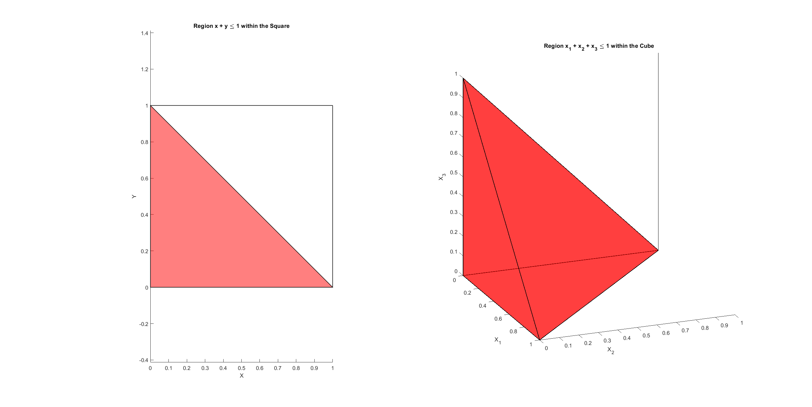
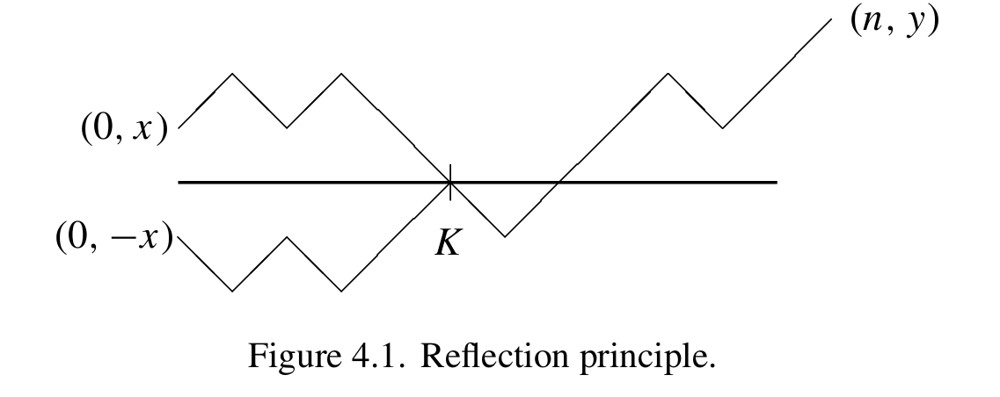
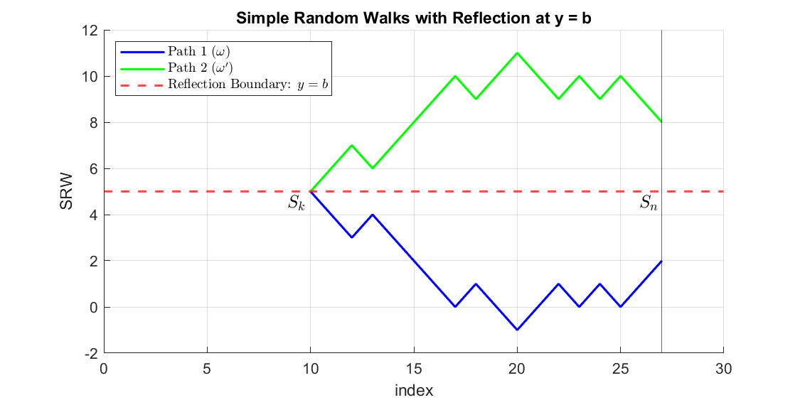

# Chapter 4 Random Walk

- **Definition**. Let $X_1,X_2,...$ be iid random variables in $\mathbb R^d$. Let $S_n=X_1+\cdots+X_n$. Then $\{S_n:n\ge 1\}$ is called random walk. We usually take $S_0=0$. 

  - **Simple Random Walk**: if $P(X_i=1)=P(X_i=-1)=\frac12$, then $\{S_n:n\ge 1\}$ is called a simple random walk (**SRW**) in $\mathbb R^1$. Simple for SRW in $\mathbb R^2$:
    $$
    P(X_i=(1,1))=P(X_i=(1,-1))=P(X_i=(-1,1))=P(X_i=(-1,-1))=\frac14
    $$

  - All definitions and theorems in this chapter focus on whole trajectory: $\{S_n:n\ge 1\}$

- **Four questions to be answered in this chapter about random walk:**

  - Q1: what is long term behaviors like (Theorem 4.1.2)?
  - Q2: probability of the random walk $S_n$ reach $b$ before $n_a$ (Corollary (*))
  - Q3: probability of the random walk $S_n$ will return to $0$ (Theorem 4.2.3)
  - Q4: distribution of time spent above 0 (Lemma 4.3.3)

## 1. Random Walk

- **Permutable event**: An event is permutable (or exchangeable) if it does not change under finite permutation of $\{X_1,X_2,...\}$

  - **More clear definition**: for any index $k>\infty$, if the event $\{X_1,X_2,...,X_k,X_{k+1},...\}$ is the same as $\{X_{n_1^k},X_{n_2^k},...,X_{n_k^k},X_{k+1},...\}$, where $n_1^k,n_2^k,...n_k^k$ are reorganized indices of $1,...,k$. It means the set is permutable if we can change the order of first $k$ elements freely for any finite $k$

  - More general counter-example: is a set represents passwords, then changing order of first $k$ elements could make the set no longer the same as original set. **So essentially, permutable set means whether the set is defined by both *what elements it include* and *the order of the elements***

  - Relation with tail event: 

    - All tail events in $\mathcal T=\cap_{i=1}^\infty\sigma(X_i,X_{i+1},...)$ are permutable. It's because tail events are determined by asymptotic behaviors of a sequence of random variables. Still, think of a tail event example in Chapter 2. No matter how to change the order of first $k$ elements, whether sample mean limit exists is determined by only asymptotic random variables in the sequence. 
      $$
      \text{Example 1}:\quad\begin{align}
      A&\equiv\left\{(\omega_1,\omega_2,...):\lim_{N\to\infty}\frac{X_1+\cdots+X_N}N<\infty\right\}\\
      &=\left\{(\omega_1,\omega_2,...):\lim_{N\to\infty}\frac{X_1+\cdots+X_n}N+\frac{X_{n+1}+\cdots+X_N}N<\infty\right\}\\
      &=\left\{(\omega_1,\omega_2,...):0+\lim_{N\to\infty}\frac{X_{n+1}+\cdots+X_N}N<\infty\right\}\\
      &=\left\{(\omega_{n+1},\omega_{n+2},...):\lim_{N\to\infty}\frac{X_{n+1}+\cdots+X_N}N<\infty\right\}
      \end{align}
      $$

    - Not all permutable events are tail events. E.g.:
      $$
      \text{Example 2}:\;\;\{\limsup_{n\to\infty} S_n\ge c\},\quad\text{where }S_n=\sum_{i=1}^n X_i
      $$
      (note that here we consider more general cases, so $S_n$ need not to be random walk). If we change first $k$ elements sequence, and since $S_n$ is summation, then the total summation does not change for given $(\omega_1,\omega_2,...)$, so it is permutable. It is not tail events because first $k$ elements summation $\sum_{i=1}^k X_i$ could affect whether the limit fulfills $S_n\ge c$ or not

- **Theorem 4.1.1**. Hewitt-Savage 0-1 law. If $A$ is permutable, then $P(A)=0$ or $1$

  - **Why this theorem**: 
    - we are trying to figure out tail characteristics of a sequence of random variables $S_1,...,S_n$. 
    - Kolmogorov’s 0-1 Law shows how tail events being with probability of 0 or 1. 
    - However, random walk, as summation of iid random variables, is not tail event (See Example 1 vs Example 2 in previous bullet point) and thus we cannot use Kolmogorov’s 0-1 Law for random walk
    - But random walk must be permutable. So we use this Hewitt-Savage 0-1 law.
  - The proof will not be proved here.

- **Theorem 4.1.2.** For a random walk on $\mathbb R^1$, one of the following has probability 1:
  $$
  \begin{align}&\mathrm{(i)~}S_n=0\text{ for all }n.\\
  &\mathrm{(ii)~}S_n\to\infty,\text{ as }n\to\infty.\\
  &\mathrm{(iii)~}S_n\to-\infty,\text{ as }n\to\infty.\\
  &\mathrm{(iv)~}-\infty=\lim\inf_{n\to\infty}S_n<\lim\sup_{n\to\infty}S_n=\infty.
  \end{align}
  $$
  **Proof.**

  - By Hewitt-Savage 0-1 law, $\{\limsup_{n\to\infty} S_n\ge c\}$ has probability 0 or 1. 

    - It means for some $c_0\in\mathbb R\cup\{-\infty,\infty\}$, the probability of $\limsup_{n\to\infty} S_n= c_0$ is one. 
    - More clearly put it, it implies for some random walk $S_n$ (a random walk is distinguished from the other means the increment of one random walk has different distribution from the other), there exists some $c_0\in\mathbb R\cup\{-\infty,\infty\}$ such that $\limsup_{n\to\infty} S_n= c_0$ with probability 1.
    - Similarly, for any random walk $S_n$, there exists some $c_0'\in\mathbb R\cup\{-\infty,\infty\}$ such that $\liminf_{n\to\infty} S_n= c_0'$

  - Then it is easy to understand the theorem and its proof like this:

    - the theorems means given some defined random walk, when one statement is true with probability 1, the other 3 statements are false. So four statements means four categories of random walks
    - So we could construct four disjoint scenarios with 1-to-1 mapping relation with four categories of random walks. We need to show four disjoint scenarios could result in four statements respectively. 
    - We construct four scenarios by combinations of varying realized values of $\limsup_{n\to\infty}S_n,\;\limsup_{n\to\infty}S_n$
    - Before considering different combinations of values of $\limsup$ and $\liminf$, we need to show the values could be realized with probability 1 for specific random walk. That is what we did with Hewitt-Savage 0-1 law right now.
    - The below four steps shows how four disjoint scenarios could result in four statements respectively

  - $(\mathrm i)$. $\limsup_{n\to\infty}S_n<\infty$

    - There exists $c_0\in \mathbb R$ (finite real number), such that we have $\limsup_{n\to\infty} S_n= c_0$ with probability one. (Or in convergence representation: $\sup_{m\ge n}S_m\overset{\text{d}}\to c_0$)

    - The $\limsup$ implies equal in distribution and thus:
      $$
      \limsup_{n\to\infty}S_n\stackrel{d}{=}\limsup_{n\to\infty}(S_{n+1}-X_1)=\limsup_{n\to\infty}S_{n+1}-X_1=\limsup_{n\to\infty}S_n-X_1
      $$

    - Since $\limsup_{n\to\infty} S_n= c$ is true with probability 1, it means $X_1=0$ by above inequality

    - More rigorously, let $Y_n=\sup_{m\ge n}S_m$, then according to above equation, we have:
      $$
      \begin{cases}
      Y_n\overset d\to Y_n-X_1\\
      Y_n\overset{\text{d}}\to c_0\\
      \end{cases}\\\quad\Rightarrow\quad\\
      Y_n-Y_n\overset d\to Y_n-Y_n-X_1\quad\Rightarrow\quad\\0\overset d= X_1\;\;(X_1\overset{a.s.}=0\Rightarrow X_1=0)
      $$

    - We can also show $X_2=X_3=\cdots=X_N=0$ by using the below equality in distribution:
      $$
      \limsup_{n\to\infty}S_n\stackrel{d}{=}\limsup_{n\to\infty}(S_{n+k}-S_k)
      $$

    - Then $S_n=0$ for all $n\le N<\infty$ when $c_0\in \mathbb R$

  - $(\mathrm{ii})$. $\limsup_{n\to\infty}S_n=\liminf_{n\to\infty}S_n=\infty$

    - Still, with Hewitt-Savage 0-1 law, we know $\limsup_{n\to\infty}S_n=\liminf_{n\to\infty}S_n=\infty$ could be achieved with probability 1.
    - Hewitt-Savage 0-1 law implies exactly $\lim_{n\to\infty}S_n=\infty$ with probability 1

  - $(\mathrm{iii})$. $\limsup_{n\to\infty}S_n=\liminf_{n\to\infty}S_n=-\infty$

    - Still, with Hewitt-Savage 0-1 law, we know $\limsup_{n\to\infty}S_n=\liminf_{n\to\infty}S_n=-\infty$ could be achieved with probability 1.
    - Hewitt-Savage 0-1 law implies exactly $\lim_{n\to\infty}S_n=-\infty$ with probability 1

  - $(\mathrm{iv})$. $\limsup_{n\to\infty}S_n=\infty,\;\;\liminf_{n\to\infty}S_n=-\infty$

    - Still, with Hewitt-Savage 0-1 law, we know both $\limsup_{n\to\infty}S_n=\infty$ and $\liminf_{n\to\infty}S_n=-\infty$ could be achieved with probability 1.
    - So the two parts could be achieved at the same time with probability 1.

- **Definition**. Let $X_1,X_2,\ldots $ be a sequence of random variables. For the $\sigma$-fields $\mathcal F_n:=\sigma(X_1,...,X_n)$ , the **filtration** is defined as the increasing sequence of the $\sigma$-fields:
  $$
  \{\mathcal F_n\}_{n\in\mathbb N_+}
  $$

  - Note that the filtration could include a trivial element $\mathcal F_0$, which is usually $\{\varnothing,\Omega\}$. This will not affect analysis in this course, and usually we can just consider $n\in\mathbb N_+$ without further specification.
  
- **Definition**. $\tau\in\{1,2\ldots,\}\cup\{\infty\}$ is a **stopping time** or optional random variable, optimal time, Markov time) with respect to the filtration $\{\mathcal F_n\}$ if:
  $$
  \{\tau=n\}\in\mathcal{F}_n,\:\forall\:n=1,2,\ldots
  $$

  - Understanding: stopping time is a random variable that is realized when some specified event happens. 

    - For example: Let $S_n$ be SRW. Then below is a stopping time
      $$
      \tau:=\inf\{n\geq1:S_n=0\}
      $$
      which means find first time that $S_n=0$

    - Since stopping time is random variable, we can model it like this: denote $\omega=(\omega_1,\omega_2,\dots)$, where $\omega_i$ takes sample point $\{H\}$ or $\{T\}$, like a coin flipping, and $X_i(\omega_i=H)=1,X_i(\omega_i=T)=-1$. Then we have below representation of stopping time:
      $$
      \tau(\omega)=\inf\{n\geq1:S_n(\omega)=0\}=\inf\{n\geq1:\sum_{i=1}^\infty X_i(\omega)=0\}
      $$

    - Recall the official definition: $\{\omega:\tau(\omega)=n\}\in\mathcal{F}_n,\:\forall\:n=1,2,\ldots$ It means we can check whether $n$ is the stopping time by checking information up to time $n$: $\mathcal F_n$. We can also write $\tau(\omega)=\tau(X_1(\omega),X_2(\omega),...)$

    - For example, we want to know whether stopping time is $2$, then we check when $\{\omega:\tau(\omega)=2\}$. Apparently, when $\omega\in\{(T,H),(H,T)\}$, we have $S_2=0$. It is easy to verify $\{(T,H),(H,T)\}\subset \mathcal F_2$

    - So essentially, stopping time is a random variable that could be realized as $n\in\mathbb N_+$. The official definition means if we impose a rule for a critical time based on randomness of the sequence of random variables and whether the critical time is at time $n$ could be determined by $\mathcal F_n$, then it is a stopping time

  - Remark. Equivalent definitions of stopping times :
    $$
    \begin{align}
    \mathrm{(i)~}&\{\tau=n\}\in\mathcal{F}_n\\
    \mathrm{(ii)~}&\{\tau\leq n\}\in\mathcal{F}_n\\
    \mathrm{(iii)~}&\{\tau\geq n+1\}\in\mathcal{F}_n\\
    \end{align},\quad\forall n\in\mathbb N_+
    $$

    - Note the key for below equivalence is $\{\tau=1\},\{\tau=2\},...$ are mutually disjoint, i.e., if stop at this time point, it cannot stop at the other time points. It is also true that $\{\tau\le n-1\}$ and $\{\tau=n\}$ are disjoint.

    - Proof of $\mathrm{(i)}\Leftrightarrow\mathrm{(ii)}$
      $$
      \begin{align}
      &\Rightarrow:\quad \{\tau\leq n\}=\cup_{k=1}^\infty\{\tau= n\}\in\mathcal F_n\\
      &\Leftarrow:\quad \{\tau= n\}=\underbrace{\{\tau\le n\}}_{\in\mathcal F_n}\backslash\underbrace{\{\tau\le n-1\}}_{\in\mathcal F_{n-1}\subset\mathcal F_n}\in\mathcal F_n\\
      \end{align}
      $$

    - Proof of $\mathrm{(ii)}\Leftrightarrow\mathrm{(iii)}$
      $$
      \begin{align}
      &\Rightarrow:\quad \{\tau\ge n+1\}=\{\tau\le n\}^c\in\mathcal F_n\\
      &\Leftarrow:\quad \{\tau\le n\}=\{\tau\ge n+1\}^c\in\mathcal F_n\\
      \end{align}
      $$

    - Also, intrusively, definition $\mathrm{(ii)}$ means we can check whether the stopping time is at or before $n$ could be determined by each realized path of $\mathcal F_n$; $\mathrm{(iii)}$ means we can check whether the stopping time is at or after $n$ could be determined by each realized path of $\mathcal F_n$
    
  - Fact. if $\tau_1,\tau_2$ are both stopping times w.r.t. $\{\mathcal F_n\}$, then $\tau_1\wedge\tau_2,\;\tau_2\vee\tau_2,\;\tau_2+\tau_2$ are all stopping times w.r.t. $\{\mathcal F_n\}$. Some explanations:

    - $\tau_1\wedge\tau_2$: imagine they are stopping times of two SRW that satisfying two different conditions (regarded as two random variables). It means if we know some realized path of $\{\mathcal F_n\}$, we can check whether minimum of two stopping time is at time $n$. We can prove it is stopping time by:
      $$
      \{\omega:\tau_1(\omega)\wedge\tau_2(\omega)\ge n+1\}=\underbrace{\{\omega:\tau_1(\omega)\ge n+1\}}_{\in\mathcal F_n}\cap\underbrace{\{\omega:\tau_2(\omega)\ge n+1\}}_{\in\mathcal F_n}\in\mathcal F_n
      $$

    - $\tau_1\vee\tau_2$: We can check whether maximum of two stopping times is at time $n$ by certain realized path of $\{\mathcal F_n\}$. Proof:
      $$
      \{\omega:\tau_1(\omega)\vee\tau_2(\omega)\le n\}=\underbrace{\{\omega:\tau_1(\omega)\le n\}}_{\in\mathcal F_n}\cap\underbrace{\{\omega:\tau_2(\omega)\le n\}}_{\in\mathcal F_n}\in\mathcal F_n
      $$

    - $\tau_1+\tau_2$: imagine two consecutive stopping times. The summation operation here is usually based on some condition on $\tau_1,\tau_2$, like $\tau_2$ is stopping time given information after $\tau_1$:
      $$
      \tau_1=\inf\{n\geq1:S_n=0\}\\
      \tau_2=\inf\{n>\tau_1:S_n=0\}-\tau_1
      $$
      proof like:
      $$
      \{\omega:\tau_1(\omega)+\tau_2(\omega)=n\}=\bigcup_{k=1}^{n-1}\{\omega:\tau_1(\omega)=k\}\cap\{\omega:\tau_2(\omega)=n-k\}\in\mathcal F_n
      $$

  - Revisit the example: Let $X_1,X_2,...$ be a sequence of random vectors in $\mathbb R^d$ and:
    $$
    \mathcal{F}_n:=\sigma(X_1,\ldots,X_n)
    $$
    Let $S_n=X_1+\cdots+X_n$ and $A$ be a measurable subset of $\mathbb R^d$. Then:
    $$
    \tau:=\inf\{n\geq1:S_n\in A\}
    $$
    is a stopping time. Proof is simple:
    $$
    \{\tau(\omega)=n\}=\{\omega:S_n(\omega)\in A\text{ and } \forall k\in\{1,..,n-1\}:S_k\not\in A\}\in\sigma(X_1,...,X_n)
    $$

- **Theorem 4.1.5**. Wald Equation. Let $X_1,X_2,...$ be iid. $\tau$ is a stopping time. If $E|X_1|<\infty,\; E\tau<\infty$, and $S_\tau=\sum_{i=1}^\tau X_i$, then:
  $$
  E(S_\tau)=E(X_1)E(\tau)
  $$
  **Proof:**

  - First consider the case $X_i\ge 0$. We have:
    $$
    \begin{aligned}
    E(S_\tau)&=E(\sum_{i=1}^\tau X_i)\\
    &=E(\sum_{i=1}^\infty X_i1_{\{\tau\geq i\}})\\
    &=\sum_{i=1}^\infty E(X_i1_{\{\tau\geq i\}})&\text{(Fubini)}\\
    &=\sum_{i=1}^\infty E(X_i)E(1_{\{\tau\geq i\}})&\text{(}\{\tau\geq i\}\in\mathcal{F}_{i-1})\\
    &=E(X_i)\cdot\sum_{i=1}^\infty E(1_{\{\tau\geq i\}})&(\text{iid }X_i)\\
    &=E(X_1)E(\tau)&(\text{Fubini Lemma})
    \end{aligned}
    $$
    
  - Note that in general cases, we can replace above $X_i$ with $|X_i|$ from second line, and all the rest operations are the same. So we have:
    $$
    \begin{aligned}
    E(\sum_{i=1}^\infty |X_i|1_{\{\tau\geq i\}})&=\sum_{i=1}^\infty E(|X_i|1_{\{\tau\geq i\}})&\text{(Fubini)}\\
    &=\cdots&(\text{same as when }X_i\ge 0)\\
    &=E(|X_1|)E(\tau)<\infty &(\text{last result})
    \end{aligned}
    $$
    then it means:
    $$
    \begin{aligned}
    E(S_\tau)&=E(\sum_{i=1}^\tau X_i)\\
    &=\sum_{i=1}^\infty E(X_i1_{\{\tau\geq i\}})&\text{(Fubini)}\\
    &=\cdots&(\text{same as when }X_i\ge 0)\\
    &=E(X_1)E(\tau)
    \end{aligned}
    $$

- **Theorem 4.1.6**. Wald's Second Equation. Let $X_1,X_2,...$ be iid and $\tau$ is a stopping time. If
  $$
  EX_1=0,\quad EX_1^2=\sigma^2<\infty,\quad E\tau<\infty,
  $$
  then:
  $$
  E(S_\tau^2)=\sigma^2E(\tau)
  $$
  **Proof:**

  - We can write:
    $$
    S_{\tau\wedge n}^2=S_{\tau\wedge(n-1)}^2+(2X_nS_{n-1}+X_n^2)1_{\{\tau\geq n\}}
    $$

    - think whLen $\tau\ge n$, then $S_{\tau\wedge n}^2=S_{n}^2=(S_{n-1}+X_n)^2$
    - when $\tau\le n-1$, then $S_{\tau\wedge n}^2=S_{\tau}^2=S_{\tau\wedge (n-1)}^2$
    - So above representation holds

  - Then the expectation of $S_{\tau\wedge n}^2$ is:
    $$
    \begin{aligned}
    ES_{\tau\wedge n}^{2}&=ES_{\tau\wedge(n-1)}^2+E\big[2X_n\underbrace{S_{n-1}1_{\{\tau\geq n\}}}_{\in\mathcal F_{n-1}}\big]+E[X_n^21_{\{\tau\geq n\}}]\\
    &=ES_{\tau\wedge(n-1)}^2+0+\sigma^2P(\tau\geq n)&\text{(indep of disjoint info)}
    \end{aligned}
    $$

  - We can iterate $ES_{\tau\wedge n}^{2}=ES_{\tau\wedge(n-1)}^2+\sigma^2P(\tau\geq n)$ and get:
    $$
    ES_{\tau\wedge n}^{2}=\sigma^2\sum_{i=1}^n P(\tau\geq i)
    $$

  - then letting $n\to\infty$ gives the result because:
    $$
    LHS=ES_{\tau\wedge n}^{2}\to ES^2_{\tau}\\
    RHS=\sigma^2\sum_{i=1}^n P(\tau\geq i)\to \sigma^2\sum_{i=1}^\infty P(\tau\geq i)=\sigma^2 E(\tau)
    $$
    More strict proof sketch:

    - It is easy to see that $\{S_{\tau\wedge n}^{2}\}_{n\in\mathbb N_+}$ is a Cauchy sequence in $\mathcal L^2$ because:
      $$
      E(S_{\tau\wedge n}-S_{\tau\wedge m})^2=\sigma^2\sum_{i=m+1}^n P(\tau\ge i)\\\Downarrow\\
      \operatorname*{sup}_{m,n\geq N}\|S_{\tau\wedge m}-S_{\tau\wedge n}\|_{2}\to0\text{ as }N\to\infty
      $$

    - According to completeness of the Cauchy sequence:
      $$
      \lim_{n\to\infty}E|S_{\tau\wedge n}-S'|^2=0
      $$

    - Since $S_{\tau\wedge n} = S_\tau$ for sufficiently large $n$, then $S_{\tau\wedge n}$ converges to $S_\tau$ almost surely. Here, we can deduce verify convergence in $L^2$. 
      
    - Since convergence in $L^2$ implies [convergence of second moment](https://math.stackexchange.com/questions/2379508/does-l2-convergence-implies-convergence-of-the-second-moments), we have:
      $$
      E(S^2_\tau)=\lim_{n\to\infty}E(S^2_{\tau\wedge n})=\sigma^2E(\tau)
      $$

- Example 1. Let $X_1,X_2,...$ be i.i.d. $U(0,1)$. $S_n=X_1+\cdots+X_n$. Let $\tau:=\inf\{n:S_n> 1\}$. Then:
  $$
  E(\tau)=e,\quad E(S_\tau)=\frac e2
  $$
  **Proof.** 

  - We have:
    $$
    \begin{aligned}
    P(\tau>n)&=P(S_n\leq1)&(\text{think of }\tau:=\inf\{n:S_n\ge 1\})\\
    &=\int_0^1\cdots\int_0^11_{\{x_1+\cdots+x_n\leq1\}}dx_1\cdots dx_n&\text{(from the uniform distribution)}\\
    &=\int_0^1\int_0^{y_n}\cdots\int_0^{y_2}dy_1dy_2\cdots dy_n&\text{(by a change of variable)}\\
    &=\frac1{n!}.\end{aligned}
    $$

    - For the first line, it could be understood as: if stopping time $\tau>n$, it means time time $n$, the random walk $S_n$ has not yet reach the condition to stop, which mans $S_n\ge 1$ does not hold

    - For second line, consider $P(S_n\le 1)=E1_{(S_n\le 1)}$

    - For third line, first consider two-dimension version: $\int_0^1\int_o^{y_2}dy_1=\frac12$, i.e., the integral is actually area of intersection between $x_1+x_2\le 1$ and unit area $[0,1]^2$. Similarly, for three dimensions, it means volume of intersection of $x_1+x_2+x_3\le 1$ and $[0,1]^3$ 

      

  - Then we have:
    $$
    E(\tau)=\sum_{n=0}^\infty P(\tau>n)=e\\\Downarrow(\text{by Wald 1st Equation})\\
    E(S_\tau)=E(X_1)E(\tau)=\frac e2
    $$

- **Example 2**. Let $X_1,X_2,...$ be i.i.d. with $P(X_1=1)=P(X_1=-1)=\frac12$. Let $S_n=X_1+\cdots+X_n$ (SRW). Let $a,b$ be two integers with $a<0<b$.. Let:
  $$
  \tau:=\inf\{n:S_n\notin(a,b)\}
  $$
  then:
  $$
  \begin{aligned}
  &1.\quad E(\tau)<\infty,\\
  &2.\quad S_\tau=a\text{ or }b,\\
  &3.\quad P(S_\tau=a)=\frac b{b-a},\quad P(S_\tau=b)=\frac{-a}{b-a},\\
  &4.\quad E(\tau)=E(S_\tau^2)=(-a)b.
  \end{aligned}
  $$
  **Proof** ([additional reference](https://people.math.wisc.edu/~roch/grad-prob/gradprob-notes12.pdf))

  - $E(\tau)<\infty$:

    - Firstly We have:
      $$
      E(\tau)=\sum_{i=0}^\infty P(\tau>i)\le (b-a)\sum_{k=1}^\infty P(\tau>k(b-a))
      $$

      - Imagine $\sum_{i=0}^\infty P(\tau>i)$ is grouped into blocks of size $b-a$:
        $$
        [k(b-a),\;(k+1)(b-a)-1],\quad k=0,1,2,...
        $$

      - It means the first block $k=0$ would capture index $i=0,1,...,b-a-1$, and second block captures $i=b-a,b-a+1,...,2(b-a)-1$

      - So Now we represent $E(\tau)$ as:
        $$
        E(\tau)\equiv\sum_{i=0}^\infty P(\tau>i)=\sum_{k=0}^\infty\sum_{i=k(b-a)}^{(k+1)(b-a)-1}P(\tau>i)
        $$

      - Given any stopping time and any $i_0\in\mathbb N_+$, we must have $P(\tau>i_0+1)\le P(\tau>i_0)$. Intuitively, if stopping time is after $i_0+1$, then it must also be after $i_0$. So $\{\tau>i_0+1\}\subset\{\tau>i_0\}$ and thus the probability is non-increasing.

      - So within each block, we have $P(\tau>i)\le P(\tau>k(b-a))$ for all $i=k(b-a),k(b-a)+1,...(k+1)(b-a)-1$ in the block, and then have:
        $$
        \sum_{i=k(b-a)}^{(k+1)(b-a)-1}P(\tau>i)\le (b-a)P(\tau>k(b-a))
        $$

    - Now we consider the probability:
      $$
      P(\tau>k(b-a))\le\left(1-\frac1{2^{b-a}}\right)^k
      $$

      - First let's see the LHS event is $\{\tau>k(b-a)\}$, which means for all first $k$ blocks the stopping time is not realized, i.e., there is no $S_n\in(a,b)$ within these blocks.

      - For RHS, consider the event: $A_i=\{(X_{(i-1)(b-a)+1},...,X_{i(b-a)})=\vec 1\},i=1,2,...,k$, which means $S_n$ must realize a stopping time in this block. Understand in this way: for path $\omega\in A_i$, it will make $S_{i(b-a)}-S_{(i-1)(b-a)}$ (which is increment across the block) to be $b-a$. Increment of $b-a$ must make the random walk exit $(a,b)$ in this block, no matter where the initial point of the block is. So paths in this event will make stopping time realized in the block.

      - So for each block, the probability of $A_i^c$ is $\left(1-\frac1{2^{b-a}}\right)$, which means random walk will not realize a stopping time in a strong degree (by strong degree I mean $A_i$ defined above is a quite special and strong scenario to make stopping time realized). Now consider $\cap_{i=1}^kA_i^c$. It include scenarios of non-strong realizing stopping time, and also all scenarios that stopping time is not realized in all first $k$ blocks, i.e., $\{\tau>k(b-a)\}$ is a subset of $\cap_{i=1}^kA_i^c$

      - So probability measure property implies the inequality
        $$
        P(\tau>k(b-a))\le\left(1-\frac1{2^{b-a}}\right)^k
        $$

    - Finally, 
      $$
      \begin{align}
      E(\tau)&=\sum_{i=0}^\infty P(\tau>i)\\
      &\le (b-a)\sum_{k=1}^\infty P(\tau>k(b-a))&(\text{previous result})\\
      &\le(b-a)\sum_{k=1}^\infty\left(1-\frac1{2^{b-a}}\right)^k<\infty&(\text{geometric summation})
      \end{align}
      $$

  - $S_\tau=a\text{ or }b$ is obvious. Consider $\tau=\inf\{n:S_n\notin(a,b)\}$. When there is critical transformation at two time points $\tau-1,\tau$, it implies $S_{\tau-1}\in (a,b)\cap Z$ and $S_{\tau}\in (a,b)^c\cap Z$. Also since $S_{\tau}-S_{\tau-1}=\pm1$, so $S_{\tau}$ must be edge points of $(a,b)^c$, which is $a$ or $b$

  - $P(S_\tau=a)=\frac b{b-a},\;\; P(S_\tau=b)=\frac{-a}{b-a}$:

    - By Wald’s First equation and previous statement, we have:
      $$
      E(S_\tau)\equiv a\cdot P(S_\tau=a)+b\cdot P(S_\tau=b)\overset{\text{Wald}}= E(X_1)E(\tau)=0\\\Downarrow\\
      a\cdot P(S_\tau=a)+b\cdot P(S_\tau=b)=0
      $$

    - Together with $P(S_\tau=a)+P(S_\tau=b)=1$, we can solve with:
      $$
      P(S_\tau=a)=\frac b{b-a},\quad P(S_\tau=b)=\frac{-a}{b-a}
      $$

  - $E(\tau)=E(S_\tau^2)=-ab$

    - With Wald’s Second equation and since $\sigma^2=1$, we know:
      $$
      E(S_\tau^2)=\sigma^2E(\tau)=1
      $$

    - Given $P(S_\tau=a)=\frac b{b-a},\;\; P(S_\tau=b)=\frac{-a}{b-a}$, we know:
      $$
      E(S_\tau^2)=\frac{b}{b-a}\cdot a^2+\frac{-a}{b-a}\cdot b^2=-ab
      $$

  - **Corollary (*)** from this proof: 

    - Let $T_a=\inf\{n:S_n=a\},\;\;T_b=\inf\{n:S_n=b\}$, then
      $$
      \frac {b}{b-a}=P(S_\tau=a)\equiv P(T_a<T_b)\quad\mathrm{for~}a<0<b
      $$
      because they both means $S_n$ reaches $a$ first. 

    - Set $b=M$ and let $M\to\infty$, then we have:
      $$
      P(T_a<\infty)\ge P(T_a<T_M)\to1
      $$
      note we do not use $P(T_a<T_M)\to P(T_a<\infty)$ as $M\to\infty$ because this notation requires proof that include joint distribution of $T_a,T_M$, which could be complicated. So here we apply a more straightforward way to discuss on the relation, and here it may also be represented as:
      $$
      P(T_a<\infty)\ge \sup_M\frac{M}{M-a}=1\Rightarrow P(T_a<\infty)=1
      $$
      also note it is true for all $a<0$

    - Note we can also prove $P(T_b<\infty)=1$ by using:
      $$
      \frac {-a}{b-a}=P(S_\tau=b)\equiv P(T_b<T_a)\quad\mathrm{for~}a<0<b\\\Downarrow\\
      P(T_b<\infty)\ge P(T_b<T_M)\to1
      $$

    - Also, the trivial case $T_0=\inf\{n:S_n=0\}$ means $P(T_0<\infty)=1$ (in fact, $P(T_0=0)=1$). So we know $T_x=\inf\{n:S_n=x\}$ fulfills $P(T_x<\infty)=1$ for all $x\in\mathbb Z$

## 2. Recurrence vs. Transience

- **Setup**. 

  - **Study focus**: whether random processes will ever return to its initial position. 
  - **Returning Time** defined on SRW on $\mathbb R^d$ is:

  $$
  \begin{aligned}\tau_1&=\inf\{m\geq1:S_m=0\},\\\tau_n&=\inf\{m>\tau_{n-1}:S_m=0\}.\end{aligned}
  $$

  - **Recurrent**: $P(\tau_1<\infty)=1$
  - **Transient**: $P(\tau_1<\infty)=1$

- **Theorem**. The following are equivalent (*equivalent definitions of recurrence*):
  $$
  \begin{align}
  \mathrm{(i)~}&P(\tau_1<\infty) = 1.\\
  \mathrm{(ii)~}&P(\tau_n<\infty)= 1,\;\forall\:n = 1,2,3,...\\
  \mathrm{(iii)~}&P(S_m = 0\:i.o.) = 1.\\
  \mathrm{(iv)~}&\sum_{m = 1}^\infty P(S_m = 0) = \infty.
  \end{align}
  $$
  **Proof:**

  - $\mathrm{(ii)}\Rightarrow\mathrm{(i)}$: let $n=1$, then result follows

  - $\mathrm{(i)}\Rightarrow\mathrm{(ii)}$:

    - First we show $P(\tau_1<\infty)$ could imply $P(\tau_1<\infty)$:
      $$
      \begin{aligned}
      P(\tau_2<\infty)&=P(\tau_1<\infty,\tau_2-\tau_1<\infty)\\
      &=\sum_{m,n=1}^\infty P(\tau_1=m,\tau_2-\tau_1=n)\\
      &=\sum_{m,n=1}^\infty P\left(\begin{align}&X_1+\cdots+X_m=0,X_1+\cdots+X_u\neq0,\forall~1\leq u<m
      \\&\quad\quad\quad\quad\quad\quad\quad\quad\quad\quad\quad\text{ and }\\
      &X_{m+1}+\cdots+X_{m+n}=0,X_{m+1}+\cdots+X_{m+v}\neq0,\forall~1\leq v<n\end{align}\right)\\
      &=\sum_{m,n=1}^\infty P(\tau_1=m)P(\tau_1=n)&\text{(by i.i.d. assumption)}\\
      &=[P(\tau_1<\infty)]^2
      \end{aligned}
      $$

    - Similarly, we can prove $P(\tau_3<\infty)=[P(\tau_2<\infty)]^2$, and iterations shows $P(\tau_n<\infty)=(P(\tau_1<\infty))^n=1$

  - $\mathrm{(iii)}$ is equivalent to $\mathrm{(i)}$ and $\mathrm{(ii)}$ because of its meaning:

    -  $1=P(S_m = 0\:i.o.)\equiv P(\cap_{n=1}^\infty\cup_{m=n}^\infty \{S_m=0\})$
    - It means the statement is certain to happen: for any $n\ge 1$, there is some $m\ge n$ such that $S_m=0$. In other word, for some $n_1$, we can find some $m\ge n_1$ such that $S_m=0$, i.e., $\tau_1=m$; then for some $n_2>\tau_1=m\ge n_1$, we can find some $m\ge n_2$ such that $\tau_2=m$; The iterations continuous and $\mathrm{(ii)}$ holds

  - $\mathrm{(iv)}$ is equivalent to $\mathrm{(i)}$

    - We can show:
      $$
      \begin{aligned}
      \sum_{m=1}^\infty P(S_m=0)&=\sum_{m=1}^\infty E1_{\{S_m=0\}}=E\sum_{m=1}^\infty1_{\{S_m=0\}}&(\text{Fubini})\\
      &=E\sum_{n=1}^\infty1_{\{\tau_n<\infty\}}&\text{(both count the number of times the SRW is at 0)}\\
      &=\sum_{n=1}^\infty E1_{\{\tau_n<\infty\}}=\sum_{n=1}^\infty P(\tau_n<\infty)&(\text{Fubini again})\\
      &=\sum_{n=1}^\infty(P(\tau_1<\infty))^n
      \end{aligned}
      $$

    - Note that the key point here is both $1_{\{S_m=0\}}$ and $1_{\{\tau_n<\infty\}}$ means indicator of whether it is a stopping time that makes SRW to be zero

    - Note that $\sum_{m=1}^\infty P(S_m=0)=\infty$ if and only if $P(\tau_1<\infty)=1$

- **Theorem 4.2.3**. Simple random walk is recurrent in $\mathbb R^1$ and $\mathbb R^2$, and is transient in $\mathbb R^d$ for $d\ge 3$. Proof:

  - In $\mathbb R^1$:
    $$
    \begin{aligned}\sum_{m=1}^\infty P(S_m=0)&=\sum_{n=1}^\infty P(S_{2n}=0)&\text{(can only return to 0 at even steps)}\\&=\sum_{n=1}^\infty\binom{2n}n\frac1{2^{2n}}&\text{(combinatorics)}\\&\sim\sum_{n=1}^\infty\frac{\sqrt{2\pi2}n(\frac{2n}e)^{2n}}{(\sqrt{2\pi n}(\frac ne)^n)^2}\frac1{2^{2n}}&\text{(Stirling's formula)}\\&=\sum_{n=1}^\infty\frac1{\sqrt{\pi n}}=\infty;\end{aligned}
    $$

    - note the reason why $P(S_{2n}=0)=\binom{2n}n\cdot\frac1{2^{2n}}$ is because we have $2^{2n}$ potential paths, and to make $S_{2n}=0$, we need to let half of $2n$, i.e., $n$ steps in each path to have up direction $+1$.
    - Stirling's formula is a way to approximate factorials 

  - In $\mathbb R^2$:
    $$
    \begin{aligned}\sum_{m=1}^\infty P(S_m=0)&=\sum_{n=1}^\infty P(S_{2n}=0)&\text{(can only return to 0 at even steps)}\\&=\sum_{n=1}^\infty\binom{2n}n^2\frac1{4^{2n}}&\text{(combinatorics)}\\&\sim\sum_{n=1}^\infty\frac1n=\infty
    \end{aligned}
    $$

  - In $\mathbb R^3$: $\sum_{m=1}^\infty P(S_m=0)=\sum_{n=1}^\infty P(S_{2n}=0)\sim\sum_{n=1}^\infty\frac1{n^{3/2}}<\infty$, hence it is transient. In higher dimensions , the probability becomes smaller and hence transient

- **Extension of Theorem 4.2.3.**

  - For $a,b\in\mathbb Z^d$, we define the first time a random walk starting from $a$ reaches $b$:
    $$
    \tau_{a\to b}:=\inf\{m\geq1:a+S_m=b\}
    $$

  - It can be proved that:
    $$
    P(\tau_1<\infty)=1\text{ if and only if }P(\tau_{a\to b}<\infty)=1,\:\forall\:a,b\in\mathbb Z^d
    $$

    Note $\Leftarrow$ is easy to show by: let $a=b=0$, then $\tau_{a\to b}\equiv\tau_1$. Now we show $\Rightarrow$ in more details:
    
    - define $S'_n=S_n-(b-a)$ and $\tau'=\inf\{m\ge 1: S'_m=0\}$. Then it means:
    
    $$
      \tau_{a\to b}\equiv\tau'
    $$
    
    - So we only need to show $P(\tau'<\infty)=1$ if $P(\tau_1<\infty)=1$.
      $$
      \begin{aligned}
      P(\tau'<\infty)&=\sum_{m=1}^\infty P(\tau'=m)\\
      &=\sum_{m=1}^\infty P(X_1+\cdots+X_m=0,X_1+\cdots+X_u\neq0,\forall~1\leq u<m)\\
      &=\sum_{m=1}^\infty P(\tau_1=m)=P(\tau_1<\infty)
      \end{aligned}
      $$
    
    - Note the key point is: for shifted $S_n'$, the newly defined stopping time $\tau'$ is equivalent to $\tau_{a\to b}$, which means any event defined on the same measurable space is the same. The increment of $S'_n$ distributions are essentially with $S_n$, and both $P(\tau'<\infty)$ and $P(\tau_1<\infty)$ could be expanded into these increment $X_i$, which make the $P(\tau'<\infty)=P(\tau_1<\infty)$
    
  - Now we can link Theorem 4.2.3 to an interesting claim: [a drunk man will eventually find his way home, but a drunk bird may get lost forever](https://medium.com/@shuchen.wu2/a-drunk-man-will-find-his-way-home-but-a-drunk-bird-may-get-lost-forever-cc395dcbc2bb):
  
    - Theorem 4.2.3 implies $P(\tau_1<\infty)$, which means there is finite $m\ge 1$ such that $S_m=0$. So intuitively, a 2-dimension (or 1-dimension) SRW will return to the starting point of zero. 
    - In above claim, the full scene  is: the drunk man is leaving from the starting point (say, the bar). For each step, he will walk with $(E,S),(E,N),(W,S),(W,N)$, and the notation means four directions of east, west, south, north. It could resemble a 2-dimension SRW, and Theorem 4.2.3 means the drunk man could eventually return to the bar (eventually means he could return to the bar with finite steps with probability 1, even though the number of steps could be quite large)
    - However, for a bird who could fly in three-dimension space, it resembles a 3-dimension SRW, and Theorem 4.2.3 tells us the probability that the bird return to its starting point with finite steps is less than 1, so the bird may fly forever but never return to starting point
    - Since $P(\tau_{a\to b}<\infty)=1$ is equivalent to $P(\tau_1<\infty)$, we know Theorem 4.2.3 could be extended to the scenario when $S_m=x$ for all $x\ne 0$, so above drunk guy not only can return to the bar within finite step, but also can return home within finite steps.

## 3. Refection Principle and Arcsine Distribution

- **Theorem**. Reflection Principle. If $x,y>0$, then the number of paths from $(0,x)$ to $(n,y)$ that are o at some time is equal to the number of paths from $(0,-x)$ to $(n,y)$
  
  
  
  - Note the theorem is intuitive from the graph
  - Also, the starting point could be symmetric around any point, see below theorem:
  
- **Theorem**. (Refection Principle). Consider simple random walk in $\mathbb R^1$: $X_{1},X_{2},\dots $ be i.i.d. with $P(X_1=1)=P(X_1=-1)=\frac12$, $S_n=X_1+\cdots+X_n$. For any positive integer $b$, we have:
  $$
  P(\max_{1\leq k\leq n}S_k\geq b)=2P(S_n>b)+P(S_n=b)
  $$
  **Proof:**

  - By total probability law:
    $$
    \begin{aligned}&P(\max_{1\leq k\leq n}S_k\geq b)\\=&P(\max_{1\leq k\leq n}S_k\geq b,S_n>b)+P(\max_{1\leq k\leq n}S_k\geq b,S_n<b)+P(\max_{1\leq k\leq n}S_k\geq b,S_n=b).\end{aligned}
    $$

  - The first two terms are equal because of reflection principle:

    - Let's see the two events:
      $$
      A=\{\max_{1\leq k\leq n} S_k\ge b,\;S_n>b\}=\{\max_{1\leq k\leq n} S_k\ge b\}\cap\{\;S_n>b\}\\
      B=\{\max_{1\leq k\leq n} S_k\ge b,\;S_n>b\}=\{\max_{1\leq k\leq n} S_k\ge b\}\cap\{\;S_n<b\}\\
      $$

    - It is obvious that both $A,B\subset\{\omega:\max_{1\leq k\leq n} S_k(\omega)\ge b\}=C$. So for any given $\omega\in C$, there exist some $k\in[1,n]\cap\mathbb Z$ such that $S_k\ge b$. Note that the random walk is SRW, it means the first $k$ that makes $S_k\ge b$ must fulfills $S_k=b$. 

    - Then according to reflection principle, we know for whichever path that finally make $S_n(\omega)>b$, there must exist a symmetric path around $y=b$ such that $S_n(\omega')<b$. See plot below:

      
    
    - So the number of paths $\omega$ such that $S_n(\omega)>b$ is the same the number of paths such that $S_n(\omega')<b$, which means $P\{S_n>b\}=P\{S_n<b\}$, and thus $P(A)=P(B)$
    - The reflection means the probability for two events are equal
    - For more official definition for reflection principle, see Theorem 4.3.1. Reflection principle in PTE textbook
    
  - Note that $\{\max_{1\leq k\leq n} S_k\ge b\}\supset\{\;S_n>b\}$, and $\{\max_{1\leq k\leq n} S_k\ge b\}\supset\{\;S_n=b\}$ then we know:
    $$
    P[\{\max_{1\leq k\leq n} S_k\ge b\}\cap\{\;S_n>b\}]=P(S_n>b)\\
    P[\{\max_{1\leq k\leq n} S_k\ge b\}\cap\{\;S_n=b\}]=P(S_n=b)
    $$

  - So 
    $$
    P(\max_{1\leq k\leq n}S_k\geq b)=2P(S_n>b)+P(S_n=b)
    $$

- **Combinations of Simple Random Walk Paths**

  - Suppose there are some paths that starting from $(0,0)$ to $(n,x)$, which denotes the paths from $S_0=0$ to $S_n=x$. 

  - Suppose there are $a$ positive steps and $b$ negative steps. Then we have:
    $$
    \begin{cases}
    x=a-b,\\
    n=a+b
    \end{cases}\quad\Rightarrow\quad\\
    \begin{cases}
    a=(n+x)/2,\\
    b=(n-x)/2
    \end{cases}
    $$

  - Note that the above $a$ and $b$ are well defined as integer under SRW. It is because $S_n$ is even for every even $n$ and so it odd number. That means $n+x,n-x$ must be even and dividing them by 2 must be integer. **Which means as long as we want to know $S_n=x$, we know number of positive steps and negative steps**

  - We represent the number of paths the simple random walk starting from $(0,0)$ to $(n,x)$ as:
    $$
    N_{n,x}=\binom na=\binom nb
    $$

- **Theorem 4.3.2**. Ballot theorem. Suppose in an election candidate $A$ get $\alpha$ votes, and candidate $B$ get $\beta$ votes where $\beta<\alpha$. The probability that throughout the counting $A$ always leads $B$ is $\frac{\alpha-\beta}{\alpha+\beta}$.

  - Let $x=\alpha-\beta,\;n=\alpha+\beta$. This could be modeled into SRW: 

    - $\alpha$ is number of positive steps, while $\beta$ is number of negative steps. So we consider $S_k$ to be the number of votes that candidate $A$ leads $B$ after counting $k$ voting sheet. Since we require $A$ always leads $B$, it means $S_k>0$ for all $k=1,..,n$
    - Eventually $A$ leads $B$ by $\alpha-\beta$, which means  $S_n=\alpha-\beta$; There are $n=\alpha+\beta$ vote sheets in total, because the votes are either for $A$ or $B$

  - Since we require the $A$ leads $B$ all the time, we firstly need the first vote sheet is for $A$, so we consider paths that starting from $S_1=1$. 

    - Now that there are $n-1$ steps to reach $S_n=x$, and we know the number of positive steps are now $\alpha-1$. 
    - So number of paths from $(1,1)$ to $(n,x)$ is:

    $$
    N_{n-1,x-1}=\binom{n-1}{\alpha-1}
    $$

  - Then we consider number of paths from $(1,-1)$ to $(n,x)$, which is:
    $$
    N_{n-1,x+1}=\binom{n-1}{\alpha}
    $$

    - Note that all paths from $(1,-1)$ to $(n,x)$ must touch zero at some point before $(n,x)$ because $x>0$
    - With reflection principle, we know any path from $(1,-1)$ to $(n,x)$  has a corresponding path among the paths from $(1,1)$ to $(n,x)$, and therefore these corresponding paths from $(1,1)$ to $(n,x)$ all touches zero at some point before $(n,x)$, and the number of these paths are the same as the number of paths from $(1,-1)$ to $(n,x)$. So it means a 1-to-1 relation.
    - Also, except for these corresponding paths from $(1,1)$ to $(n,x)$, there is no any other paths  from $(1,1)$ to $(n,x)$ who touches zero. It is because if there exists some, according to reflection principle, it has a corresponding path from $(1,-1)$ to $(n,x)$, which contradicts the fact that we already has mapped all paths from $(1,-1)$ to $(n,x)$ to paths in $(1,1)$ to $(n,x)$

  - So the number of paths from $(1,1)$ to $(n,x)$ that never touches zero, i.e., $S_k>0$ for all $k=1,...,n$, is:
    $$
    \begin{aligned}N_{n-1,x-1}-N_{n-1,x+1}&=\binom{n-1}{\alpha-1}-\binom{n-1}{\alpha}\\&=\frac{(n-1)!}{(\alpha-1)!(n-\alpha)!}-\frac{(n-1)!}{\alpha!(n-\alpha-1)!}\\&=\frac{\alpha-(n-\alpha)}n\cdot\frac{n!}{\alpha!(n-\alpha)!}=\frac{\alpha-\beta}{\alpha+\beta}N_{n,x}\end{aligned}
    $$

    - Note that for all above we count paths from $(1,1)$ or $(1,-1)$, not from $(0,1)$. It does not matter because the first step $S_1=1$ is sufficient condition for $S_k>0$ for all $k=1,...,n$, so all paths that make $S_k>0$ is equivalent to counting paths from $(1,1)$ to $(n,x)$
    - So we know the probability that $A$ always leads $B$ is $\frac{\alpha-\beta}{\alpha+\beta}$

- **Lemma 4.3.3**. For a simple random walk, we have this equality: 
  $$
  P(S_1\neq0,\ldots,S_{2n}\neq0)=P(S_{2n}=0)
  $$
  which means the probability: $P\big(S_{k}>0,\;\forall\; k\in[1,2n]\cap\mathbb Z\big)$. **Proof:**

  - First we decompose:
    $$
    P(S_1>0,\ldots,S_{2n}>0)=\sum_{r=1}^\infty P(S_1>0,\ldots,S_{2n-1}>0,S_{2n}=2r)
    $$
    note that we can decompose into $S_{2n}=2r$ for $r=1,2,...$ because for even index, the simple random walk must be even numbers. 

  - According to previous example, we know:
    $$
    P(S_1>0,\ldots,S_{2n-1}>0,S_{2n}=2r)=\frac12\cdot\frac{N_{2n-1,2r-1}-N_{2n-1,2r+1}}{2^{2n-1}}
    $$

    - again, for RHS, the part excluding $\frac12$ is the probability that simple random walk from $(1,1)$ to $(n,x)$ will never touches zero (so always be positive). $\frac12$ here means accounting for the requirement that SRW's first step should be positive $(1,1)$.

  - So:
    $$
    P(S_1>0,\ldots,S_{2n}>0)=\sum_{r=1}^\infty P(S_1>0,\ldots,S_{2n-1}>0,S_{2n}=2r)\\
    =\sum_{r=1}^\infty\frac12\cdot\frac{N_{2n-1,2r-1}-N_{2n-1,2r+1}}{2^{2n-1}}
    =\frac12\cdot\frac1{2^{2n-1}}\sum_{r=1}^\infty{N_{2n-1,2r-1}-N_{2n-1,2r+1}}\\
    =\lim_{r\to\infty}\frac12\cdot\frac{N_{2n-1,1}-N_{2n-1,2r+1}}{2^{2n-1}}=\frac12P(S_{2n}=0)
    $$

    - Note $\lim_{r\to\infty} N_{2n-1,2r+1}=0$ almost surely because it means at finite steps $2n-1$, how many paths could make $S_{2n-1}=2r+1=\infty$. The answer is clear: no path. That is because $S_{2n-1}\le 2n-1<\infty$

    - Also:
      $$
      \frac{N_{2n-1,1}}{2^{2n-1}}=\binom{2n-1}{n}/2^{2n-1}=\frac{(2n-1)!}{n!(n-1)!2^{2n-1}}\\
      \frac{N_{2n,0}}{2^{2n}}=\binom{2n}{n}/2^{2n}=\frac{(2n)!}{n!n!2^{2n}}
      $$

    - These above two terms represents $P(S_{2n-1}=1)$ and $P(S_{2n}=0)$, and they are equal. So we have 
      $$
      P(S_1>0,\ldots,S_{2n}>0)=\frac12P(S_{2n}=0)
      $$

  - With reflection principle, we know:
    $$
    P(S_1<0,\ldots,S_{2n}<0)=\frac12P(S_{2n}=0)\\\Downarrow\\
    P(S_1\neq0,\ldots,S_{2n}\neq0)=P(S_{2n}=0)
    $$

- **Convergence in Distribution to Arcsine Distribution**

  - Consider three random variables under SRW at $\mathbb R^1$:

  | Random Variables  of Interest | Definition                                                   | Interpretation                                        |
  | ---------------------------------- | ------------------------------------------------------------ | ----------------------------------------------------- |
  | $L_{2n}$                           | $\begin{aligned}\sup\{m\leq2n:S_m=0\}\end{aligned}$          | Last time to reach zero between times $0$ to $2n$     |
  | $F_n$                              | $\inf\{0\leq m\leq n:S_m=\max_{0\leq k\leq n}S_k\}$          | First time to reach maximum between times $0$ to $2n$ |
  | $\pi_{2n}$                         | for $1\le k\le 2n$, counting the number of $k$ such that the segment $\begin{aligned}(k{-}1,S_{k-1})\to(k,S_k)\end{aligned}$ is on or above x-axis | The two points of segment counted should be $\ge0$    |

  - Arcsine distribution is defined with continuous distribution on $(0,1)$ with density:
    $$
    \frac1{\pi\sqrt{x(1-x)}},\quad x\in(0,1)
    $$

  - Then we have $\frac{L_{2n}}{2n},\frac{F_n}n,\frac{\pi_{2n}}{2n}$ **all converge in distribution to the arcsine distribution**

  - Miscellaneous about $\pi_{2n}$:
    $$
    P(\pi_{2n}=2k)=\binom{2k}{k}\binom{2n-2k}{n-k}\left(\frac12\right)^{2n}
    $$

  - Not discussed in this lecture. Refer to textbook: An introduction to probability theory and its applications.
