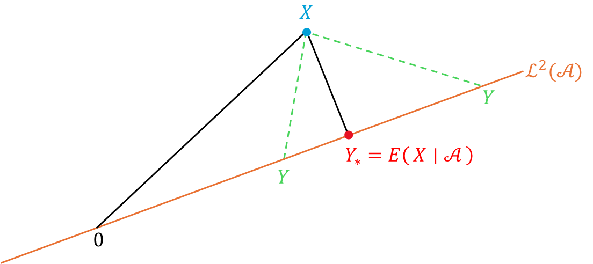
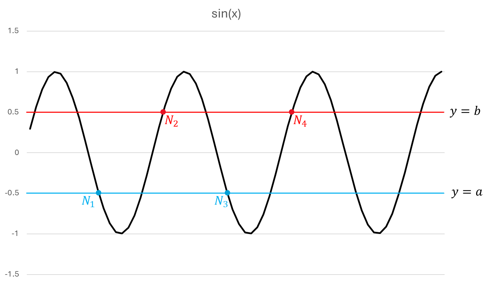
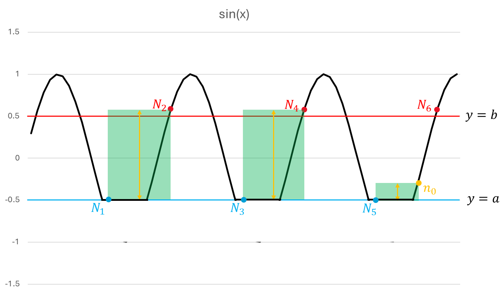

# Chapter 5 Martingales

[TOC]


## 1. Conditional Expectation

### 1.1 Definition

- **Definition**. $X$ is a random variable on $(\Omega,\mathcal F,P)$ with $E|X|<\infty$. $\mathcal A$ is a $\sigma$-field and $\mathcal A\subset \mathcal F$. $E(X|\mathcal A)$, called the conditional expectation of $X$ given $\mathcal A$, is defined as a random variable $Y$ satisfying:
  $$
  \begin{align}
  &\mathrm{(i)}\;Y\in\mathcal{A},\text{ i.e., }Y\text{ is }\mathcal{A}\text{-measurable}\\
  &\mathrm{(ii)}\;\forall A\in\mathcal{A}\text{:}\;E[X1_A]=E[Y1_A].\end{align}
  $$

   **Understanding of the story**: 

    - Suppose we want to evaluate expectation of $X$ given another random variable $Z$ defined on the same sample space. That is, we evaluate $E(X|Z)$, where $Z$ could take values of any Borel set in $\mathbb R$. For $Z$ taking specific Borel set $B$, the conditional expectation means we are considering expectation of $X$ given the event $A=Z^{-1}(B)=\{\omega:Z(\omega)=B\}$

    - We derive the $\sigma$-field of $Z$: $\sigma(Z)\equiv\mathcal A\subset \mathcal F$. When we evaluate $E(X|Z)$, we actually evaluate how $Z$ taking different events in $\sigma(Z)$ could result in different conditional expectation. That is why we can also write $E(X|Z)=E(X|\sigma(Z))=E(X|\mathcal A)$

    - Thus, uncertainty for $Z$ implies $E(X|\mathcal A)=E(X|Z)$ is a random variable whose realization is determined by how $Z$ take events in $\mathcal A$. (Still, it means considering some event $A=Z^{-1}(B)\in\mathcal A$)

    - Let $Y=E(X|\mathcal A)$. Condition $\mathrm{(i)}$ could also be expressed as: the random variable $Y$ is measurable w.r.t. the $\sigma$-field $\mathcal A$. It means for every Borel set $B\subset \mathbb R$, we have $Y^{-1}(B)\in\mathcal A$. Thus the more clear representation of $Y\in\mathcal A$ is : $\forall B\in\mathcal B:\;Y^{-1}(B)\in\mathcal A$. It means we can trace realizations of $Y$ back to event in $\mathcal A$. So we can also say $\sigma(Y)\subset \mathcal A$ Here random variable $Z$ is an agent to *classify event that work as condition*. So even we do not impose $Z$ as random variable, the event collection $\mathcal A$ could still work fine as condition. 

    - In other words, $\mathcal A$ is the collection of events that could capture all potential events represented by random variable $Y$, and meanwhile, since $\mathcal A$ is $\sigma$-field, it means the probability measure could be well defined accordingly

    - Lastly, condition $\mathrm{(ii)}$ could guarantee expectation of $X$ and $Y$ could be identical on same event in $\mathcal A$. It could **guarantee the conditional expectation operation is based on the conditional probability**, which depends on original probability measure of $X$. 

- **Example**: [rolling a dice](https://math.stackexchange.com/questions/1492306/conditional-expectation-with-respect-to-a-sigma-algebra)

    - **Example details:**

      - $X(\omega)=\omega\in\Omega=\{1,2,3,4,5,6\}$. Then the $\sigma$-field defined on $X$ could be the power set: $\mathcal F=2^\Omega$
    
      - If we have a random variable $Z$ whose realization is dice rolling result being even or odd number:
    
      $$
      Z(\omega)=\begin{cases}
      1,\;\;\omega\text{ is odd}\\
      2,\;\;\omega\text{ is even}
      \end{cases}
      $$
       then we have a corresponding $\sigma$-field in the following format:
    $$
      \mathcal A=\{\varnothing,\;\Omega,\;\{1,3,5\},\;\{2,4,6\}\}:=\sigma(Z)
    $$
    
    
    - **Now we explore why conditional expectation is defined based on above two conditions.**
    
      - Suppose $A=\{\omega:Z(\omega)=1\}=\{1,3,5\}\in\mathcal A$, and thus $1_A=1_{Z(\omega)=1}$. Now we consider the original random variable and another random variable $Y$ whose features are not fully clarified now. Then:
      $$
        E(X1_A)=\sum_{\omega\in\Omega} X(\omega)P(\omega)1_{1_{Z(\omega)=1}}=\sum_{\omega\in\{1,3,5\}} X(\omega)P(\omega)\\
      E(Y1_A)=\sum_{\omega\in\Omega} Y(\omega)P(\omega)1_{1_{Z(\omega)=1}}=\sum_{\omega\in\{1,3,5\}} Y(\omega)P(\omega)\\
      $$
      
    
      - Note that $Y$ is measurable w.r.t. $\mathcal A$ ensures $Y(\omega)$'s probability could be defined on any events in $\mathcal A$ (including $\Omega$). That is, $E(Y1_A)$ could be well defined. Also, within each event, measurability means $Y(\omega=1)=Y(\omega=3)=Y(\omega=5)$.  
    
    
      - We simplify notations:
        $$
        E(X1_A)=x_1p_1+x_2p_2+x_3p_3\\
        E(Y1_A)=y_1p_1+y_2p_2+y_3p_3\\
        y_1=y_2=y_3
        $$
        
      - Then our target is to find out what $y_1,y_2,y_3$ looks like.
        
      - Meanwhile, the condition $\mathrm{(ii)}$ requires $E(X1_A)=E(Y1_A)$. The solution for $y_1,y_2,y_3$ is:
        $$
        y_1=y_2=y_3=x_1\cdot\frac{p_1}{p_1+p_2+p_3}+x_2\cdot\frac{p_2}{p_1+p_2+p_3}+x_3\cdot\frac{p_3}{p_1+p_2+p_3}=\frac{x_1p_1+x_2p_2+x_3p_3}{p_1+p_2+p_3}
        $$
        
      - Note that $y_1=y_2=y_3=$ expected value of $x_1,x_2,x_3$ evaluated with conditional probability $\frac{p_i}{p_1+p_2+p_3}$. It means letting $E(X1_A)=E(Y1_A)$ ensures $Y$ is defined as the way we firstly learn conditional expectation in elementary statistics course: weighted averaged with weights to be conditional probability. Also, for every single sample point within the event (which is so-called *condition*), the conditional expectation is the same.
        
      - Eventually, we denote $Y=E(X|\mathcal A)$, which is consistent with conditional expectation in elementary statistics course
    
    
    - **Back to this example:**
    
      - Let $Y=E(X|\mathcal A)=E(X|\sigma(Z))$. Since the definitions implies we should take conditional expectation based on conditional probability, then we know:
        $$
        E(X|Z=z_i)=\sum_{j:\;X^{-1}(x_j)\in A}x_jP(X=x_j\mid Z=z_i)
        $$
    
    
      - So we can compute:
        $$
        E(X|Z=1)=3,\quad E(X|Z=2)=4\\\Downarrow\\
        Y=E(X|Z)=Z+2
        $$
        We can verify $E(X1_A)=E(Y1_A)$ for every $A\in\mathcal A$ accordingly.
    
    - Or we can start from condition of $E(X1_{A_i})=E(Y1_{A_i})$, where $A_i=\{Z=z_i\}$. The expectation of $Y$ implies
      $$
      E(Y1_{A_i})=\sum_{\omega\in {A_i}} Y(\omega)dP(\omega),\quad\text{and}\quad Y(\omega)=c_{A_i}\text{ for all }\omega\in {A_i}
      $$
      for some constant $c_{A_i}$. In other words:
      $$
      E(X1_{A_i})=E(c_{A_i}1_{A_i})\Rightarrow \sum_{j:\;X^{-1}(x_j)\in {A_i}}x_jP(X=x_j\mid Z=z_i)=c_{A_i}P(A_i)=c_{A_i}P(Z=z_i)\\\Downarrow\\
      c_{A_i}=\sum_{j:\;X^{-1}(x_j)\in {A_i}}x_j\frac{P(X=x_j\mid Z=z_i)}{P(Z=z_i)}
      $$
      which is still expected value evaluated with conditional probability

- **Proof of Uniqueness**

  - Suppose $Y_1,Y_2$ both satisfies conditions $\mathrm{(i)}$ and $\mathrm{(ii)}$. Let $A=\{Y_1-Y_2\ge \epsilon>0\}$ for some $\epsilon$, then we can decompose event $A$ into:
  $$
    \{Y_1\geq Y_2+\epsilon\}=\bigcup_{y\in\mathbb{Q}}(\{Y_1\geq y\}\cap\{Y_2\leq y-\epsilon\})
  $$
  
  - Since both $[y,+\infty]$ and $(-\infty,y-\epsilon]$ are both Borel set, and given that both $Y_1,Y_2$ fulfills conditions $\mathrm{(i)}$, it means $\{Y_1\geq y\}$ and $\{Y_2\leq y-\epsilon\}$ are both in $\mathcal A$. Also, because $\mathcal A$ is a $\sigma$-field, then above countable unions and intersections is also in $\mathcal A$, i.e., $A\in\mathcal A$

  - Thus we have:
  $$
    \begin{aligned}
    0&=E(X1_A)-E(X1_A)\\
    &\overset{\mathrm{(ii)}}{\operatorname*{=}}E(Y_11_A)-E(Y_21_A)\\
    &=E[(Y_1-Y_2)1_A]\quad\quad\quad\text{(linearity of }E)\\
    &=\int_A(Y_1(\omega)-Y_2(\omega))1_A(\omega)dP(\omega)+\int_{A^c}\underbrace{(Y_1(\omega)-Y_2(\omega))1_A(\omega)}_{=0}dP(\omega)\\
    &\ge \int_A\epsilon\cdot1_AdP(\omega) + \int_{A^c}\epsilon\cdot1_AdP(\omega)\\ 
    &\geq\varepsilon P(A)
    \end{aligned}
  $$
    which means $P(A)=0$ for any $\epsilon>0$
  
  - Denote $A=A_\epsilon$, then as $\epsilon\downarrow0$, we have:
  $$
    A_\epsilon=\{Y_1-Y_2\ge \epsilon>0\}\;\;\downarrow\;\; A_\infty=\{Y_2-Y_2>0\}
  $$
    With measure property of continuity:
  $$
    P(Y_1>Y_2)=P(Y_1-Y_2>0)=\lim_{\varepsilon\downarrow0}P(Y_1-Y_2\geq\varepsilon)=0
  $$
  
  - Similarly, we can show $P(Y_1< Y_2)=0$, thus $P(Y_1=Y_2)=1$, which means $Y_1=Y_2$ a.s.

- **Proof of Existence**
  - Before the proof, we revisit Radon-Nikodym theorem.
    
  - **Radon-Nikodym theorem**: Let $\nu,\mu$ be $\sigma$-finite measures on $(\Omega,\mathcal A)$. If $\nu\ll\mu$ (i.e., $\mu(A)=0$ implies $\nu(A)=0$), then there is a function $f\in\mathcal A$ such that for all $A\in\mathcal A$, we have:
    $$
    \int_A fd\mu=\nu(A)
    $$
    where such $f$ is called Radon-Nikodym derivative, which is also denoted as $\frac{d\nu}{d\mu}$

    - Not proved here, but some explanations on conditions of this theorem.
  
    - $\sigma$-finite measures means the space and measure on it could be decomposed into [a collection of countably many finite measure spaces being glued together](https://stats.stackexchange.com/questions/402619/why-sigma-finite-measure). In another word, If $\mu$ is a $\sigma$-finite measures on $(\Omega,\mathcal A)$, Wit means there exists a countable family of finite measure spaces $(\Omega_i,\mathcal A_i,\mu_i)$ that forms $(\Omega,\mathcal A,\mu)$ in the way of:
      $$
      \Omega=\bigcup_{i}\Omega_i\\
      A\cap\Omega_i\in\mathcal A_i\Leftrightarrow A\in\mathcal A\\
      \mu(A)=\sum_{i}\mu_i(A\cap\Omega_i)
      $$

    - So it actually ensures the space can be decomposed into [a family of finite measure spaces lying "side by side"](https://math.stackexchange.com/questions/98965/significance-of-sigma-finite-measures#:~:text=And%20then%20just%20like%20in,significance%20of%20%CF%83%E2%88%92finite%20measures.) (so as for the measures). Thus, when we prove results for $\sigma$-finite spaces we are essentially just finding a way to "string together" the result for these **finite** spaces. 

    - $\sigma$-finite measure is defined with more alternative scenarios than above statement, see [wiki](https://en.wikipedia.org/wiki/%CE%A3-finite_measure)

    - $\sigma$-finite measure's above countable family of finite measure spaces could ensure the Radon-Nikodym derivative could be constructed accordingly.

  - **Then we prove the existence** for $X\ge0$
  
    - Define two measures:
      $$
      \mu(A)=P(A),\quad \nu(A)=E(X1_A),\quad\forall A\in\mathcal A
      $$

    - Then we know theseL

      - $\nu\ll\mu$ because for any $A\in\mathcal A$, if $\mu(A)=0$, then $\mu(A)=E(X1_A)=0$ too

      - $\nu$ is a measure when $X\ge 0$ (think of three conditions of measure)

      - $\mu$ is a probability measure, and thus a $\sigma$-finite measure, see [here](https://math.stackexchange.com/questions/3562205/are-probability-measures-always-sigma-finite-measures#:~:text=Indeed.,class%20of%20sigma%2Dfinite%20measures.)
  
      - $\nu$ is a $\sigma$-finite measure because: since $\mu$ is a $\sigma$-finite measure, then there exists sequence of event such that $A_i\to A_\infty=\Omega$. Note $\nu$ and $\mu$ are defined on the same space, so
        $$
        \nu(A_i)=E(X1_{A_i})\le E(X)<\infty
        $$
        (because here we assume $X\ge 0$ and the conditional expectation definition requires $E|X|<\infty$. Also note that $\nu$ does not have to be a probability measure.)
  
    - So Radon-Nikodym theorem tells us that there exists some random variable (which is Radon-Nikodym derivative) $Y=\frac{d\nu}{d\mu}$ such that $Y\in\mathcal A$ and:
      $$
      E(Y1_A)=\int_A Yd\mu=\int_A \frac{d\nu}{d\mu}d\mu=\nu(A)=E(X1_A)
      $$

    - So such $Y$ make both condition $\mathrm{(i)}$ and condition $\mathrm{(i)}$ holds, which means existence
  
  - For more general case, we consider $X=X^+-X^-$ and let $Y_1=E(X^+\mid\mathcal A)$ and $Y_2=E(X^-\mid\mathcal A)$. 
  
    - Since $Y_1-Y_2\in\mathcal A$ is integrable (because $E|X|<\infty$ and $\max(\cdot,0)$ does not change finiteness), so the expectation could be taken
  
    - Previous $X\ge 0$ case tell us that:
      $$
      E(X^+1_A)=E(Y_11_A),\quad E(X^-1_A)=E(Y_21_A)\\\Downarrow\\
      $$
  
    - So we have:
      $$
      E(X1_A)=\nu(A)=E(X^+1_A)-E(X^-1_A)=E(Y_11_A)-E(Y_21_A)=E[(Y_1-Y_2)1_A]
      $$
      which means $Y_1-Y_2$ is the random variable that make both condition $\mathrm{(i)}$ and condition $\mathrm{(i)}$ holds


### 1.2 Properties of Conditional Expectation

- $(a).$ $E(X)=E[E(X\mid \mathcal A)]$

  - **Proof**: take $A=\Omega\in\mathcal A$, then according to condition $\mathrm{(ii)}$ of conditional expectation definition, we know:
    $$
    E(X1_A)=E(Y1_A)\Longleftrightarrow E(X)=E[E(X\mid \mathcal A)]
    $$
    note that when we write $E(X\mid\mathcal A)$, we means expectation of $X$ given event in $\mathcal A$ that already happened

  - Example: We evaluate expectation of $X=\sum_{i=1}^N\xi_i$, where $N$ is a random variable (with sample space being subset of $N^+$ and $EN<\infty$), and $N$ is independent of the sequence of random variables $\xi_i,i=1,2,...$ (with $E\xi_i=\mu<\infty$). The expectation is:
    $$
    E(X)\overset{(a)}=E[E(X\mid N)]= E\left[E\left(\sum_{i=1}^N\xi_i\mid N\right)\right]=E(NE(\xi_1))=E(N\mu)=\mu E(N)
    $$

- $(b).$ $E|X|\ge E|E(X\mid\mathcal A)|$. 
  
  - By $(a)$ and conditional Jensen's inequality, we have:
  
  $$
  E|X|\overset{(a)}=E[E(|X|\mid \mathcal A)]\overset{\text{(Jensen's)}}\ge E|E(X\mid \mathcal A)|
  $$
  note that the Jensen's inequality is applied based random variable $E(X\mid\mathcal A)$ and $\varphi(z)=|z|$ 
  
- $(c).$ If $X\in\mathcal A$, then $E(X\mid\mathcal A)=X$. 

  - This holds because $X$ fulfills both condition $\mathrm{(i)}$ and condition $\mathrm{(ii)}$:
    $$
    \mathrm{(i):}\quad X\in\mathcal A\\
    \mathrm{(ii):}\quad E(RHS\cdot 1_A)=E(X1_A)
    $$

  -  so $X$ is a conditional expectation of $X$ on $\mathcal A$. Also, given uniqueness, we know $X=E(X\mid\mathcal A)$.

- $(d).$ If $X$ and $\mathcal A$ are independent, then $E(X|\mathcal A)=E(X)$ 

  - Independence here means: for every $A_1\in\sigma(X)$ and every $A_2\in\mathcal A$, there is $P(A_1\cap A_2)=P(A_1)P(A_2)$

  - Proof: 

    - since $E(X)$ is a constant, then $E(X)\in\mathcal A$

    - $\forall A\in\mathcal A$. we have by independence:
      $$
      \begin{align}
      &E(X1_A)=E(X)E(1_A) &(\text{independece})\\
      &=E[E(X)1_A] &(E(X)\text{ is constant})\\
      \end{align}
      $$

    - So $E(X)$ fulfills both condition $\mathrm{(i)}$ and condition $\mathrm{(i)}$, and thus $E(X)$ is a conditional expectation of $X$ on $\mathcal A$. Also, given uniqueness, we know $E(X)=E(X\mid\mathcal A)$.

- $(e).$ **(linearity)**. If $E|X|<\infty, \;E|Y|<\infty$, $a$ is a constant, then:
  $$
  E(aX+Y\mid\mathcal A)=aE(X\mid\mathcal A)+E(Y\mid\mathcal A)
  $$
  Proof:

  - Since $E(X\mid\mathcal A),E(Y\mid\mathcal A)\in\mathcal A$ because both of them are conditional expectations, then $aE(X\mid\mathcal A)+E(Y\mid\mathcal A)\in\mathcal A$ as well

  - Now consider for all $A\in\mathcal A$, we can show:
    $$
    \begin{aligned}
    &\quad\;\; E\big[aE(X\mid\mathcal{A})1_A+E(Y\mid\mathcal{A})1_A\big]\\
    &=aE[E(X\mid\mathcal{A})1_A]+E[E(Y\mid\mathcal{A})1_A]&\text{(by linearity of E)}\\
    &=aE(X1_A)+E(Y1_A)&\text{(from the definition of conditional expectation)}\\
    &=E[(aX+Y)1_A].&\text{(by linearity of E again)}\end{aligned}
    $$

- $(f).$ **(conditional monotonicity)**. If $X\le Y$, then $E(X\mid\mathcal A)\le E(Y\mid\mathcal A)$. Proof:

  - For any $\epsilon>0$ we define:
    $$
    A=\{E(X|\mathcal{A})-E(Y|\mathcal{A})\geq\varepsilon\}\in\mathcal{A}
    $$
    $A\in\mathcal A$ for the same reason as when we prove uniqueness of conditional expectation

  - Then we have:
    $$
    \begin{align}
    0&\ge E(X1_A)-E(Y1_A)&(X\ge Y\Rightarrow X1_A\ge Y1_A)\\
    &=E\big[E(X\mid\mathcal A)1_A]-E[E(Y\mid\mathcal A)1_A\big]&(\text{condition }\mathrm{(ii)})\\
    &=E\big[\big(E(X\mid\mathcal A)-E[E(Y\mid\mathcal A)\big)1_A\big]&(\text{linearity of E})\\
    &\ge E(\epsilon1_A)&(\text{by construction of }A)\\
    &=\epsilon P(A)\\
    &\Downarrow\\
    0&=P(A)\Rightarrow P(A^c)=1
    \end{align}
    $$

  - So it means for all $\epsilon>0$, we have $P\big[E(X\mid\mathcal A)- E(Y\mid\mathcal A)<\epsilon\big]=1$. Let $\epsilon\downarrow0$, by property of measure, we have $P\big[E(X\mid\mathcal A)\le E(Y\mid\mathcal A)\big]=1$

- $(g).$ (**conditional MCT**): If $X_n\ge 0,\; X_n\uparrow X$ and $EX<\infty$, then $E(X_n\mid\mathcal A)\uparrow E(X\mid\mathcal A)$. Proof:

  - By $(e)$, we know:
    $$
    Z_n:=E(X\mid\mathcal{A})-E(X_n\mid\mathcal{A})=E(X-X_n\mid\mathcal{A})\in\mathcal A
    $$

  - Also, since $X-X_n$ is decreasing to 0 (which means $X_n-X\to 0$ a.s.), i.e., $X-X_{n+1}\le X-X_n$, then with $(f)$, we know $E(X-X_n\mid\mathcal{A})$ is decreasing, i.e., $E(X-X_{n+1}\mid\mathcal{A})\le E(X-X_n\mid\mathcal{A})$, which is $Z_n\downarrow$.

  - Since $Z_n$ is decreasing and $Z_n$ is bounded from below by $0$ (which is because $X-X_n\ge 0\Rightarrow Z_n=E(X-X_n\mid\mathcal A)\ge 0$ by $(f)$; we can also show $Z_n$ is bounded above similarly), then we know limit of $Z_n$ exists and suppose the (*almost surely*) limit is $Z$. Also, since $Z_n\in\mathcal A$, then the limit $Z\in\mathcal A$, too. See [this](https://math.stackexchange.com/questions/1327081/how-to-prove-limit-of-measurable-functions-is-measurable)

  - So now we have $Z_n\to Z$ and $Z$ in bounded (thus bounded in expectation). That is the same for $Z_n1_A\to Z1_A$ and corresponding boundedness, where $A=\{Z\ge\epsilon>0\}$. So we have:
    $$
    \begin{align}
    \epsilon P(A)&\le E(Z1_A)&(\text{by construction of }A)\\
    &=\lim_{n\to\infty}E(Z_n1_A)&(\text{DCT})\\
    &=\lim_{n\to\infty} E\big[E(X-X_n\mid\mathcal A)1_A\big]\\
    &=\lim_{n\to\infty} E\big[(X-X_n)1_A\big]&\text{(def of conditional expectation)}\\
    &=E(0\cdot 1_A)=0&(\text{DCT for }X_n-X\downarrow0)
    \end{align}
    $$

  - So $P(A)=0$ for all $\epsilon>0$, which means $P\big[Z<\epsilon\big]=1$ for all $\epsilon>0$. Let $\epsilon\downarrow0$, by property of measure, we have $P\big[Z=0\big]=1$, which means $Z_n\to Z$ almost surely. QED

  - Note that the key point for $(f)$ and $(g)$: $X\le Y$ is considered in almost surely perspective, and when we say $Z_n\downarrow Z$, it implies convergence almost surely.

- $(h).$ (**conditional Fatou's Lemma**). If $X_n\ge 0\;\forall n\in N^+$, and $E|X_n|<\infty,\; E|\liminf_{n\to\infty}X_n|<\infty$, then
  $$
  \liminf_{n\to\infty}E(X_n\mid\mathcal A)\ge E\left(\liminf_{n\to\infty}X_n\mid\mathcal A\right)
  $$
  Proof:

  - First, let $Y_n=\inf_{m\ge n}X_m$, and we know $Y_n\uparrow Y=\liminf_{n\to\infty}X_n$. So by $(g)$, conditional MCT, we know  RHS could be written as:
    $$
    E\left(\liminf_{n\to\infty}X_n\mid\mathcal A\right)\equiv E\left(\lim_{n\to\infty}Y_n\mid\mathcal A\right)\overset{MCT}=\lim_{n\to\infty}E\left(Y_n\mid\mathcal A\right)\equiv \lim_{n\to\infty}E\left(\inf_{m\ge n} X_m\mid\mathcal A\right)
    $$

  - Also, since $Y_n=\inf_{m\ge n}X_m\le X_k$ for all $k\ge n$, then by $(f)$ conditional monotonicity, we have:
    $$
    E\left(\inf_{m\ge n} X_m\mid\mathcal A\right)\le E\left( X_k\mid\mathcal A\right),\;\forall k\ge n\\\Downarrow\\
    E\left(\inf_{m\ge n} X_m\mid\mathcal A\right)\le \inf_{k\ge n}E\left( X_k\mid\mathcal A\right)\\\Downarrow\\
    \lim_{n\to\infty}E\left(\inf_{m\ge n} X_m\mid\mathcal A\right)\le \lim_{n\to\infty}\inf_{k\ge n}E\left( X_k\mid\mathcal A\right)
    $$

  - Note that last term is $\liminf_{n\to\infty}E\left( X_k\mid\mathcal A\right)$. And put all above together, we have:
    $$
    \liminf_{n\to\infty}E(X_n\mid\mathcal A)\ge E\left(\liminf_{n\to\infty}X_n\mid\mathcal A\right)
    $$

- $(i).$ (**conditional DCT**). If $|X_n|\le Y\;\forall n$, $E|Y|<\infty$, and $X_n\to X$ a.s., then $E(X_n\mid \mathcal A)\to E(X\mid\mathcal A)$.

  - Since $|X_n|\le Y\;\forall n$, we know $X_n+Y\ge 0$ a.s., and thus applying apply conditional Fatou's lemma is possible:
    $$
    \liminf_{n\to\infty}E(X_n+Y\mid\mathcal A)\ge E\left(\liminf_{n\to\infty}(X_n+Y)\mid\mathcal A\right)
    $$

  - Consider RHS first. Since $X_n\to X$ almost surely, thus $X_n+Y\to X+Y$ almost surely, which means:
    $$
    \liminf_{n\to\infty}(X_n+Y)=X+Y\\\Downarrow\\
    E\left(\liminf_{n\to\infty}(X_n+Y)\mid\mathcal A\right)=E(X+Y\mid\mathcal A)=E(X)+E(Y\mid\mathcal A)
    $$

  - For LHS, it is easy to see:
    $$
    \begin{align}
    &\quad\;\liminf_{n\to\infty}E(X_n+Y\mid\mathcal A)\\
    &=\liminf_{n\to\infty}E(X_n\mid\mathcal A)\quad+\quad E(Y\mid\mathcal A)&(\text{linearity})
    \end{align}
    $$

  - So inequality given by Fatou lemma becomes:
    $$
    \liminf_{n\to\infty}E(X_n\mid\mathcal A)\ge E\left(X\mid\mathcal A\right)
    $$

  - Similarly, we can prove $\limsup_{n\to\infty}E(X_n\mid\mathcal A)\le E\left(X\mid\mathcal A\right)$ by considering below:
    $$
    \lim\sup_{n\to\infty}E(X_n-Y\mid\mathcal A)=-\lim\inf_{n\to\infty}E(-X_n+Y\mid\mathcal A)\le -\\
    \begin{align}
    \limsup_{n\to\infty}E(X_n-Y\mid\mathcal A)
    &=-\liminf_{n\to\infty}E(-X_n+Y\mid\mathcal A)\quad&(\sup_nZ_n=-\inf_n(-Z_n))\\
    &\leq-E[\liminf_{n\to\infty}(-X_n+Y\mid\mathcal A)]\quad&(\text{Fatou's lemma})\\
    &=-E[-X+Y\mid\mathcal A]\quad&(\text{property of }\overset{a.s.}{\operatorname*{\to}})\\&\Downarrow\\
    \limsup_{n\to\infty}E(X_n\mid\mathcal A)-E[Y\mid\mathcal A]&\le E\left(X\mid\mathcal A\right)-E[Y\mid\mathcal A]
    \end{align}
    $$
    and the result follows

  - Then the relations could guarantee convergence of expectation:
    $$
    \liminf_{n\to\infty}E(X_n\mid\mathcal A)=E(X\mid\mathcal A)=\limsup_{n\to\infty}E(X_n\mid\mathcal A)
    $$

- $(j).$  **(Conditional Jensen's inequality).** If $\varphi$ is convex, $E|X|<\infty$, $E|\varphi(X)|<\infty$, then:
  $$
  \varphi(E(X|\mathcal{A}))\leq E(\varphi(X)|\mathcal{A})
  $$
  Proof:

  - Let
    $$
    S=\{(a,b):a,b\in\mathbb{Q},\:ax+b\leq\varphi(x)\text{ for all }x\}
    $$

    - In another word, $S$ could be regarded as a countable collection of parameter tuples $(a_n,b_n)$ such that $a_nx+b_n\leq\varphi(x)$. So the corresponding random version is: $\varphi(X)\ge a_nX+b_n$ almost surely. Then we can take conditional expectation by $(f)$:

    $$
    E(\varphi(X)\mid\mathcal{A})\geq E(a_nX+b_n\mid\mathcal{A})=a_n\mathrm{~}E(X\mid\mathcal{A})+b_n\quad\text{a.s.}
    $$

  - Now take $\sup$ over $(a_n,b_n)\in S$, then the LHS remain unchanged, but RHS of the inequality ensures
    $$
    \sup_{(a_nb_n)\in S}a_n\mathrm{~}E(X\mid\mathcal{A})+b_n\le \varphi\big[E(X\mid\mathcal A)\big]
    $$

  - So we have:
    $$
    E(\varphi(X)|\mathcal{A})\ge \varphi(E(X|\mathcal{A}))
    $$

  - Special case of example: if $p\ge 1$, then $|E(X\mid\mathcal{A})|^p\leq E(|X|^p\mid\mathcal{A})$

  - Also, note that Jensen's inequality could be used to show $EX^2<\infty\Rightarrow EY^2<\infty$, where $Y=E(X\mid\mathcal A)$:
    $$
    E\big[(E(X\mid\mathcal A))^2\big]\overset{\text{Jensen's}}\le E\big[E(X^2\mid\mathcal A)\big]\overset{(a)}=EX^2
    $$

- $(k).$ **(Conditional Holders Inequality).** If $p\ge 1$ and $\frac1p+\frac1q=1$, also assume $E|X|^p<\infty,\; E|Y|^p<\infty$ then:
  $$
  E(|XY|\mid\mathcal{A})\leq\big[E(|X|^p\mid\mathcal{A})\big]^{1/p}\big[E(|Y|^q\mid\mathcal{A})\big]^{1/q}
  $$
  Proof sketch when assuming $E(|X|^p\mid\mathcal A),E(|Y|^p\mid\mathcal A)>0$:

  - Given $(n)$ to be proved later, we can have below equality:

  $$
  \begin{align}
  \frac{E(|XY|\mid\mathcal A)}{\big[E(|X|^p\mid\mathcal{A})\big]^{1/p}\big[E(|Y|^q\mid\mathcal{A})\big]^{1/q}}
  &=E\left(\frac{|XY|}{\big[E(|X|^p\mid\mathcal{A})\big]^{1/p}\big[E(|Y|^q\mid\mathcal{A})\big]^{1/q}} \;\bigg|\;\mathcal A\right)\\
  &=E\left(\frac{|X|}{\big[E(|X|^p\mid\mathcal{A})\big]^{1/p}}\cdot\frac{|Y|}{\big[E(|Y|^q\mid\mathcal{A})\big]^{1/q}} \;\bigg|\;\mathcal A\right)\quad(*)
  \end{align}
  $$

  ​	still, remember conditional on $\mathcal A$ means conditional on some event in $\mathcal A$. 

  - Given Young's inequality that $xy\le \frac{x^p}p+\frac{y^q}q$ for all $x,y\ge 0$ and $p,q>1$. So we have random variable version:
    $$
    \frac{|X|}{\big[E(|X|^p\mid\mathcal{A})\big]^{1/p}}\cdot\frac{|Y|}{\big[E(|Y|^q\mid\mathcal{A})\big]^{1/q}}\le \frac1p\cdot\frac{|X|^p}{E(|X|^p\mid\mathcal{A})}+\frac1q\cdot\frac{|Y|^q}{E(|Y|^q\mid\mathcal{A})}
    $$

  - So the conditional expectation in above $(*)$ fulfills:
    $$
    \begin{align}
    (*)&\le E\left(\frac1p\cdot\frac{|X|^p}{E(|X|^p\mid\mathcal{A})}+\frac1q\cdot\frac{|Y|^q}{E(|Y|^q\mid\mathcal{A})} \;\bigg|\;\mathcal A\right)\\
    &=\frac1p\cdot E\left(\frac{|X|^p}{E(|X|^p\mid\mathcal{A})}\;\bigg|\;\mathcal A\right)+\frac1q\cdot E\left(\frac{|Y|^q}{E(|Y|^q\mid\mathcal{A})} \;\bigg|\;\mathcal A\right)&(\text{linearity})\\
    &=\frac1p\cdot \frac{1}{E(|X|^p\mid\mathcal{A})}\cdot E\left({|X|^p}\mid\mathcal A\right)+\frac1q\cdot \frac{1}{E(|Y|^q\mid\mathcal{A})}\cdot E\left({|Y|^q} \mid\mathcal A\right)&(\text{property }(n))\\
    &=\frac1p+\frac1q=1
    \end{align}
    $$
    which implies the result

  - Note that when either $E(|X|^p\mid\mathcal A)=0$ or $E(|Y|^p\mid\mathcal A)=0$ or both, the inequality still holds. 

    - We can generalize it by considering $(|X|^p+\epsilon^p)^{1/p},\;(|Y|^p+\epsilon^q)^{1/q}$ for some $\epsilon>0$ as $|X|,|Y|$ above, then we have:

    $$
    E\big[(|X|^p+\epsilon^p)^{1/p}\cdot(|Y|^p+\epsilon^q)^{1/q}\;\big|\;\mathcal{A}\big]
    \leq\big[E(|X|^p+\epsilon^p\mid\mathcal{A})\big]^{1/p}\big[E(|Y|^p+\epsilon^q\mid\mathcal{A})\big]^{1/q}
    $$

    - set $\epsilon\downarrow 0$, then by conditional DCT, we have:

    $$
    LHS\to E(|XY|\mid\mathcal A),\quad RHS\to E(|X|^p\mid\mathcal A)^{1/p}\cdot E(|Y|\mid\mathcal A)^{1/q}
    $$

    - then the limit $E(|XY|\mid\mathcal A)\le E(|X|^p\mid\mathcal A)^{1/p}\cdot E(|Y|\mid\mathcal A)^{1/q}$. Note these convergence of expectation are based on:

    $$
    \forall n:a_n\to a,\;b_n\to b,\;c_n\to c\\\Downarrow\\
    ab\le c
    $$

  - [wiki](https://en.wikipedia.org/wiki/H%C3%B6lder%27s_inequality#Conditional_H%C3%B6lder_inequality) also shows a proof for this conditional Holder inequality

- $(l).$ **(conditional Minkowski’s Inequality).** If $p\ge 1$, $E|X|^p,E|Y|^p<\infty$, then we have:
  $$
  \big[E(|X+Y|^p\mid\mathcal A)\big]^{1/p}\le \big[E(|X|^p\mid\mathcal A)\big]^{1/p}+\big[E(|Y|^p\mid\mathcal A)\big]^{1/p}
  $$

  - We can recall classical proof for Minkowski’s Inequality to prove this conditional version

- $(m).$ **(Conditional Markov Inequality).** If $X\ge 0,\; a>0$, then 
  $$
  P(X\ge a\mid\mathcal A)\le \frac{E(X\mid\mathcal A)}a
  $$
  Proof:
  $$
  \begin{align}
  E(1_{\{X\ge a\}}\mid\mathcal A)&\le E\left(\frac Xa1_{\{X\ge a\}}\;\big|\;\mathcal A\right)&(\text{conditional monotonicity})\\
  &\le E\left(\frac Xa\;\big|\;\mathcal A\right)=\frac{E(X\mid\mathcal A)}a
  \end{align}
  $$

  - Special case: Chebyshevs Inequality, which says when $a>0$, then:
    $$
    P(|X|\geq a\mid\mathcal{A})\leq a^{-2}E(X^2\mid\mathcal{A})
    $$

- $(n).$ If $E|Y|<\infty$, $E|XY|<\infty$, $X\in\mathcal A$, then:
  $$
  E(XY\mid\mathcal{A})=XE(Y\mid\mathcal{A})
  $$
  Proof:

  - First, we know $XE(Y\mid\mathcal A)\in\mathcal A$ because both $X,\;E(Y\mid\mathcal A)\in\mathcal A$ so the product is in $\mathcal A$ too. This could be verified by (let $Z=E(Y\mid\mathcal A)$) below countable unions and intersection operation:
    $$
    \{\omega: X(\omega)Z(\omega)<q\}=\bigcup_{r,s\in\mathbb{Q},rs<q}(\{\omega: X(\omega)<r\}\cap\{\omega: Z(\omega)<s\})\in\mathcal A
    $$

  - Then if we can prove $\forall A\in\mathcal A:E(XY1_A)=E\big[XE(Y\mid \mathcal A)1_A\big]$, then it implies $XE(Y\mid \mathcal A)$ is conditional expectation of $XY$ on $\mathcal A$, and with uniqueness, we can prove the result. So in the rest of the proof we will prove:
    $$
    \forall A\in\mathcal A:E(XY1_A)=E\big[XE(Y\mid \mathcal A)1_A\big]
    $$
     by 4 cases (4 types of random variables for $X$).

  - Case 1: indicator r.v., $X=1_B,\;B\in\mathcal A$.

    - $LHS=E(1_BY1_A)=E(Y1_{A\cap B})$
    - $RHS=E\big[1_BE(Y\mid \mathcal A)1_A\big]=E\big[E(Y\mid \mathcal A)1_{A\cap B}\big]$
    - Since $A\cap B\in\mathcal A$ because $\mathcal A$ is a $\sigma$-field, then $RHS=E(Y1_{A\cap B})$ with condition $\mathrm{(ii)}$ of definition of conditional expectation. So $RHS=LHS$

  - Case 2: simple r.v., $X=\sum_{i=1}^nb_i1_{B_i}$

    - We can verify by:
      $$
      \begin{align}
      E(XE(Y\mid\mathcal A)1_A)&=E\left(\sum_{i=1}^nb_i1_{B_i}E(Y\mid\mathcal A)1_A\right)\\
      &=\sum_{i=1}^nb_iE(E(Y\mid\mathcal A)1_{A\cap B_i})&(\text{by linearity})\\
      &=\sum_{i=1}^nb_iE(Y1_{A\cap B_i})&(\text{Case 1})\\
      &=RHS
      \end{align}
      $$

    - Case 1 implies $E(XY\mid\mathcal{A})=XE(Y\mid\mathcal{A})$ when $X=1_B$ (because both two conditions of conditional expectation are fulfilled). So we can directly check whether $E(XY\mid\mathcal{A})=XE(Y\mid\mathcal{A})$ when $X$ is simple r.v. by similar trick:

    $$
    E(\sum_{i=1}^nb_i1_{B_i}Y|\mathcal{A})\stackrel{\text{linearity}}{=}\sum_{i=1}^nb_iE(1_{B_i}Y|\mathcal{A})\stackrel{\text{Case 1}}{=}\sum_{i=1}^nb_i1_{B_i}E(Y|\mathcal{A})=XE(Y|\mathcal{A}).
    $$

  - Case 3: both $X,Y$ are nonnegative r.v., whose expectation is defined by:
    $$
    \\E(X):=\underset{\substack{{Z:0\leq Z\leq X} \\ Z\text{ is a simple random variable}}}\sup E(Z)
    $$

    - So we can construct $Z_n\uparrow X$ (without considering $E(Z_n)$ in fact). Then given $Z_n$ is simple r.v. for every $n$, so we know by Case 2:
      $$
      \forall A\in\mathcal A:E(Z_nY1_A)=E\big[Z_nE(Y\mid \mathcal A)1_A\big]
      $$
      and naturally we have:
      $$
      Z_nE(Y\mid\mathcal{A})\uparrow XE(Y\mid\mathcal{A})
      $$

    - Since $Z_n,Y\ge 0$ by assumption, so by conditional MCT:
      $$
      E(Z_nY\mid\mathcal{A})\uparrow E(XY\mid\mathcal{A})\\
      $$

    - Therefore we get:
      $$
      E(XY\mid\mathcal{A})=XE(Y\mid\mathcal{A})
      $$

  - Case 4: decompose with $X=X^+-X^-,Y=Y^+-Y^-$ and then:
    $$
    \begin{align}
    E(XY\mid\mathcal{A})&=E\big[(X^+-X^-)(Y^+-Y^-)\mid\mathcal{A}\big]\\
    &=E\big[(X^+Y^++X^-Y^--X^+Y^--X^-Y^+)\mid\mathcal{A}\big]\\
    &=E(X^+Y^+)+E(X^-Y^-\mid\mathcal{A})-E(X^+Y^-\mid\mathcal{A})-E(X^-Y^+\mid\mathcal{A})&(\text{linearity})\\
    &=X^+E(Y^+\mid\mathcal{A})+X^-E(Y^-\mid\mathcal{A})-X^+E(Y^-\mid\mathcal{A})-X^-E(Y^+\mid\mathcal{A})&(\text{Case 3})\\
    &=(X^+-X^-)\big[E(Y^+\mid\mathcal{A})-E(Y^-\mid\mathcal{A})\big]&(\text{rearrange})\\
    &\equiv XE(Y\mid\mathcal{A})
    \end{align}
    $$

- $(o).$ **(Tower property).** if $\mathcal A_1\subset\mathcal A_2$, and $E|X|<\infty$, then:
  $$
  \mathrm{(a)~}E(E(X\mid\mathcal{A}_1)\mid\mathcal{A}_2)=E(X\mid\mathcal{A}_1)\\
  \mathrm{(b)~}E(E(X\mid\mathcal{A}_2)\mid\mathcal{A}_1)=E(X\mid\mathcal{A}_1)
  $$
  Proof:

  - Before proof, we know $E(X\mid\mathcal A_1)$ is already well defined with below:

    - $E(X\mid\mathcal A_1)\in\mathcal A_1$. By condition $\mathcal A_1\subset\mathcal A_2$ we further have $E(X\mid\mathcal A_1)\in\mathcal A_2$
    - $E\big[E(X\mid\mathcal A_1)1_A\big]=E(X1_A)$ for all $A\in\mathcal A_1$

  - Similar for $E(X\mid\mathcal{A}_2)\in\mathcal A_2$ and $E\big[E(X\mid\mathcal A_2)1_A\big]=E(X1_A)$ for all $A\in\mathcal A_1\subset\mathcal A_2$

  - Now we verify RHS of $\mathrm{(a)}$ and $\mathrm{(b)}$ fulfills both conditions of conditional expectation to define LHS. condition $\mathrm{(i)}$ is easy to verify because:

    - for $\mathrm{(a)}$, LHS requires the conditional expectation, as a random variable, should $\in\mathcal A_2$, and for RHS, we already have $E(X\mid\mathcal A_1)\in\mathcal A_1\subset\mathcal A_2$
    - for $(b)$, LHS requires the conditional expectation as a random variable should $\in\mathcal A_1$, which is also satisfied since $E(X\mid\mathcal A_1)\in\mathcal A_1$

  - So it remains to verify condition $\mathrm{(ii)}$

    - for $\mathrm{(a)}$, based on definition of conditional expectation, we need to verify $E(X'1_A)=E(Y'1_A)$ for all $A\in\mathcal A_2$, where $X',Y'$ is denoted as below:
      $$
      E(\underbrace{E(X\mid\mathcal{A}_1)}_{X'}\mid\mathcal{A}_2)\overset{?}=\underbrace{E(X\mid\mathcal{A}_1)}_{Y'}
      $$
      (? means we are tending to verify conditional expectation conditions)

    - Since $X'=Y'\in\mathcal A_1\subset\mathcal A_2$, then condition $\mathrm{(ii)}$ holds naturally, see property $(c).$

    - for $\mathrm{(b)}$, we need verify $E(X'1_A)=E(Y'1_A)$ for all $A\in\bf{\mathcal A_1}$, where $X',Y'$ is denoted as below:
      $$
      E(\underbrace{E(X\mid\mathcal{A}_2)}_{X'}\mid\mathcal{A}_1)\overset{?}=\underbrace{E(X\mid\mathcal{A}_1)}_{Y'}\\\Downarrow\\
      E(Y'1_A)=E\big[E(X\mid\mathcal{A}_1)1_A\big]=E(X1_A)\\
      E(X'1_A)=E\big[E(X\mid\mathcal{A}_2)1_A\big]=E(X1_A)
      $$
      so condition $\mathrm{(ii)}$ is verified.

- $(p).$ **(Theorem 5.1.8 Triangular Inequality)**. Suppose $EX^2<\infty$. Then for any $Y\in\mathcal A$ with $EY^2<\infty$, we have:
  $$
  E(X-E(X\mid\mathcal{A}))^2\leq E(X-Y)^2
  $$

  - Proof:

    - Given:
      $$
      E[(X-E(X\mid\mathcal{A}))(Y-E(X\mid\mathcal{A}))]\\
      =E\big[X(Y-E(X\mid\mathcal{A}))\big]-E[E(X\mid\mathcal{A})\underbrace{(Y-E(X\mid\mathcal{A}))}_{\in\mathcal A}]\\
      =E\big[X(Y-E(X\mid\mathcal{A}))\big]-\underbrace{E\big[E(X(Y-E(X\mid\mathcal{A}))\;\big|\;\mathcal{A})\big]}_{\text{by }(n).}\\
      =E\big[X(Y-E(X\mid\mathcal{A}))\big]-\underbrace{E[X(Y-E(X\mid\mathcal{A}))]}_{\text{by }(a).}=0
      $$

    - So we have:
      $$
      \begin{aligned}
      E(X-Y)^2&=E(X-E(X\mid\mathcal{A})+E(X\mid\mathcal{A})-Y)^2\\
      &=E(X-E(X\mid\mathcal{A}))^2+E(Y-E(X\mid\mathcal{A}))^2-2E[(X-E(X\mid\mathcal{A}))(Y-E(X\mid\mathcal{A}))]\\
      &=E(X-E(X\mid\mathcal{A}))^2+E(Y-E(X\mid\mathcal{A}))^2-2\cdot0\\
      &\ge E(X-E(X|\mathcal{A}))^2
      \end{aligned}
      $$

  - Interpretation: 

    - The triangular relation is:
      $$
      E(X-Y)^2=\underbrace{E(X-E(X\mid\mathcal{A}))^2}_{g(X)}+\underbrace{E(Y-E(X\mid\mathcal{A}))^2}_{h_X(Y)}\ge E(X-E(X\mid\mathcal{A}))^2
      $$

    - So think of $E(X-Y)=g(X)+h_X(Y)$, where $X$ is treated as a "constant", and $Y$ is a variable. 

    - Our target is to find solution for $Y$ such that $E(X-Y)$ is minimized. 

    - Now $g(X)$ can be treated as "constant", and since $Y=E(X\mid\mathcal A)$ could make $h_X(Y)=0$, then it means $g(X)=E(X-E(X\mid\mathcal{A}))^2$ is exactly the minimum value for $E(X-Y)$. 

    - Note that to achieve the solution $Y=E(X\mid\mathcal A)$, $Y$ must fulfills $EY^2<\infty$ because $E(X\mid\mathcal A)$ also has finite second moment, as is shown in conditional Jensen's inequality

    - Now repeat above interpretations with more formal notations. Consider All $Y\in\mathcal L^2(\mathcal A)$, where $\mathcal L^2(\mathcal A)=\{Y\in\mathcal A:EY^2<\infty\}$, i.e., $Y$ is a random variable that is measurable wrt $\mathcal A$ and with finite second moment. In this case, $E(X\mid\mathcal A)$ is the projection of $X$ onto $\mathcal L^2(\mathcal A)$. See plot below:

      

    - Note that we are trying to find a solution for $Y\in\mathcal L^2(\mathcal A)$ such that that $E(X-Y)^2$ is minimized. In the triangle $XYY_*$, where $Y_*$ is right angle vertex, $YY_*$ represents $E(Y-E(X\mid\mathcal A))^2$, and $XY_*$ represents $E(X-XE(X\mid\mathcal A))^2$, and since $Y\in\mathcal L^2(\mathcal A)$, which is represented by the orange line, so the problem becomes we try to find minimized segment represented by $XY$. Obviously, the minimum value is $XY_*$ when $YY_*$ is zero. 
  
- $(q).$ $Var(X)\ge Var[E(X\mid\mathcal A)]$. 

  - From $(p),$ we know:
    $$
    E(X-Y)^2=E(X-E(X\mid\mathcal{A}))^2+E(Y-E(X\mid\mathcal{A}))^2
    $$

  - Insert $Y=E(X)$, then we have:

  $$
  E(X-E(X))=E(X-E(X\mid\mathcal{A}))^2+\underbrace{E(E(X)-E(X\mid\mathcal{A}))^2}_{=Var[E(X\mid\mathcal A)]}
  $$

  - The last underbrace is because:
    $$
    \begin{align}
    Var[E(X\mid\mathcal A)]&=E[(E(X\mid\mathcal A))^2]-[E(E(X\mid\mathcal A))]^2\\
    &=E[(E(X\mid\mathcal A))^2]-\underbrace{[E(X)]^2}_{(a).}\\
    E(E(X)-E(X\mid\mathcal{A}))^2&=E[(E(X\mid\mathcal A))^2]+[E(X)]^2-2E(X)E[E(X\mid\mathcal A)]&(E[E(X)]=E(X))\\
    &=E[(E(X\mid\mathcal A))^2]-[E(X)]^2\\
    &\Downarrow\\
    Var[E(X\mid\mathcal A)]&=E(E(X)-E(X\mid\mathcal{A}))^2
    \end{align}
    $$

  - So we have:
    $$
    Var(X)\equiv E(X-E(X))^2=E(X-E(X\mid\mathcal{A}))^2+Var[E(X\mid\mathcal A)]\\
    \ge E(X-E(X\mid\mathcal{A}))^2\equiv Var[E(X\mid\mathcal A)] 
    $$

- $(r).$ If $Z$ is independent of $\{X,Y\}$, then $E(X\mid Y,Z)=E(X\mid Y)$. Proof:

  - Note that we write $E(X\mid Y)$ means we define the conditional expectation on $\sigma(Y)$. So It is obvious that $E(X\mid Y)\in\sigma(Y)\in\sigma(Y,Z)$ ) ($\sigma(Y)$ represents all events determined by $Y$ while $\sigma(Y,Z)$ represents all events determined by $(Y,Z)$. "Determine" here means preimage of $Y$ taking Borel set is within $\sigma(Y)$ and so for $(Y,Z)$).

  - The remaining part will show the second condition for definition of conditional expectation:
    $$
    E(X1_A)=E[E(X\mid Y)1_A]
    $$

  - Define $\mathcal L$ as below, and we will show it is a $\lambda$-system
    $$
    \mathcal L=\{\;A\in\sigma(Y,Z):\; E(X1_A)=E[E(X\mid Y)1_A]\;\}
    $$

    - $\Omega\in\mathcal L$ because $\Omega\in\sigma(Y,Z)$, and it is easy to verify $RHS=E[E(X\mid Y)1_\Omega]=E[E(X\mid Y)]=E(X)=E(X1_\Omega)=RHS$ holds

    - When $A,B\in\mathcal L$ and $A\subset B$, then
      $$
      E(X1_A)=E[E(X\mid Y)1_A],\quad E(X1_B)=E[E(X\mid Y)1_B]\\\Downarrow\\
      E(X1_B)-E(X1_A)=E[E(X\mid Y)1_B]-E[E(X\mid Y)1_A]\\\Downarrow\\
      E[X(1_B-1_A)]=E[E(X\mid Y)(1_B-1_A)]\\\Downarrow\\
      E(X1_{B-A})=E[E(X\mid Y)(1_{B-A})]
      $$
      note that $1_B-1_A=1_{B-A}$ is because $A\subset B$. Also, since $B-A\in\mathcal \sigma(Y,Z)$ because of $B,A\in\mathcal \sigma(Y,Z)$, then $B-A\in\mathcal L$

    - Consider $A_1,A_2,...\in\mathcal L$ and $A_i\uparrow A$. Then $A_i,A\in\sigma(Y,Z)$ obviously and the condition gives $E(X1_{A_i})=E[E(X\mid Y)1_{A_i}]$ for all $i$. Then we need to show $E(X1_A)=E[E(X\mid Y)1_A]$.

    - When $X\ge 0$, then $X1_{A_i}\uparrow X1_A$ almost surely (because the set $A_i$ is getting larger with $i$ to $A$ eventually). By (classic and conditional) MCT, we know:
      $$
      E(X1_{A_i})\uparrow E(X1_A),\quad E[E(X\mid Y)1_{A_i}]\uparrow E[E(X\mid Y)1_A]\\\Downarrow\\
      E(X1_A)=E[E(X\mid Y)1_A]
      $$
      because $\text{given }E(X1_{A_i})=E[E(X\mid Y)1_{A_i}]$

    - Then consider $X=X^+-X^-$:
      $$
      \begin{align}
      E[E(X\mid Y)1_A]&\equiv E\big[E(X^+-X^-\mid Y)1_A\big]\\
      &=E\big[E(X^+\mid Y)1_A-E(X^-\mid Y)1_A\big]=E[E(X^+\mid Y)1_A]-E[(X^-\mid Y)1_A]\\
      &=E(X^+1_A)-E(X^-1_A)\quad\quad\quad(\text{by previous }X\ge 0\text{ case})\\
      &=E((X^+-X^-)1_A)\equiv E(X1_A)
      \end{align}
      $$

  - Also Let define $\mathcal P$
    $$
    \mathcal P=\{(\;Y^{-1}(B_1),Z^{-1}(B_2)\;)\;:\; (B_1,B_2)\in\mathcal B^2 \}\\
    \quad\;\;=\{(\;Y^{-1}(B_1)\cap Z^{-1}(B_2)\;)\;:\; (B_1,B_2)\in\mathcal B^2 \}
    $$

    - $\mathcal P$ could be shown to be a $\pi$-system in [this md file](Ch5_inventory/Pi_Preimage.md), and naturally, $\mathcal P\subset \sigma(Y,Z)$

    - Also, we can show $\mathcal P\subset \mathcal L$ (refer to [this](https://pages.stat.wisc.edu/~shao/stat709/stat709-04.pdf)) in the rest of this part

    - for any event $A=Y^{-1}(B_1)\cap Z^{-1}(B_2)$, where $(B_1,B_2)\in\mathcal B^2$, we know $A\in\mathcal P$. 

    - Assign $M=Y^{-1}(B_1),\; N=Z^{-1}(B_2)$, then $A=M\cap N$. So we have:
      $$
      \begin{align}
      E\big[E(X\mid Y)1_{A}\big]&=E\big[E(X\mid Y)1_{M\cap N}\big]=E\big[E(X\mid Y)1_M1_N\big]\\
      &=E\big[E(X\mid Y)1_{M}\big]E\big[1_N\big]&(1)\\
      &=E\big[E(X1_{M}\mid Y)\big]E\big[1_N\big]&(2)\\
      &=E(X1_{M})E(1_N)&(3)\\
      &=E(X1_{M}1_N)&(4)\\
      &=E(X1_{M\cap N})=E(X1_A)&(5)
      \end{align}
      $$

    - $(1)$ is because $[E(X\mid Y)\cdot1_M]\in\sigma(Y)$, and $1_N\in\sigma(Z)$. Since $Z$ is independent of $Y$ (which means independence between $\sigma$-fields), then by Theorem 5 in Chapter 2 ($EXY=EXEY$ given independence), we get $(1)$

    - $(2)$ and $(3)$ is because $(n).$ and $(a)$ respectively

    - $(4).$ is because $X1_M\in\sigma(X,Y)$, and $1_N\in\sigma(Z)$, and independence between $(X,Y)$ with $Z$ implies $(4)$ with same reason as is in $(1)$

    - $(5).$ means $E\big[E(X\mid Y)1_{A}\big]=E(X1_A)$, which implies for all $A\in\mathcal P$, we have $A\in\mathcal L$, thus $\mathcal P\subset\mathcal L$

  - Now we are ready to apply $\lambda$-$\pi$ theorem, we can show $\sigma(\mathcal P)\subset\mathcal L$

    - We have proved the $\lambda$-system and $\pi$-system fulfills $\mathcal P\subset L$, so by $\lambda$-$\pi$ theorem, we know $\sigma(\mathcal P)\subset\mathcal L$

    - By Exercise 1.3.1 in Chapter 2, we know $\sigma(X^{-1}(\mathcal B^2))\equiv\sigma(\mathcal P)=\sigma(Y,Z)$

    - Recall:
      $$
      \sigma(\mathcal P)=\sigma(Y,Z)\subset\mathcal L=\{\;A\in\sigma(Y,Z):\; E(X1_A)=E[E(X\mid Y)1_A]\;\}\\\Downarrow\\
      \forall A\in\sigma(Y,Z):\; E(X1_A)=E[E(X\mid Y)1_A]
      $$
      

- **Example 5.1.4: closed form of conditional expectation**. We write $E(X\mid Y):=E[X\mid\sigma(Y)]$, which can be regarded as a function of $Y$, say $h(Y)$. $h(Y)$ could be expressed in closed form for random variable $X,Y$ has joint pdf $f(x,y)$ given the density is well defined.

  - We can first solve for $E(X\mid Y=y)=h(y)$, which is deterministic:

    - marginal density: $f_Y(y)=\int f(x,y)dx,$

    - conditional density: $f_Y(y)=\int f(x,y)dx$

    - If $E|X|<\infty$, then the conditional expectation:
      $$
      E(X|Y=y)=\int x\frac{f(x,y)}{f_Y(y)}dx:=h(y)
      $$

  - Then we can show $\begin{aligned}E(X|Y)=h(Y)\end{aligned}$, the stochastic version, is correct. 

    - Suppose $A\in\sigma(Y)$, and write it as $A=\{Y\in B\}$ (i.e., although the event $A$ is primarily defined on $\Omega$, we find the event which is Borel subset $B$ that is corresponding to $A$, then their probability measure will align). 
    - Then we have:

    $$
    \begin{align}
    E[h(Y)1_A]&=\int_Bh(y)f_Y(y)dy\\
    &=\int_B\int x\frac{f(x,y)}{f_Y(y)}dxf_Y(y)dy\\
    &=\int_{\mathscr X} \int_{\mathscr Y}xf(x,y)dy\;dx=\int_{\mathscr X}\int_{\mathscr Y} x1_{(Y\in B)}f(x,y)dy\;dx\\
    &=E[X1_A]
    \end{align}
    $$

- **Example 5.1.5.** If $X,Y$ are independent and $E|g(X,Y)|<\infty$, then:
  $$
  E(g(X,Y)|Y)=h(Y),\quad\text{where }h(y)=Eg(X,y)
  $$
  Proof: for any $A\in\sigma(Y)$, write it as $A=\{Y\in B\}$, we have:
  $$
  \begin{align}
  E[g(X,Y)1_A] & = E[g(X,Y)1_{Y\in B}] = \int_{\mathscr X}\int_{\mathscr Y} g(x,y)1_B(y)d\nu(y)d\mu(x)\\
  &= \int_{\mathscr Y}1_B(y)\left(\int_{\mathscr X}g(x,y)d\mu(x)\right)\;d\nu(y)\\
  &=\int 1_B(y)h(y)d\nu(y) = E[h(y)1_{Y\in B}]
  \end{align}
  $$


## 2. Martingales

- Note that in this part we still use index for conditional expectation properties
- Also note the conditional expectation constraint $E(S_n\mid\mathcal{F}_{n-1}) = S_{n-1},\:\forall n\geq2$ is equivalent to $E(S_{n+1}\mid\mathcal{F}_{n}) = S_{n},\:\forall n\geq1$

### 2.1 Definitions, Examples, Properties

- **Definition**. 

  - **Martingales**: Let $\{\mathcal F_n,n\ge 1\}$ be a sequence of increasing $\sigma$-fields, i.e., a filtration. Let $\{S_n,n\ge 1\}$ be a sequence of random variables. $\{S_n\}$ is called a martingale with respect to $\{\mathcal F_t\}$ if:

  $$
  \begin{align}
  &(\mathrm{i})\:E|S_n|<\infty,\:\forall n\geq1\\&(\mathrm{ii})\:S_n\in\mathcal{F}_n,\:\forall n\geq1\\&(\mathrm{iii})\:E(S_n\mid\mathcal{F}_{n-1}) = S_{n-1},\:\forall n\geq2.
  \end{align}
  $$

  	we often denote the martingale as $(S_n,\mathcal F_n)$.

  - **Martingale differences**: Suppose $\{S_n\}$ is a martingale w.r.t. $\{\mathcal F_n\}$. The below $\{X_n\}$ are called martingale differences:
    $$
    X_1:=S_1,~X_2:=S_2-S_1,\ldots,X_n:=S_n-S_{n-1},\ldots
    $$

- **Facts about Martingales**

  - Fact 1: Taking expectations on both sides of $\mathrm{(iii)}$, we have:
    $$
    E(S_1)=E(S_2)=\cdots=E(S_n)=\cdots\\\Downarrow\\
    E(X_i)=0,\;\;\forall i\ge 2
    $$

    - Note if $E(S_i)=0$, then it is called mean-zero martingale

    - We can verify martingale difference's zero correlation:
      $$
      \begin{align}
      &\quad\;\;E[S_{n+1}-S_n-E(S_{n+1}-S_n)][S_n-S_{n-1}-E(S_n-S_{n-1})]\\
      &=E(S_{n+1}-S_n)(S_n-S_{n-1})&(ES_i=ES_j)\\
      &=E\big[E\big((S_{n+1}-S_n)(S_n-S_{n-1})\mid\mathcal F_n\big)\big]&(a).\\
      &=E\big[(S_n-S_{n-1})E\big(S_{n+1}-S_n\mid\mathcal F_n\big)\big]\\
      &=E\big[(S_n-S_{n-1})\big(\underbrace{E\big(S_{n+1}\mid\mathcal F_n\big)-S_n}_{=0\text{ cuz martingale}}\big)\big]
      \end{align}
      $$
      
    
  - Fact 2: Take expectations on absolute values of both sides of $\mathrm{(iii)}$ by by conditional Jensen's inequality:
    $$
    E|S_{n-1}|=RHS=LHS=E\big|E(S_n\mid\mathcal{F}_{n-1})\big|\le E\big[E(|S_n|\mid\mathcal F_{n-1})\big]=E|S_n|\\\Downarrow\\
    E|S_1|\leq E|S_2|\leq\cdots\leq E|S_n|\leq\cdots 
    $$
  
  - Fact 3: For above martingales, if $EX_n^2<\infty\;\forall n$, then:
    $$
    E(S_n^2)=\sum_{i=1}^nE(X_i^2)
    $$
    Proof:
  
    - Note that by linearity property $(e).$, martingale condition $\mathrm{(iii).}$ and $(c).$ property, we have:
      $$
      \begin{align}
      E(X_n\mid\mathcal{F}_{n-1})&=E(S_n-S_{n-1}\mid\mathcal{F}_{n-1})\\
      &=E(S_n\mid\mathcal{F}_{n-1})-E(\underbrace{S_{n-1}}_{\in\mathcal{F}_{n-1}}\mid\mathcal{F}_{n-1})&(e).\\
      &=S_{n-1}-S_{n-1}&\mathrm{(iii).}\text{ and }(c).\\
      &=0
      \end{align}
      $$
      
    - Then:
      $$
      \begin{align}
      E(S_{n-1}X_n)&=E[E(S_{n-1}X_n\mid\mathcal{F}_{n-1})]&(a).\\
      &=E[S_{n-1}E(X_n\mid\mathcal{F}_{n-1})]&(n).\\ 
      &=0
      \end{align}
      $$
    
    - Therefore by expanding $S_n^2$ over and over again:
      $$
      \begin{align}
      E(S_n^2)&=E(S_{n-1}+X_n)^2\\
      &=E(S_{n-1}^2+2\underbrace{S_{n-1}X_n}_{=0}+X_n^2)=E(S_{n-1}^2+X_n^2)\\
      &=\cdots\\
      &=\sum_{i=1}^nE(X_i^2)
      \end{align}
      $$
    
  - Fact 4: for any $m\ge 1$, we have $E(S_{m+n}\mid\mathcal F_n)=S_n$. 
  
    - Given $\mathcal F_n\subset \mathcal F_{n+1}, then$ by Tower property $(o).$ (second equality),  we have:
      $$
      E(S_{n+2}\mid\mathcal F_n)=E\big[\underbrace{E(S_{n+2}\mid\mathcal F_{n+1})}_{=S_{n+1}\text{ by }\mathrm{(iii)}}\;\big|\;\mathcal F_n\big]=\underbrace{E(S_{n+1}\mid\mathcal F_n)}_{\text{ by }\mathrm{(iii)}\text{ again}}=S_n
      $$
  
    - Repeat above process, we know the result
  
  - **Brief summary: ** through above four facts, we can have an understanding of characteristics of martingales: 
  
    - zero-expectation increment (Fact 1 and Fact 4), 
    - increasing variance (Fact 3 and Fact 4) with time, 
    - and increment is uncorrelated with past information ( $E(X_n\mid\mathcal{F}_{n-1})=0=E(X_nS_{n-1})$ in Fact 3). 
    - Note that martingale only implies uncorrelation between increment and past information, not independence, although some classical example of martingale, such as simple random walk, could has independent increment
  
- **Examples**

  - If $X_1,X_2,...$ are independent and $EX_i=0$, and $E|X_i|<\infty$. Then $S_n=\sum_{i=1}^nX_i$ is a martingale w.r.t. $\mathcal F_n=\sigma(X_1,...,X_n)$. 

    Proof:

    - verify $\mathrm{(i)}$: $E|S_n|=E|X_1+\cdots+X_n|\le E|X_1|+\cdots+E|X_n|<\infty$

    - verify $\mathrm{(ii)}$: $S_n=X_1+\cdots+X_n\in\mathcal F_n$

    - verify $\mathrm{(iii)}$:
      $$
      \begin{align}
      E(S_n\mid\mathcal{F}_{n-1}) & = E(S_{n-1}+X_n\mid\mathcal{F}_{n-1})\\ 
      & = E(S_{n-1}\mid\mathcal{F}_{n-1})+E(X_n\mid\mathcal{F}_{n-1})&(\text{linearity})\\ & = S_{n-1}+E(X_n)  = S_{n-1}
      \end{align}
      $$
      note $E(S_{n-1}\mid\mathcal{F}_{n-1})=S_{n-1}$ because $S_{n-1}\in\mathcal F_{n-1}$ and property $(c).$ while $E(X_n\mid\mathcal{F}_{n-1})=E(X_n)$ because $X_n$ is independent of $X_1,...,X_{n-1}$, i.e., independent of $\mathcal F_{n-1}$

  - **Doob martingale**. If $E|X|<\infty$ and $\{\mathcal F_n,n\ge 1\}$ is a filtration. Let $S_n=E(X\mid\mathcal F_n)$. Then $\{S_n\}$ is a martingale w.r.t. $\mathcal F_n$

    - verify $\mathrm{(i)}$: (through conditional Jensen's inequality)
      $$
      E|S_n|=E|E(X\mid\mathcal{F}_n)|\leq E[E(|X|\mid\mathcal{F}_n)]=E|X|<\infty
      $$

    - verify $\mathrm{(ii)}$: obvious because $S_n=E(X\mid\mathcal F_n)\in\mathcal F_n$ by definition of conditional expectation

    - verify $\mathrm{(iii)}$: 
      $$
      \begin{align}
      E(S_n\mid\mathcal{F}_{n-1})&=E(E(X\mid\mathcal{F}_n)\mid\mathcal{F}_{n-1})&(\text{setup of } S_n)\\
      &=E(X\mid\mathcal{F}_{n-1})&(\text{tower property})\\
      &=S_{n-1}&(\text{again, setup of } S_n)
      \end{align}
      $$

    - In particular, we can set Doob martingale with:
      $$
      Y=f(X_1,..,X_n)\\
      \mathcal F_t=\sigma(X_1,...,X_t)\\
      S_t=E(Y\mid\mathcal F_t)
      $$

- **Branching process**: this originates in the problem of [ultimate extinction](https://en.wikipedia.org/wiki/Branching_process). 
  
  - Definition. Let $\xi_i^{(m)}$ be i.i.d. nonnegative integer-valued random variables. Define a sequence $Z_n,n\ge 0$ by $Z_0=1$ and:
    $$
    Z_{n+1}=\begin{cases}\xi_1^{n+1}+\cdots+\xi_{Z_n}^{n+1}&\text{if }Z_n>0\\0&\text{if }Z_n=0\end{cases}\quad(5.3.2)
    $$
     then $Z_n$ is called Galton-Watson process. The idea for this definition is:
    
    - The process models reproduction process of certain species. $Z_n$ is the number of individuals in $n$th generation of this species. 
    - $Z_0=1$ means there is one individual in 0th generation, say we call it founder individual, which is deterministic
    -  Consider $Z_1$, which is number of individuals in the first generation (i.e., children of 0th generation). So since there is one individual in 0th generation, this individual could reproduce some nonnegative number of children, denoted as $\xi_1$.
    - For $n$th generation, there is $Z_n$ individuals, denoted by $i=1,2,...Z_n$. Each individual will has random nonnegative children, denoted by  $\xi_1,\xi_2,...,\xi_{Z_n}$. Also, we add superscript $\xi_i^{(n+1)}$ means it is $(n+1)$th generation's number of individuals whose parents is individual $i$ in $n$th generation 
    
  - **Claim is**: assume $E(\xi_i^{(m)})=\mu$ for any $i,m$ (since i.i.d. assumption), and $\mu\in(0,\infty)$, then $\left\{\frac{Z_n}{\mu^n}\right\}_{n=1}^\infty$ is a martingale w.r.t.
    $$
    \mathcal F=\sigma\left(\xi_i^{(m)}:m\le n\right):=\sigma\left(
    
    \xi_1^{(1)},\xi_2^{(1)},...\xi_i^{(2)},...,\xi_i^{(n)}\right)
    $$
    
    $$
    \mathcal F=\sigma\left(\xi_i^{(m)}:m\le n\right):=\sigma
    \begin{pmatrix}
    \xi_{Z_0:=1}^{(1)}\\
    \xi_1^{(2)},\xi_2^{(2)},...\xi_{Z_1}^{(2)}\\
    \cdots\\
    \xi_1^{(n)},\xi_2^{(n)},...\xi_{Z_{n-1}}^{(n)}
    \end{pmatrix}
    $$
    
    
    
    - We verify $\mathrm{(i)}$ first: since $Z_{n+1}\ge 0$ almost surely for all $n$, then $E|Z_{n+1}|=E(Z_{n+1})$
      $$
      \begin{align}
      E(Z_{n+1})&:=E\left(\sum_{i=1}^{Z_n}\xi_i^{(n+1)}\right)\\
      &=E\left(\sum_{i=1}^{\infty}\xi_i^{(n+1)}1_{(Z_n\ge i)}\right)\\
      &= \sum_{i=1}^{\infty}E\left(\xi_i^{(n+1)}1_{(Z_n\ge i)}\right)&(\text{linearity})\\
      &=\sum_{i=1}^{\infty}E\big(\xi_i^{(n+1)}\big)E(1_{(Z_n\ge i)})&(\text{see e.g. in property }(a))\\
      &=E\big(\xi_i^{(n+1)}\big)\sum_{i=1}^{\infty}P(Z_n\ge i)&(E\big|\xi_i^{(n+1)}\big|=E\big|\xi_j^{(n+1)}\big|\text{ because i.i.d.})\\
      &=\mu E(Z_n)&(\text{Fubini lemma})\\
      \end{align}
      $$
    
    - we continue the iterations (induction) and eventually we get: 
      $$
      E(Z_{n+1})=\mu^{n+1}Z_0=\mu^{n+1}<\infty\text{ for all }1\le n<\infty
      $$
    
    - Then dividing both sides:
      $$
      E\left(\left|\frac{Z_{n+1}}{\mu^{n+1}}\right|\right)=E\left(\frac{Z_{n+1}}{\mu^{n+1}}\right)=1<\infty
      $$
      because of the fraction inside is always positive by definition. 
    
    - $\frac{Z_n}{\mu^n}\in\mathcal F$ is obvious
    
    - Replicate $\mathrm{(i)}$ with conditional version, we have:
      $$
      \begin{align}
      E(Z_{n+1}\mid\mathcal F_n)&:=E\left(\sum_{i=1}^{Z_n}\xi_i^{(n+1)}\;\big|\;\mathcal F_n\right)\\
      &=E\left(\sum_{i=1}^{\infty}\xi_i^{(n+1)}1_{(Z_n\ge i)}\;\big|\;\mathcal F_n\right)\\
      &= \sum_{i=1}^{\infty}E\left(\xi_i^{(n+1)}1_{(Z_n\ge i)}\;\big|\;\mathcal F_n\right)\\
      &=\sum_{i=1}^{\infty}1_{(Z_n\ge i)}E\big(\underbrace{\xi_i^{(n+1)}}_{\text{indep with }\mathcal F_n}\mid\mathcal F_n\big)&(\text{property }(n))\\
      &=\mu\sum_{i=1}^{\infty}1_{(Z_n\ge i)}E\big(\xi_i^{(n+1)}\big)\\
      &=\mu\sum_{i=1}^{\infty}1_{(Z_n\ge i)}=Z_n&(\sum_{i=1}^{Z_n}1_{(Z_n\ge i)}=\sum_{i=1}^{Z_n}1=Z_n)
      \end{align}
      $$
    
    - Then divide both sides by $\mu^{n+1}$, we have:
      $$
      E\left(\frac{Z_{n+1}}{\mu^{n+1}}\;\big|\; \mathcal F_n\right)=\frac{Z_n}{\mu^n}
      $$
      so condition $\mathrm{(iii).}$ is verified
  
- **Definition**. $\{S_n,n\ge 1\}$ is called a *supermartingale* w.r.t. a filtration $\{\mathcal F_n,n\ge 1\}$ if:
  $$
  \begin{align}
  &(\mathrm{i})\:\;\;E|S_n|<\infty,\:\forall n\geq1\\&(\mathrm{ii})\:\;\;S_n\in\mathcal{F}_n,\:\forall n\geq1\\&(\mathrm{iii})\:\;E(S_n|\mathcal{F}_{n-1})\leq S_{n-1},\:\forall n\geq2.
  \end{align}
  $$

  - $\{S_n,n\ge 1\}$ is called *submartingale* if third condition is changed to:

  $$
  (\mathrm{iii})\:\;E(S_n|\mathcal{F}_{n-1})\ge S_{n-1},\:\forall n\geq2.
  $$

  - Fact. If $\{S_n,\mathcal F_n\}$ is a supermartingale, then $\{-S_n,\mathcal F_n\}$ is a submartingale. This could be verified from above three conditions in definition. This implies results for supermartingales can be translated into results for submartingales

  - Another fact is $E(S_n)\le E(S_{n-1})$ for supermartingale, while  $E(S_n)\ge E(S_{n-1})$ for submartingale. The supermartingale fact is verified by:
    $$
    E(S_n)-E(S_{n-1})=E\big[E(S_n\mid\mathcal F_{n-1})\big]-E(S_{n-1})\\
    =E\big[\underbrace{E(S_n\mid\mathcal F_{n-1})}_{\le S_{n-1}}\big]-E(S_{n-1})\le 0
    $$
  
- **Theorem 5.2.3 & 5.2.4**. (Martingale Transforms). 

  - 5.2.3: If $(S_n,\mathcal F_n)$ is a martingale and $\varphi$ is a convex function such that $E|\varphi(S_n)|<\infty\;\forall n$, then $\varphi(S_n)$ is a submartingale (w.r.t. $\mathcal F_n$)

    - $\mathrm{(i)}$ holds because of condition $E|\varphi(S_n)|<\infty\;\forall n$

    - $\mathrm{(ii)}$ holds because $S_n\in\mathcal F_n$ (since $(S_n,\mathcal F_n)$ is a martingale ) implies $\varphi(S_n)\in\mathcal F_n$ (since [convex function implies Borel measurable](https://math.stackexchange.com/questions/780693/convex-then-also-measurable))

    - $\mathrm{(iii)}.$ Verify by Jensen's inequality:
      $$
      E(\varphi(S_n)\mid \mathcal{F}_{n-1})\geq\varphi(E(S_n|\mathcal{F}_{n-1}))=\varphi(S_{n-1})
      $$

    - Example: $|S_n|$

  - 5.2.4: If $(S_n,\mathcal F_n)$ is a submartingale and $\varphi$ is a convex and increasing function such that $E|\varphi(S_n)|<\infty\;\forall n$, then $\varphi(S_n)$ is a submartingale (w.r.t. $\mathcal F_n$)

    - Proof the same for $\mathrm{(ii)}$, $\mathrm{(i)}$, and then verify $\mathrm{(iii)}$:
      $$
      E(\varphi(S_n)\mid\mathcal{F}_{n-1})\overset{\text{Jensen's}}\geq\varphi(E(S_n|\mathcal{F}_{n-1}))\overset{\text{increasing }\varphi(.)}\geq\varphi(S_{n-1})
      $$

    - Example: $\varphi(S_n)=S^+_n=\max(S_n,0)$; $\varphi(S_n)=(S_n-a)^+$; 

    - Translation into supermartingale: if $S_n$ is supermartingale, then $S_n'=-S_n$ is submartingale, so $\varphi(S'_n)=\max(S'_n,-a)$ is increasing convex function, thus $\varphi(S'_n)=\max(-S_n,-a)=-\min(S_n,a)$ is submartingale. So $\min(S_n,a)$ is supermartingale


## 2.2 Martingale Convergence Theorem

### 2.2.1 Proof of Martingale Convergence Theorem

```flow
st=>start: Predictable seuqnece (Definition & Theorem 5.2.5)
op=>operation: Upcrossing inequality (Def & Theorem 5.2.7)
ed=>end: Martingale Convergence Theorem (5.2.8)

st->op->ed
```

- **Definition**. $\{\mathcal F_n,n\ge 1\}$ is a filtration. $H_n,n\ge 2$ is called a predictable sequence if:
  $$
  H_n\in\mathcal F_{n-1},\;n\ge 2
  $$

  - Example 1: for AR(1) model $Y_n=\phi Y_{n-1}+\epsilon_t$, let $H_n=E(Y_n\mid\mathcal F_{n-1})$, then it could be verified that $H_n=\phi Y_{n-1}\in\mathcal F_{n-1}$
  - **Example 2**: think of $H_n$ as decision of trading volume positive for long position and negative for short position. We assume only short position is not allowed. Suppose the trading decision is determined by information up to time $n$, i.e., $\mathcal F_n$. E.g., if the moving average from $n$ to $n-9$ is greater than a threshold, then $H_n=1$, i.e., buy one share, and if not, do nothing. Below theorem can be understood from this example. And of course, $H_n$ as a decision could include varying trading volume for different given information.

- **Theorem 5.2.5.** Suppose $(S_n,\mathcal F_n)$ is a supermartingale. $H_n,n\ge 2$ is predictable and $0\le H_n<\infty$ (nonnegative and bounded). Then:
  $$
  T_1:=0:=S_1,\;T_n:=S_1+\sum_{i=2}^nH_i(S_i-S_{i-1}),\:n\geq2
  $$
  is a supermartingale w.r.t. $\{\mathcal F_n\}$. 

  - verify $\mathrm{(i)}$: because both $H_i$ and $S_i$ are bounded, then:
    $$
    E|T_n|\le E|T_1|+\sum_{i=2}^n E|H_i(S_i-S_{i-1})|<\infty
    $$

  - verify $\mathrm{(ii)}$: $T_n\in\mathcal F_n$ because all its components of $T_n$ are within $\mathcal F_n$

  - verify $\mathrm{(iii)}$: 
    $$
    \begin{align}
    E(T_n|\mathcal{F}_{n-1}) & =E(T_{n-1}+H_n(S_n-S_{n-1})\mid\mathcal{F}_{n-1})\\ & = T_{n-1}+H_nE(S_n-S_{n-1}\mid\mathcal{F}_{n-1})\\
    &= T_{n-1}+H_nE(S_n\mid\mathcal{F}_{n-1})-H_nS_{n-1}\\
    &\leq T_{n-1}+H_nS_{n-1}-H_nS_{n-1}=T_{n-1}
    \end{align}
    $$

  - Example of losing games: 
  
    - if $P(X_1=1)=p,P(X_1=-1)=1-p,p\le \frac12$, then it is obvious $S_n=\sum_{i=1}^n$
    - according to the theorem, no matter what strategy $H_n\in\mathcal F_{n-1}$ proposed (which means trading strategy at time $n$ based on $\mathcal F_{n-1}$ is proposed), the conditional expected value is always decreasing (which means conditional expected return is always negative)
  
- **Definition**. Suppose $(S_n,\mathcal F_n)$ is a submartingale. $a<b$ are two constants. Define:
  $$
  \begin{align}
  N_{1} & = \inf\{m\geq1:\;\;\;S_m\leq a\},\\N_{2} & = \inf\{m>N_1:S_m\geq b\},\\N_{3} & = \inf\{m>N_2:S_m\leq a\},\\N_{4} & = \inf\{m>N_3:S_m\geq b\},
  \end{align}
  $$
  and so on. They are all stopping times w.r.t. $\{\mathcal F_n\}$. Let 
  $$
  U_n:=\sup\{k:N_{2k}\leq n\}
  $$
  be the number of upcrossings by time $n$. See below plot (this plot shows scenario where $S_{N_{2k}}=b$ and $S_{N_{2k-1}}=a$. We may relax this assumption, like $S_{N_{2k}}> b$ and $S_{N_{2k-1}}<a$):

  

- **Theorem 5.2.7.** (Upcrossing inequality). Suppose $(S_n,\mathcal F_n)$ is a submartingale. $a<b$ are two constants. For number of upcrossings $U_n$ defined above, we have:
  $$
  E(U_n)\leq\frac1{b-a}\Big[E(S_n-a)^+-E(S_1-a)^+\Big]
  $$
  Proof:

  - For $m\ge 2$, let:
    $$
    H_m=\begin{cases}1&\mathrm{if~}\exists k\text{ such that }N_{2k-1}<m\leq N_{2k}\\0&\mathrm{otherwise}&\end{cases}
    $$

    - Note that this is an indicator function to check whether index $m$ could make $S_m$ in some segment between certain downcrossing and consecutive upcrossing. E.g., it could be index within $(N_1,N_2]$, or $(N_2,N_3]$ or $(N_{2k-1},N_k]$ for whatever $k\in N_+$. 

    - $H_m\in\mathcal F_{m-1}$ is obvious: if we know some path $S_m(\omega)$ in $\mathcal F_{m-1}$ (as current information), we could know for certain whether $S_m$ is in segment between certain downcrossing and consecutive upcrossing . 

    - We can imagine like this: if $m-1\in [N_2,N_3-1]$, then it means we observe $S_{m-1}$ has currently reached an upcrossing $N_2$, but not downcrossing yet (and we do not know value of $N_3$ yet, which means we treat $N_3$ as unknown for the time being). Then $m$ is either $N_3$ or some index less that $N_3$ (i.e., at index $m\le N_3$, we know $S_m$ either get a downcrossing or not). Since $H_m=1$ if $N_{2k-1}<m\leq N_{2k}$ (let $k=2$ here), then $H_m=0$ for sure because $m\le N_3$

    - Similarly, we know if $m-1\in [N_3,N_4-1]$, then given current information $\mathcal F_{n-1}$, we know $S_n$ has reached downcrossing $N_3$, but not yet upcrossing $N_4$. Now at $m-1$, we at index $m$, $S_m$ either gets an upcrossing or not get one. for both case, $N_3<m\le N_4$ and thus $H_m=1$.

  - With above analysis, we know $H_m\in\mathcal F_{m-1}$ and if we define
    $$
    S'_n=a+(S_n-a)^+=\begin{cases}
    S_n,&\text{if }S_n\ge a\\
    a,,&\text{if }S_n< a
    \end{cases}
    $$
    then we can verify:
    $$
    (b-a)U_n\leq\sum_{m=2}^nH_m(S'_m-S'_{m-1})
    $$

    - See below pic for $S'_n$. according to $H_m$ definition, we know given any window of $m\in[N_{2k-1}+1,N_{2k}]$, $H_m=1$, and 0 otherwise.
    - LHS means we add up $(b-a)$ for $U_n$ times. So if $U_n=2$, i.e., if $N_4\le n< N_6$, then there are 2 $(b-a)$ to add up.  
    - For RHS, for the window of $m\in[N_{2k-1}+1,N_{2k}]$ given $k$, we have summation to be $S'_{N_{2k}}-S'_{N_{2k-1}}=S'_{N_{2k}}-a$ and there is $U_n$ such summation to add up. If $S'_{N_{2k}}=b$ and $S'_{N_{2k-1}}=a$, then we know summation here is equal to LHS. If  $S_{N_{2k}}> b$ and $S_{N_{2k-1}}<a$, then larger.
    - Also, if $n=n_0$ as is shown below, there is additional part $S_{n_0}-a>0$. So overall, RHS is larger. 

    

  - So we have:
    $$
    \begin{align}
    E[(b-a)U_n]&\leq E\sum_{m=2}^nH_m(S'_m-S'_{m-1})=\sum_{m=2}^nE[H_m(S'_m-S'_{m-1})]\\
    &=\sum_{m=2}^nE\big( E\big[H_m(S'_m-S'_{m-1})\mid\mathcal F_{n-1}\big]\big)&(a).\\
    &=\sum_{m=2}^nE\big[H_m E(S'_m-S'_{m-1}\mid\mathcal F_{n-1})\big]&(n).\\
    &\le \sum_{m=2}^nE\big[E(S'_m-S'_{m-1}\mid\mathcal F_{n-1})\big]\\
    &=\sum_{m=2}^n E(S'_m-S'_{m-1})=E(S'_n)-E(S'_1)
    \end{align}
    $$
    which implies:
    $$
    E(U_n)\leq\frac1{b-a}\Big[E(S_n-a)^+-E(S_1-a)^+\Big]
    $$

- **Theorem 5.2.8.** (Martingale Convergence Theorem). Suppose $(S_n,\mathcal F_n)$ is a submartingale and $\liminf E(S_n^+)<\infty$, then $S_n$ converges almost surely to a limit $S$ with $E|S|<\infty$. Proof:

  - We first show $U_n$ converges almost surely.

    - Since $(S_n-a)^+\le S^+_n+|a|$ always holds, then:

    $$
    \begin{align}
    E(U_n)&\leq\frac1{b-a}\Big[E(S_n-a)^+-E(S_1-a)^+\Big]&(\text{theorem 5.2.7})\\
    &\le \frac1{b-a}\Big[E(S_n-a)^+\Big]&(\text{eliminate sth to scale up})\\
    &\le \frac{E(S_n^+)+|a|}{b-a}&(\text{always-hold condition})
    \end{align}
    $$

    - Note that submartingale condition enable us to apply theorem 5.2.7.

    - Also, given $U_n$ is non-decreasing with $n$, then $U_n$ could converge to $U$, where $U$ could be either finite almost surely, or infinite almost surely (divergent), or mixed. The key idea here is, when $U_n$ is non-decreasing, then no matter $\lim_{n\to\infty}U_n=U$ to be finite almost surely, or infinite almost surely, or partial finite and partial infinite, the below always holds:
      $$
      \lim_{n\to\infty}U_n=\liminf_{n\to\infty}U_n=\limsup_{n\to\infty}U_n=U
      $$

    -  So we can show:
      $$
      E(U)\overset{MCT}=\lim\inf E(U_n)\leq\lim\inf\frac{E(S_n^+)+|a|}{b-a}<\infty
      $$

    - Take care that in textbook, the condition $\sup E(S_n^+)<\infty$ play same role as $\liminf E(S_n^+)<\infty$

    - Note that $E(U)<\infty$ implies $U<\infty$ almost surely because:
      $$
      P(U\ge t)\le \frac{E(U)}{t}\quad(\text{Markov})\\\Downarrow\\
      P(U=\infty)=\lim_{t\to\infty}P(U\ge t)\le \lim_{t\to\infty}\frac{E(U)}{t}=0\\\Downarrow\\
      P(U=\infty)=0
      $$

  - Now we denote $U$ as $U_\infty^{(a,b)}$, and this is an instrument in the whole proof

    - note subscript $\infty$ is used to denote it is limit, while superscript in $U_\infty^{(a,b)}$ means this upcrossing random variable $U_\infty$ is based on threshold of $a,b$. 
    - So $P(U_\infty^{(a,b)}=\infty)=0$. 

  - Now we use $U_\infty^{(a,b)}$ to show characteristics of $S_n$

    - Note the event relation. Below first line can be interpreted as: LHS means when $n\to\infty$, there is still upcrossings, while RHS means when $n\to\infty$, there is not only upcrossings ($b<\limsup S_n$) but also downcrossings ($\liminf_{n\to\infty} S_n<a$).
      $$
      \{U_\infty^{(a,b)}=\infty\}\supset\{\liminf_{n\to\infty} S_n<a<b<\limsup_{n\to\infty} S_n\}\\\Downarrow\\
      0=P(U_\infty^{(a,b)}=\infty)\ge P(\liminf_{n\to\infty} S_n<a<b<\limsup_{n\to\infty} S_n)\\\Downarrow\\
      P(\liminf_{n\to\infty} S_n<a<b<\limsup_{n\to\infty} S_n)=0
      $$

    - Therefore, by taking all rational number tuple of $(a,b)$, we get (by measure property):
      $$
      \{\liminf S_n<\limsup S_n\}=\bigcup_{a,b\in\mathbb{Q},a<b}\{\lim\inf S_n<a<b<\lim\sup S_n\}\\\Downarrow\\
      P(\liminf S_n<\limsup S_n)\leq\sum_{a,b\in\mathbb Q}P(\liminf S_n<a<b<\limsup S_n)=0
      $$

    - Hence $\liminf S_n=\limsup S_n=\lim S_n$, i.e., $S_n$ has limit denoted as $S$. (the limit could either be finite or infinite, and although infinite could mean divergence, we still call it a limit)

  - So we are left to show $E|S|<\infty$. 

    - It is obvious to check $S_n^+\overset{a.s.}\to S^+$ and $S_n^-\overset{a.s.}\to S^-$ given $S_n\overset{a.s.}\to S$, which means limit exists:
      $$
      \liminf S_n^+=\limsup S_n^+=\lim S_n^+\\
      \liminf S_n^-=\limsup S_n^-=\lim S_n^-
      $$

    - By Fatou's lemma:
      $$
      E(S^+)\overset{\text{limit exists}}=E[\liminf S_n^+]\overset{Fatou}\le \liminf E(S^+_n)<\infty
      $$

    - By Fatou's lemma again:
      $$
      E(S^-)\overset{\text{limit exists}}=E[\liminf S_n^-]\overset{Fatou}\le\lim\inf E(S_n^-)\\
      =\lim\inf[E(S_n^+-S_n)]\leq\lim\inf(ES_n^+-ES_1)\\
      =\lim\inf(ES_n^+)-ES_1<\infty
      $$

### 2.2.2 Corollary of Theorem 5.2.8.

- **Corollary 1.** (Theorem 2.5.3 revisit). Suppose $X_1,X_2,...$ are independent (or relaxed to be uncorrelated) and $E(X_i)=0$. If $\sum_{i=1}^\infty E(X_i^2)<\infty$, then $S_n=\sum_{i=1}^n X_i$ converges almost surely. Proof:

  - Note that $S_n$ here is martingale (hence a submartingale) which we have proved in first example in [2.1](#2.1 Definitions, Examples, Properties)

  - Then it suffices to verify condition of theorem 5.2.8:
    $$
    \begin{align}
    E(S_n^+)&\leq E|S_n|&(\text{always holds})\\
    &\leq\sqrt{E(S_n^2)}&(\text{Cauchy-Schwarz inequality})\\
    &=\sqrt{\sum_{i=1}^\infty E(X_i^2)}<\infty&(\text{independence of }X_i)
    \end{align}
    $$

- **Corollary 2.** (Theorem 5.2.9). If $\{S_n,\mathcal F_n\}$ is a supermartingale and $S_n\ge 0$, then as $n\to\infty$, we have $S_n\to S$ a.s. where $E|S|<\infty$ and $E(S)\le E(S_1)$. Proof:

  - Note that $T_n=-S_n$ is a submartingale with $E(T_n^+)=0$ (since $S_n\ge 0$). So $T_n\to T$ almost surely for some $E|T|<\infty$, and thus $-T_n=S_n\to S=-T$ almost surely

  - Also, since $E(S_n)\le E(S_1)$ for supermartingale (see Fact in supermartingale definition above), then by Fatou's lemma:
    $$
    E(S)=E(\liminf S_n)\le \liminf E(S_n)\le \liminf E(S_1)=E(S_1)<\infty
    $$

- **Corollary 3.** (extinction study for branching process). Recall $\left\{\frac{Z_n}{\mu^n}\right\}_{n=1}^\infty$ is a martingale, where $\mu$ is expected number of children that each individual will have. If $\mu=1$ and $P(\xi_i^{(m)}=1)<1$, then $Z_n\to 0$ almost surely 

  - In branching process, $Z_n\to 0$ almost surely means the species will eventually get extinct, so we say the species will *extinct almost surely*.

  - Note that the statement could be expanded into that $\left\{\frac{Z_n}{\mu^n}\right\}_{n=1}^\infty$ is martingale for all $\mu\in\Theta_\mu$. So if we take $\mu=1$, $\{Z_n\}_{n=1}^\infty$ is still a martingale, thus supermartingale

  - Since $Z_n\ge 0$ and according to Corollary 2, we know $Z_n\to Z_\infty$ almost surely, where $\Omega_Z=\mathbb N$. So to show $Z_\infty=0$ almost surely, it suffices to show:
    $$
    P(Z_\infty=k)=0\;\;\forall k\ge 1
    $$

    - this is obvious because event $\{Z_\infty=k\}$ means there exists $N$ such that for all $n\ge N$, we have $Z_n=k$, which means $\xi_i^{(n)}=1$ for all $n\ge N$

    - But event has probability:
      $$
      P(\xi_i^{(n)}=1\text{ for all }n\ge N)=\prod_{N}^\infty P(\xi_i^{(n)})=\left[P(\xi_i^{(N)})\right]^\infty=0
      $$

    - So proof done.

- Corollary 4: Suppose $X_1,X_2,...$ are identically distributed (not necessarily independent) and $E|X_1|<\infty$. Let $\mathcal F_n=\sigma(X_1,...,X_n)$. Let $S_1=X_1$ and $S_n=S_{n-1}+X_n-E(X_n\mid\mathcal F_{n-1}),\;n\ge 2$. Then $(S_n,\mathcal F_n)$ is a martingale and:
  $$
  \frac{S_n}n\overset{p.r.}\to0
  $$

  - Martingale is easy to verify:

    - $\mathrm{(i).}$
      $$
      \begin{align}
      E|S_n|&\le E\big[|S_{n-1}|+|X_n|+|E(X_n\mid\mathcal F_{n-1})|\big]\\
      &=E|S_{n-1}|+E|X_n|+E\big|E(X_n\mid\mathcal F_{n-1})\big|\\
      &\le E|S_{n-1}|+E|X_n|+E[E(|X_n|\mid\mathcal F_{n-1})]&(\text{Jensen's})\\
      &=E|S_{n-1}|+2E|X_n|
      \end{align}
      $$
      by iterations from $S_1=X_1$ and $E|X_1|<\infty$, we know $E|S_n|<\infty$ for every $n$

    - $\mathrm{(ii).}$ $S_n\in\mathcal F_{n}$ is natural because all components of $S_n$ could be determined by information up to time $n$

    - $\mathrm{(iii).}$
      $$
      \begin{align}
      E(S_n\mid\mathcal F_{n-1})&=E(S_{n-1}\mid\mathcal F_{n-1})+E(X_n\mid\mathcal F_{n-1})-E(\underbrace{E(X_n\mid\mathcal F_{n-1})}_{\in\mathcal F_{n-1}}\mid\mathcal F_{n-1})\\
      &=S_{n-1}+E(X_n\mid\mathcal F_{n-1})-E(X_n\mid\mathcal F_{n-1})\\
      &=S_{n-1}
      \end{align}
      $$

  - Let $Y_i=X_i1_{(|X_i|\le i)},i\ge 1$. Let:
    $$
    T_1=Y_1,\quad T_n=T_{n-1}+Y_n-E(Y_n|\mathcal{F}_{n-1}),n\geq2
    $$

    - We can prove $T_n$ is martingale too in similar way as $S_n$

    - According to Fubini lemma (or [tail sum](https://mathweb.ucsd.edu/~pfitz/downloads/tailsum.pdf)), we have:
      $$
      \sum_{i=1}^\infty P(Y_i\neq X_i)=\sum_{i=1}^\infty P(|X_1|>i)=E|X_1|<\infty\quad (\alpha)
      $$

    - And 
      $$
      \begin{align}
      (\beta)\quad\sum_{i=2}^\infty\frac{E[Y_i-E(Y_i\mid\mathcal{F}_{i-1})]^2}{i^2}
      &\leq\sum_{i=2}^\infty\frac{E(Y_i^2)}{i^2}&(\text{property }(p).)\\
      &\leq\infty&(\text{proved in Theorem 2.4.1, Step 2})
      \end{align}
      $$

    - Note that $Y_i-E(Y_i\mid\mathcal{F}_{i-1})=T_n-T_{n-1}$, which is martingale difference. And since martingale difference are uncorrelated, so $(\beta)$ is also variance of $\begin{aligned}\sum_{i=2}^n\frac{Y_i-E(Y_i\mid\mathcal{F}_{i-1})}{i}\end{aligned}$, which is finite. Also, $\frac{Y_i-E(Y_i\mid\mathcal{F}_{i-1})}{i}$ are also uncorrelated across different $i$ and with zero expectation. So we can apply corollary 1:
      $$
      \quad\sum_{i=2}^n\frac{Y_i-E(Y_i\mid\mathcal{F}_{i-1})}i\text{ converges a.s.}\quad (\gamma)
      $$

    - By Kronecker's lemma and $(\gamma)$, we also have:
      $$
      \frac{1}{n}\sum_{i=2}^n\big(Y_i-E(Y_i\mid\mathcal{F}_{i-1})\big)\to0\:a.s.\quad(\eta)
      $$

    - Now $(\alpha)$ implies
      $$
      P(\lim_{N\to\infty}\cap_{i\ge N} \{Y_i=X_i\})=1
      $$
      which means there exists $N$ such that for all $i\ge N$, $Y_i=X_i$ almost surely. So:
      $$
      \lim_{n\to\infty}\frac1n\sum_{i=1}^n(X_i-Y_i)=\lim_{n\to\infty}\frac1n\sum_{i=1}^{N-1}(X_i-Y_i)+\lim_{n\to\infty}\frac1n\sum_{i=N}^\infty\underbrace{(X_i-Y_i)}_{=0\;a.s.}=0+0=0
      $$
      
    - So together with $(\eta)$, we have:
      $$
      \frac{1}{n}\sum_{i=2}^n(X_i-E(Y_i\mid\mathcal{F}_{i-1}))\to0\;a.s.\quad(\kappa)
      $$
    
    - Now:
      $$
      \begin{align}
      E\big|E(X_{i}-Y_{i}\mid\mathcal{F}_{i-1})\big|&\le E\big[E(|X_{i}-Y_{i}|\mid\mathcal{F}_{i-1})\big]&(j).\\
      &=E|X_i-Y_i|&(a).\\
      &=E\big|X_i(1_{(|X_i|\ge i)}-1)\big|\\
      &=E\big|X_i1_{(|X_i|> i)}\big| &(\;|1_{(|X_i|\ge i)}-1|=|1_{(|X_i|< i)}|\;)\\
      &=E\big|X_11_{(|X_1|> i)}\big|\to0&(E|X_1|<\infty\Rightarrow X_1<\infty\;a.s.)
      \end{align}
      $$
    
    - So:
      $$
      \frac{1}{n}\sum_{i=2}^{n}E(Y_{i}-X_{i}|\mathcal{F}_{i-1})\overset{\mathcal L^1}\to0\\\Downarrow\\
      \frac{1}{n}\sum_{i=2}^{n}E(Y_{i}|\mathcal{F}_{i-1})-\frac{1}{n}\sum_{i=2}^{n}E(X_{i}\mid\mathcal{F}_{i-1})\overset{p.r.}\to0\quad(\kappa')
      $$
    
    - Note that $(\kappa)$ (note that $\overset{a.s.}\to\Rightarrow \overset{p.r.}\to$), together with $(\kappa')$, and with Slutsky theorem, we know:
      $$
      \frac{1}{n}\sum_{i=2}^n\big[X_i-E(X_i\mid\mathcal{F}_{i-1})\big]\overset{p.r.}\to0
      $$
    
    - Finally, note that $S_n-S_{n-1}=X_i-E(X_i\mid\mathcal{F}_{i-1})$, so
      $$
      \frac{1}{n}\sum_{i=2}^n\big[X_i-E(X_i\mid\mathcal{F}_{i-1})\big]=\frac1n\sum_{i=2}^n(S_n-S_{n-1})=\frac{S_n}{n}+\frac{S_1}n\overset{p.r.}\to0
      $$
      and $\frac{S_1}n\to0$ for sure, so the corollary holds.


## 2.3 Doob's Inequality

### 2.3.1. Fundamentals

- **Theorem 5.2.6.** Suppose $(S_n,\mathcal F_n)$ is a supermartingale (submartingale). $\tau\ge 1$ is a stopping time, i.e., $\{\tau=i\}\in\mathcal F_i\;\forall i=1,2,3,...$. Let $T_n=S_{n\wedge\tau}$ and then $(T_n,\mathcal F_n)$ is a supermartingale (submartingale) and $E(T_n)\ge E(S_n)$ ($\le$)

  - verify $\mathrm{(i)}$: because $E|S_n|<\infty$ due to supermartingale, we know $|S_n|<\infty$ almost surely for any $n$. Then
    $$
    |T_n|=|S_n|1_{(\tau>n)}+|S_\tau|1_{\tau\le n}<\infty\;\;a.s.\\\Downarrow\\
    E|T_n|<\infty
    $$
    almost surely is because:
    
    - $|S_n(\omega)|1_{(\tau>n)}(\omega)\le |S_n(\omega)|<\infty$ for almost all $\omega$
    - $|S_\tau(\omega)|1_{\tau\le n}(\omega)\le \sup_{k=1}^n |S_k(\omega)|<\infty$
    
  - verify $\mathrm{(ii)}$: $T_n\in\mathcal F_n$ because: given $\mathcal F_n$, we will know whether stopping time is achieved. If it is achieved, which means $\tau\le n$, then we can get $T_n=S_{n\wedge \tau}$; if it is not achieved at time $n$, which means $\tau\ge n+1$, and $T_n=S_{n}$. So value of $T_n$ could be determined by $\mathcal F_n$

  - verify $\mathrm{(iii).}$:
    $$
    \begin{align}
    E(T_{n+1}\mid \mathcal F_n)&=E(T_n+X_{n+1}1_{(\tau\ge n+1)}\mid\mathcal F_n)\\
    &=T_n+E(X_{n+1}1_{(\tau\ge n+1)}\mid\mathcal F_n)&\text{(linearity)}\\
    &=T_n+1_{(\tau\ge n+1)}E(X_{n+1}\mid\mathcal F_n)\\
    &(\{(\tau\ge n+1)\}\in\mathcal F_n\text{ because of equiv def of stopping time})\\
    &\le T_n&(\text{supermartingale of }S_n)
    \end{align}
    $$

    - Note the operation on $T_{n+1}=T_n+X_{n+1}1_{(\tau\ge n+1)}$
    - Note here we treat $X_i=S_i-S_{i-1}$ without further notation, and supermartingale of $S_n$ implies $E(X_{n+1}\mid\mathcal F_n)\le 0$
    - if $S_n$ is submartingale, then above last step becomes: $E(T_n\mid\mathcal F_n)\ge T_n$

  - Proof of $E(S_{\tau\wedge n})=E(T_n)\ge E(S_n)$ for supermartingale and $\le $ for submartingale.
    $$
    \begin{align}
    E(T_n)&=E(T_{n-1}+X_{n}1_{(\tau\ge n)})\\
    &=E(T_{n-1})+E\big[E(X_{n}1_{(\tau\ge n)}\mid\mathcal F_{n-1})\big]&(a).\\
    &=E(T_{n-1})+E\big[1_{(\tau\ge n)}\underbrace{E(X_{n}\mid\mathcal F_{n-1})}_{\le 0\text{ when supermartingale}}\big]\\
    &\ge E(T_{n-1})+E\big[{E(X_{n}\mid\mathcal F_{n})}\big]=E(T_{n-1})+E(X_n)
    \end{align}
    $$

    - So by iterations (induction) for $E(T_n)\ge E(T_{n-1})+E(X_n)$, we know:
      $$
      E(T_n)\ge E(T_1)+E(X_2)+\cdots+E(X_n)=E(S_n)
      $$

    - Similarly, for submartingale where $E(X_n\mid\mathcal F_n)\ge 0$, we have $E(T_n)\le E(T_{n-1})+E(X_n)$ and by iterations we know $E(T_n)\le E(S_n)$

- **Theorem 5.4.2.** (Doob's inequality). $(S_n,\mathcal F_n)$ is a submartingale. Then for any $x>0$, we have:
  $$
  P(\max_{1\leq k\leq n}S_k\geq x)\leq\frac{1}{x}E\Big[S_n1_{(\max_{1\leq k\leq n}S_k\geq x)}\Big]\leq\frac{E(S_n^+)}{x}
  $$
  proof:

  - let $\tau=\inf\{k:S_k\ge x\}$. So $\tau$ is a stopping time. Let:
    $$
    A=\{\max_{1\leq k\leq n}S_k\geq x\}=\{\tau\leq n\}
    $$

  - Then:
    $$
    1_A\le \frac{S_{n\wedge\tau}}x1_A
    $$
    because when $n\wedge\tau(\omega)=\tau(\omega)$, it means there exists some $k\in[1,n]$ such that $\max_{1\leq k\leq n}S_k\geq x$, so $\omega\in A$, and $1_A(\omega)=1$, $S_{n\wedge\tau}(\omega)>x$. If $n\wedge\tau(\omega)=n$, it means there is no $S_k\ge x$ for $k\in[1,n]$, and thus $\omega\not\in A$, so $1_A(\omega)=0$.

  - Then we have 
    $$
    \begin{align}
    P(A)&=E(1_A)\le E\left(\frac{S_{n\wedge\tau}}x1_A\right)&(\text{by above})\\
    &=\frac{1}{x}\Big[E(S_{n\wedge \tau})-E(S_{n\wedge \tau}1_{A^c})\Big]\\
    &\leq\frac{1}{x}\Big[E(S_n)-E(S_n1_{A^c})\Big] \\
    &=\frac{1}{x}E(S_n1_A)
    \end{align}
    $$
    where for the one line before the last line:

    - $E(S_{n\wedge \tau})\le E(S_n)$ because of Theorem 5.2.6
    -  $E(S_{n\wedge \tau}1_{A^c})=E(S_n1_{A^c})$ because for event $A^c$, we know $\tau\ge n$, and thus $n\wedge\tau=n$.

  - So we have proved the first $\le $ in the theorem. The second $\le $ is simple because $E(S_n1_A)\le E(S_n^+)$, where we can think of $\omega$ such that $S_n(\omega)\ge 0$ and $\omega$ such that $S_n(\omega)<0$, both of which could make $S_n(\omega)1_A(\omega)\le S_n^+(\omega)$

- **Theorem 5.4.3**. ($L^p$ maximum inequality). For submartingale $S_n$ and any constant $p>1$, we have:
  $$
  E\Big[(\max_{1\leq k\leq n}S_k^+)^p\Big]\leq\Big(\frac{p}{p-1}\Big)^pE\Big[(S_n^+)^p\Big]
  $$
  Proof:

  - Let $M>0$ be a constant. We have:
    $$
    \begin{align}
    &\quad\;\;E\bigg[(\max_{1\leq k\leq n}S_k^+\wedge M)^p\bigg]\\
    &=\int_0^\infty p\lambda^{p-1}P(\max_{1\leq k\leq n}S_k^+\wedge M\geq\lambda)d\lambda&\text{(Fubini Lemma)}\\
    &\leq\int_0^\infty p\lambda^{p-1}\frac{1}{\lambda}E\bigg[S_n^+1_{(\max_{1\leq k\leq n}S_k^+\wedge M\geq\lambda)}\bigg]d\lambda,
    \end{align}
    $$

    - The last inequality could be understood from the event:
      $$
      P\{\max_{1\leq k\leq n}S_k^+\wedge M\geq\lambda\}=P\big[\{\max_{1\leq k\leq n}S_k^+\geq\lambda\}\cap \{M\geq\lambda\}\big]
      $$
  
    - When $M<\lambda$, then it is obvious:
      $$
      P(\max_{1\leq k\leq n}S_k^+\wedge M\geq\lambda)=E\bigg[S_n^+1_{(\max_{1\leq k\leq n}S_k^+\wedge M\geq\lambda)}\bigg]=0
      $$
  
    - When $M\ge\lambda$, then
      $$
      P\{\max_{1\leq k\leq n}S_k^+\wedge M\geq\lambda\}=P\{\max_{1\leq k\leq n}S_k^+\geq\lambda\}
      $$
      then we can apply Doob's inequality
  
  - We continue above integration:
    $$
    \begin{align}
    &\quad\;\; \int_0^\infty p\lambda^{p-1}\frac{1}{\lambda}E\bigg[S_n^+1_{(\max_{1\leq k\leq n}S_k^+\wedge M\geq\lambda)}\bigg]d\lambda\\
    &=E\left[S_n^+\left(\int_0^\infty p\lambda^{p-2}1_{(\max_{1\leq k\leq n}S_k^+\wedge M)}d\lambda\right)\right]&(\text{Fubini})\\
    &=E\left[S_n^+\left(p\int_0^{\max_{1\leq k\leq n}S_k^+\wedge M} \lambda^{p-2}d\lambda\right)\right]\\
    &=E\left[S_n^+\left(p\cdot\frac{\lambda^{p-1}}{p-1}\bigg|_0^{\max_{1\leq k\leq n}S_k^+\wedge M}\right)\right]=E\left[S_n^+\cdot\frac{p}{p-1}\left({\max_{1\leq k\leq n}S_k^+\wedge M}\right)^{p-1}\right]\\
    &\le \frac{p}{p-1}\bigg[E(S_n^+)^p\bigg]^{1/p}\bigg[E(\max_{1\leq k\leq n}S_k^+\wedge M)^p\bigg]^{1/q}&(\text{Holder's, where }1/p+1/q=1)
    \end{align}
    $$
  
  - So we have:
    $$
    E\bigg[(\max_{1\leq k\leq n}S_k^+\wedge M)^p\bigg]\le\frac{p}{p-1}\bigg[E(S_n^+)^p\bigg]^{1/p}\bigg[E(\max_{1\leq k\leq n}S_k^+\wedge M)^p\bigg]^{1/q}\\\Downarrow\\
    E\bigg[(\max_{1\leq k\leq n}S_k^+\wedge M)^p\bigg]^{1-1/q}=E\bigg[(\max_{1\leq k\leq n}S_k^+\wedge M)^p\bigg]^{1/p}\le \frac{p}{p-1}\bigg[E(S_n^+)^p\bigg]^{1/p}\\\Downarrow\\
    E\bigg[(\max_{1\leq k\leq n}S_k^+\wedge M)^p\bigg]\le \left(\frac{p}{p-1}\right)^{p}\bigg[E(S_n^+)^p\bigg]&(*)
    $$
    which holds for all $M>0$. Let $M\to\infty$ and by MCT, we get
    $$
    E\bigg[(\max_{1\leq k\leq n}S_k^+\wedge M)^p\bigg]\to E\Big[(\max_{1\leq k\leq n}S_k^+)^p\Big]\\
    $$
    and $(*)$ means a sequence of numbers are all bounded by RHS number, then the limit is also bounded by RHS.
  
- **Theorem** ($L^1$ convergence theorem). If $(S_n,\mathcal F_n)$ is submartingale and $S_n$ is uniformly integrable (i.e., $\forall\epsilon>0$, $\exists M_\epsilon>0$ such that $\sup_{n\ge 1} E\big[|S_n|1_{(|S_n|\ge M_\epsilon)}\big]<\epsilon$ ). Then $S_n\to S$ almost surely and $E|S_n-S|\to 0$

  - $S_n\to S$ almost surely:
    $$
    \liminf_{n\to\infty}E(S^+_n)\le \liminf_{n\to\infty}\left(E\big[|S_n|1_{(|S_n|<M_\epsilon)}\big]+E\big[|S_n|1_{(|S_n|\ge M_\epsilon)}\big]\right)\\
    $$

    - Note that $|S_n(\omega)|1_{(|S_n(\omega)|< M_\epsilon)}\le M_\epsilon$ for all $\omega$, so
      $$
      \liminf_{n\to\infty}E\big[|S_n|1_{(|S_n|<M_\epsilon)}\big]\le \liminf_{n\to\infty}M_{\epsilon}=M_\epsilon
      $$

    - Also, $\liminf_{n\to\infty}E\big[|S_n|1_{(|S_n|\ge M_\epsilon)}\big]< \epsilon$ by condition

    - So $\liminf_{n\to\infty}E(S^+_n)<\infty$ and thus we can apply theorem 5.2.8 (Martingale Convergence Theorem) and conclude almost surely convergence

  - $E|S_n-S|\to 0$:

    - From uniformly integrable condition, we use $\epsilon,\;M_\epsilon$ to construct below function:
      $$
      \varphi(x)=\begin{cases}
      -M_\epsilon,&x\le M_\epsilon\\
      x,&-M_\epsilon<x< M_\epsilon\\
      M_\epsilon,&x\ge M_\epsilon
      \end{cases}
      $$

    - Consider:
      $$
      E|S_n-S|\le E|S_n-\varphi(S_n)|+E|\varphi(S_n)-\varphi(S)|+E|\varphi(S)-S|\quad(*)
      $$

    - Note that
      $$
      |Y-\varphi(Y)|=(|Y|-M_\epsilon)^+\le |Y|1_{(|Y|\ge M_\epsilon)}
      $$

    - So we can scale up first and third term of RHS of $(*)$:
      $$
      E|S_n-S|\le E(|S_n|1_{(|S_n|\ge M_\epsilon)})+E|\varphi(S_n)-\varphi(S)|+E(|S|1_{(|S|\ge M_\epsilon)})
      $$

      - $E(|S_n|1_{(|S_n|\ge M_\epsilon)})<\epsilon$ because of uniformly integrable condition, so first term is bounded by $\epsilon$

      - Because $S_n\to S$ almost surely, and since $\varphi(\cdot)$ is continuous, so $\varphi(S_n)-\varphi(S)\to0$ almost surely. So $|\varphi(S_n)-\varphi(S)|\to0$ a.s. and $|\varphi(S_n)-\varphi(S)|$ are uniformly bounded because of setup for $\varphi(\cdot)$. So by BCT, we have $E|\varphi(S_n)-\varphi(S)|\to0$

      - By Fatou's lemma:
        $$
        E\big[\underbrace{\liminf |S_n|1_{(|S_n|\ge M)}}_{=|S|1_{(|S|\ge M)}\text{ by }S_n\overset{a.s.}\to S}\big]\le\liminf E\big[|S_n|1_{(|S_n|\ge M)}\big]<\epsilon
        $$
        so third term is bounded by $\epsilon$

      - So when $n\to\infty$, we know
        $$
        \lim_{n\to\infty}E|S_n-S|< 2\epsilon
        $$
        for every $\epsilon>0$, which means when $n\to\infty$, we have $E|S_n-S|\to0$

- **Theorem 5.4.5**. ($L^p$ convergence theorem). If $S_n$ is a martingale and for some constant $p>1$, $\sup_kE|S_k|^p<\infty$, then $S_n$ converges almost surely to a limit $S$ and $E|S_n-S|^p\to0$. Proof:

  - $S_n\overset{a.s.}\to S$ is obvious:

    -  $\sup_kE|S_k|^p<\infty,\;p>1$ implies $\sup E(S_n^+)<\infty$ (or $\liminf E(S_n^+)<\infty$). 
    - $S_n$ being martingale would also be a submartingale
    - So apply martingale convergence theorem 5.2.8

  - Now we show $E|S_n-S|^p\to0$

    - Since $S_n$ is a submartingale, then according to Theorem 5.4.3., we have:
      $$
      E(\max_{1\leq k\leq n}|S_k|)^p\leq\left(\frac{p}{p-1}\right)^pE(|S_n|^p)\quad(*)
      $$

    - Note that let $T_n=(\max_{1\leq k\leq n}|S_k|)^p$, then $T_n$ is non-decreasing with $n$. Also, we know $\lim_{n\to\infty} T_n=(\sup_{k\ge 1}|S_k|)^p$, then by MCT, we have:
      $$
      \lim_{n\to\infty}E\left(T_n\right)=E\left(\lim_{n\to\infty} T_n\right)=E(\sup_{k\ge 1}|S_k|)^p
      $$

    - Remember the expectation limit derived from MCT could be infinite in some cases. But here we can show it is finite because $(*)$ implies:
      $$
      \lim_{n\to\infty}E\left(T_n\right)=\lim_{n\to\infty}E(\max_{1\leq k\leq n}|S_k|)^p\leq\sup_{n\ge 1}\left(\frac{p}{p-1}\right)^pE(|S_n|^p)<\infty\\\Downarrow\\
      E\left(\lim_{n\to\infty} T_n\right)=E(\sup_{k\ge 1}|S_k|)^p\le\sup_{n\ge 1}\left(\frac{p}{p-1}\right)^pE(|S_n|^p)<\infty
      $$
      which implies $(\sup_{k\ge 1}|S_k|)^p<\infty$

    - Also, it easy obvious to see:
      $$
      |S_n-S|^p\leq\overbrace{(2\sup_{k\geq1}|S_k|)^p}^{Y}<\infty
      $$

    - Since $S_n\overset{a.s.}\to S$, we know $|S_n-S|^p\overset{a.s.}\to0$, and by DCT (we have proved $|S_n-S|^p<Y$ where $E|Y|<\infty$), we know:
      $$
      E|S_n-S|^p\to0
      $$
